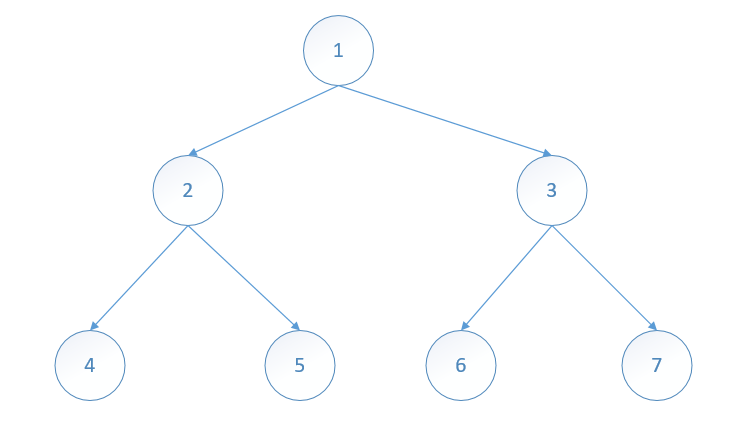
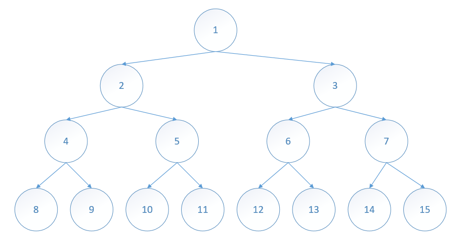
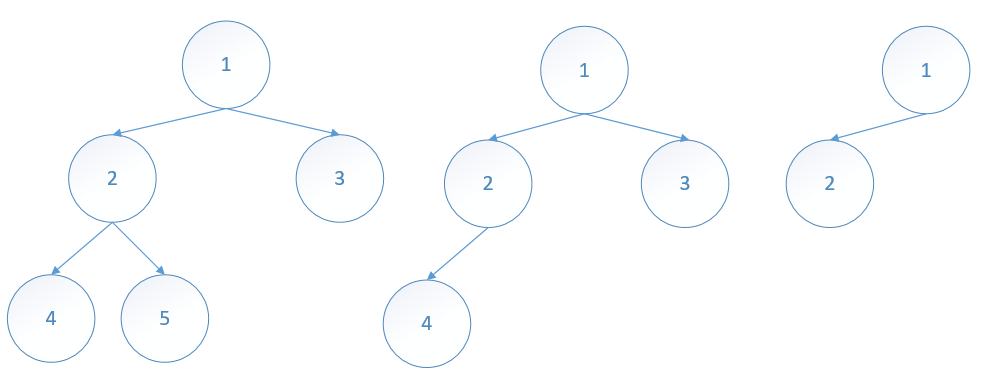
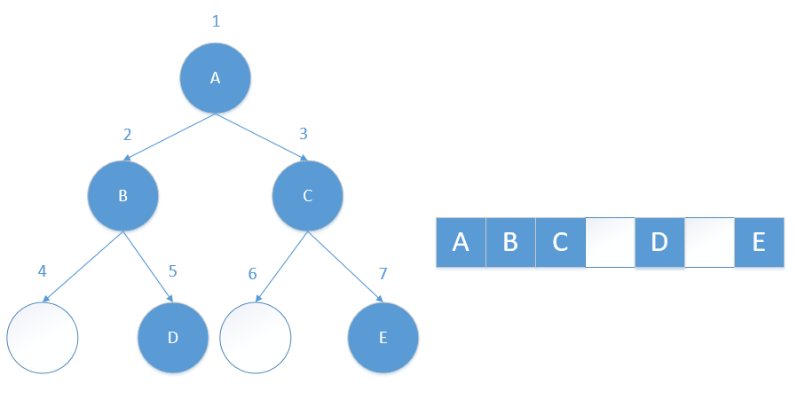
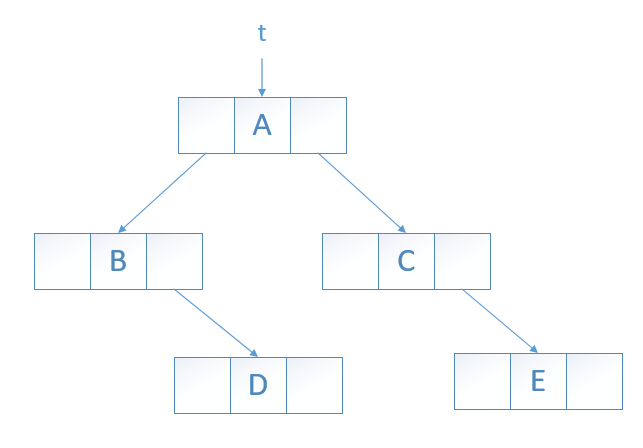

# 二叉树
定义：一颗**二叉树** t 是有限个元素的集合。当二叉树非空时，其中有一个元素称为 **根**，余下的元素被划分成两颗二叉树，分别称为 t的左子树和右子树。

二叉树和树的根本区别是：

* 二叉树的每个元素都有两颗子树（其中一个或两个可能为空）。而树的每个元素可有任意数量的子树。
* 在二叉树中，每个元素的子树都是有序的，也就是说，有左子树和右子树之分。而树的子树是无序的。



## 二叉树的特性
1. 一颗二叉树有 n 个元素，n>0，它有 n-1 条边。
2. 一颗二叉树的高度为 h，h>=0，它最少有 h 个元素，最多有2<sup>h</sup>-1个元素。
3. 一颗二叉树有 n 个元素，n>0，他的高度最大为 n，最小高度为 log<sub>2</sub>(n+1)。

当高度为 h 的二叉树恰好有 2<sup>k</sup>-1 个元素时，称其为 **满二叉树**。

 

对于深度为K的，有n个结点的二叉树，当且仅当其每一个结点都与深度为K的满二叉树中编号从1至n的结点一一对应时称之为 **完全二叉树**。

*若设二叉树的深度为 h，除第 h 层外，其它各层 (1～h-1) 的结点数都达到最大个数，第 h 层所有的结点都连续集中在最左边，这就是完全二叉树。*

  

*满二叉树是完全二叉树的一个特例。*

在完全二叉树中，节点下标之间的关系如下（根节点下标为0）：

* 若某个节点的下标为 i，则这个节点的父节点的下标为 i / 2。
* 若某个节点下标为 i，且节点的度为2，则这个节点的左子节点的下标为 (2 * i)，右子节点的下标为 (2 * i + 1)。

## 二叉树的描述

**数组描述**

在数组表示中，二叉树的元素按照其编号存储在数组的相应位置。

  

**链表描述**

二叉树最常用的表示方法是用指针。每个元素用一个节点表示，节点有两个指针域，分别称为 leftChild 和 rightChild；每个节点还有一个 element 域。

   

## 二叉树的遍历

有 4 种遍历二叉树的常用方法：

* 前序遍历。

```
template <class T>
void preOrder(binaryTreeNode<T> *t)
{
  if(t != NULL)
  {
    visit(t);                   //访问树根
    preOrder(t->leftChild);     //前序遍历左子树
    preOrder(t->rightChild);    //前序遍历右子树
  }
}
```

* 中序遍历。

```
template <class T>
void inOrder(binaryTreeNode<T> *t)
{
  if(t != NULL)
  {
    inOrder(t->leftChild);     //中序遍历左子树
    visit(t);                  //访问树根
    inOrder(t->rightChild);    //中序遍历右子树
  }
}
```

* 后序遍历。

```
template <class T>
void postOrder(binaryTreeNode<T> *t)
{
  if(t != NULL)
  {
    postOrder(t->leftChild);     //后序遍历左子树
    postOrder(t->rightChild);    //后序遍历右子树
    visit(t);                    //访问树根
  }
}
```

* 层次遍历。

```
template <class T>
void levelOrder(binaryTreesNode<T> *t)
{
  arrayQueue<binaryTreeNode<T>*> q;
  while(t != NULL)
  {
    visit(t);          //访问t

    //将 t 的孩子插入队列
    if (t->leftChild != NULL)
      q.push(t->leftChild);
    if (t->rightChild != NULL)
      q.push(t->rightChild);

    //提取下一个要访问的节点
    try {t = q.front();}
    catch (queueEmpty) {return;}
    q.pop();
  }
}
```

## 抽象数据类型

```
抽象数据类型 binaryTree
{
  实例
      元素集合；如果非空，则集合划分为一个根、一颗左子树和一颗右子树；每一科子树也是二叉树
  操作
      empty()：若树为空，则返回 true，否则返回 false
      size()：返回二叉树的节点/元素个数
      preOrder(visit)：前序遍历二叉树；visit是访问函数
      inOrder(visit)：中序遍历二叉树
      postOrder(visit)：后序遍历二叉树
      levelOrder(visit)：层次遍历二叉树
}
```
