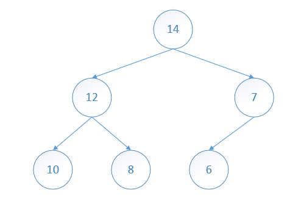
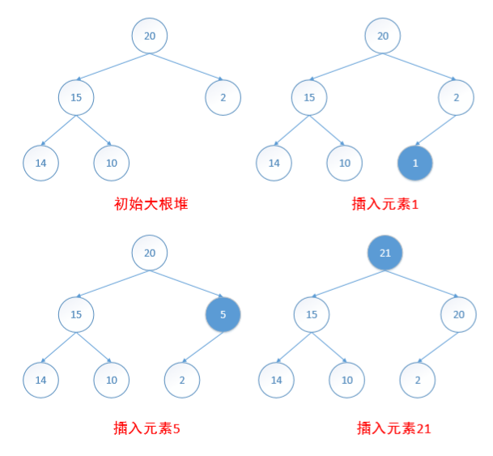
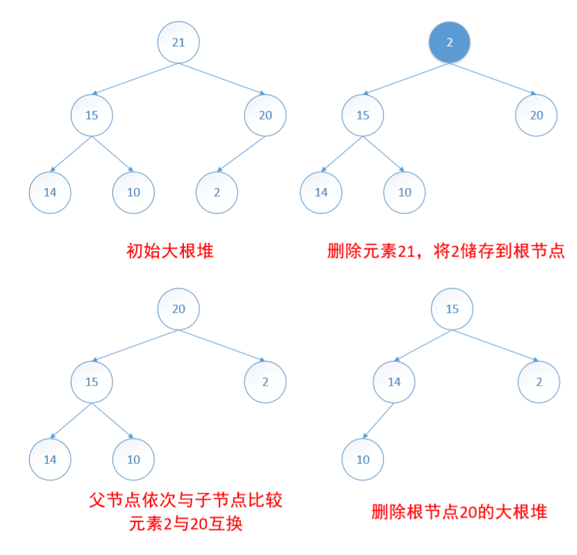
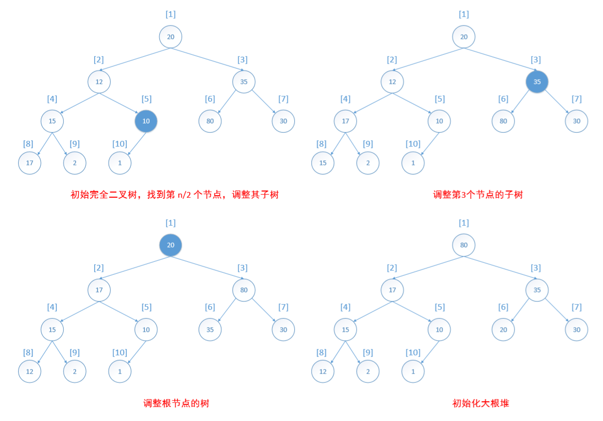

# 堆
定义：一棵大根树（小根树）是这样一棵树，其中每个节点的值都大于（小于）或等于其子节点（如果有的话）的值。

定义：一个大根堆（小根堆）既是大根树（小根树）也是完全二叉树。

## 大根堆的插入

依照**完全二叉树**的结构将新元素插入到新节点，然后沿着从新节点到根节点的路径，执行一趟起泡操作，即将新元素与其父节点的元素比较交换，直到后者**大于或等于**前者为止  

## 大根堆的删除

在大根堆中删除一个元素，就是删除**根节点**的元素。删除后，应将堆的最后一个叶子节点的值储存在根节点中，并删除叶子节点。然后将从根节点开始与其子节点比较，并与值最大的节点交换，直到该节点的值大于其子节点的值（满足大根堆的结构性质）。

 

## 大根堆的初始化

将完全二叉树转化为大根堆，从最后一个具有孩子的节点（即元素 10 的节点）开始检查。这个元素在数组中的位置为 i = (n/2)。如果以这个元素为根的子树是大根堆，则不作操作；如果以这个元素为根的子树不是大根堆，则必须把这个子树调整为大根堆。然后继续检查以 i-1、i-2 等节点为根的子树，直至检查到以 1 根的树为止。

  