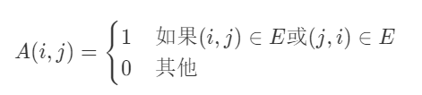
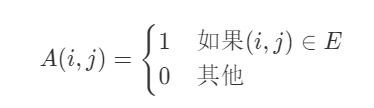
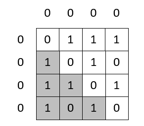
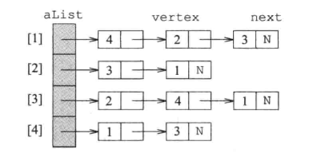
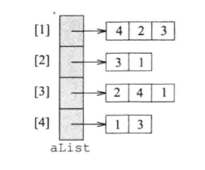
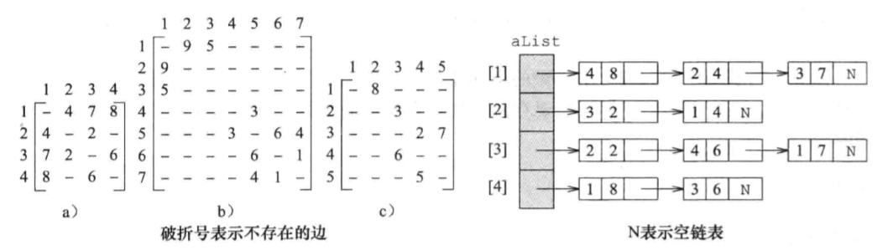

# 无权图的描述

对无向图最常用的描述方法都是基于邻接的方式：邻接矩阵、邻接链表和邻接数组。

## 邻接矩阵

一个 n 顶点图 G=(V, E) 的**邻接矩阵**是一个 n \* n 的矩阵（假设是 A），其中每个元素是 0 或 1。假设 V={1, 2, 3, ···， n}。如果 G 是一个无向图，那么其中的元素定义如下：

如果 G 是有向图，那么其中的元素定义如下：

结论：

1. 对于 n 顶点的无向图，有 A(i, i) = 0，&nbsp;&nbsp;&nbsp;&nbsp;1 <= i <= n。
2. 无向图的邻接矩阵是对称的，即 A(i, j) = A(j, i)，&nbsp;&nbsp;&nbsp;&nbsp;1 <= i <= n，1 <= j <= n。
3. 对于 n 顶点的无向图，有 $\sum_{j=1}^n{A(i, j)}$ =  $\sum_{j=1}^n{A(j, i)}$ = $d_i（d_i 是顶点的度）$
4. 对于 n 顶点的有向图，有 $\sum_{j=1}^n{A(i, j)} = d_i^{out}$ 和 $\sum_{j=1}^n{A(j, i)} = d_i^{in}$

**将邻接矩阵映射到数组**

无向图邻接矩阵是对称的，且其对角线上的元素均为 0，因此只需要存储上三角（或下三角）的元素，所需要的空间仅为 (n2-n)/2字节，这对大型图来说很有意义。

 

使用邻接矩阵时，要确定邻接至或邻接于一个给定节点的集合需要用时 Θ(n)。然而，增加或删除一条边仅需要用时 Θ(1)。

## 邻接链表

一个顶点 i 的**邻接表**是一个线性表，它包含所有邻接于顶点 i 的顶点。在一个图的邻接表描述中，图的每一个顶点都有一个邻接表。当邻接表用链表表示时，就是邻接链表。

 

在邻接表描述中，确定邻接于顶点 i 的顶点需用时 Θ（邻接于顶点 i 的顶点数）。插入或删除一条边 (i, j)的用时，对无向图是 O(di + dj)，对有向图是 O(diout)

## 邻接数组

在邻接数组中，每一个邻接表用一个数组线性表而非链表来描述。

 

# 加权图的描述

将无权图的描述进行简单扩充就可得到加权图的描述。用**成本邻接矩阵** C 描述加权图。如果 C(i, j) 表示边 (i, j) 的权，那么它的使用方法和邻接矩阵的使用方法一样。

  