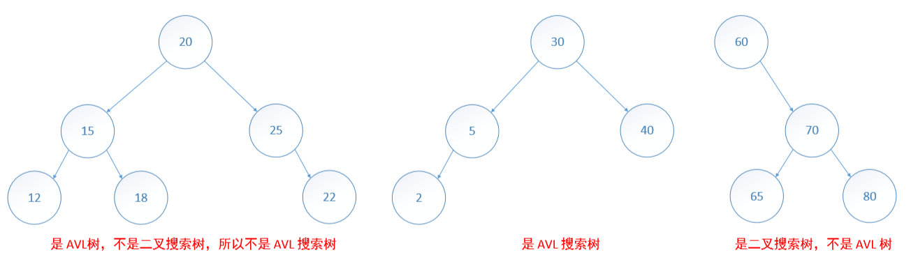
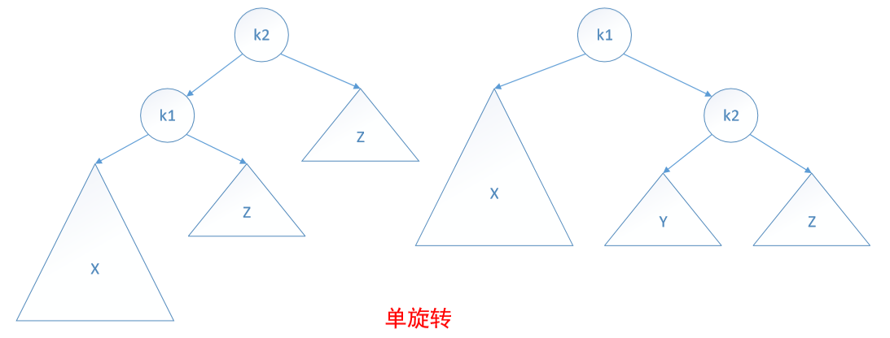
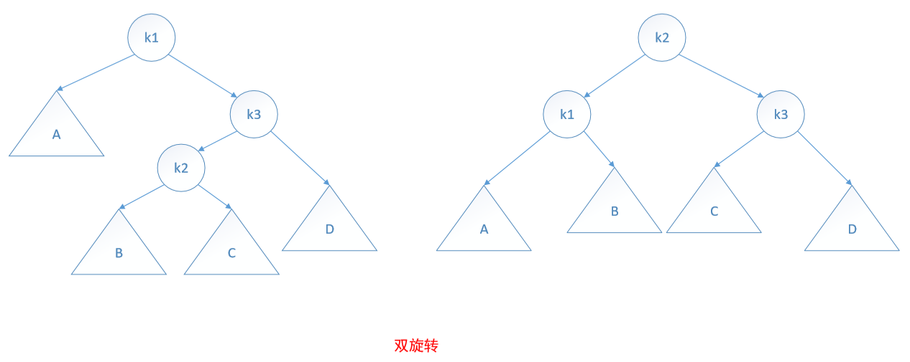
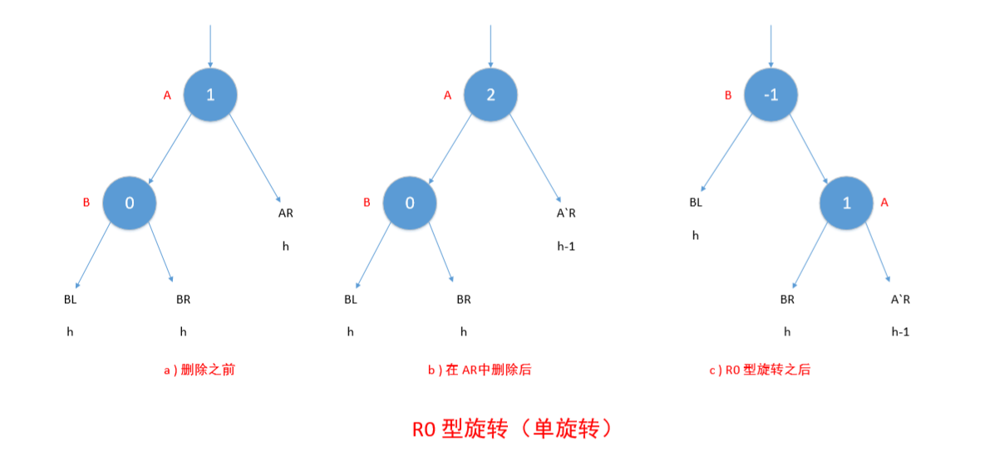
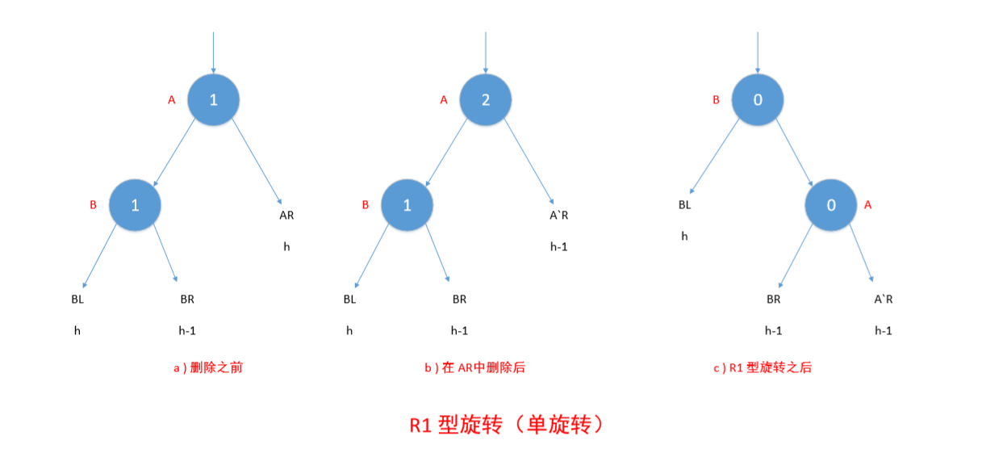
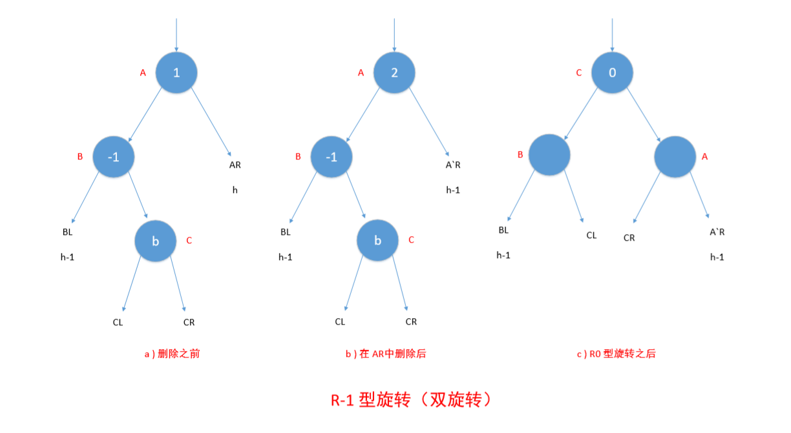

# AVL 树

如果搜索树的高度总是 O(logn)，就能保证查找、插入和删除的时间为 O(logn)。最坏情况下的高度为 O(logn) 的树称为**平衡树**。比较流行的一种平衡树是 AVL 树。

定义： 一棵空的二叉树是 AVL 树；如果 T 是一棵非空的二叉树，TL 和 TR分别是其左子树和右子树，那么当 T 满足以下条件时， T 是一棵 AVL 树：
1. TL 和 TR 是 AVL 树；
2. | hL - hR | <= 1，其中 hL 和 hR 分别是 TL 和 TR 的高。

一棵**AVL 搜索树**既是二叉搜索树，也是 AVL 树。

一棵**索引 AVL 搜索树**既是索引二叉搜索树，也是 AVL 树。

AVL 树有如下特征：
1. 一棵 n 个元素的 AVL 树，其高度是 O(logn)。
2. 对于每一个 n，n >= 0，都存在一棵 AVL 树。
3. 对一棵 n 元素的 AVL 搜索树，在 O（高度） = O(logn) 的时间内可以实现查找。
4. 将一个新元素插入一棵 n 元素的 AVL 搜索树中，可以得到一棵 n+1 个元素的 AVL 树，而且插入用时为 O(logn)。
5. 一个元素从一棵 n 元素的 AVL 搜索树中删除，可以得到一棵 n-1 个元素的 AVL 树，而且删除用时为 O(logn)

## AVL 树的高度

如果 AVL 树中有 n 个节点，那么树的最大高度为：O(logn)

## AVL 树的描述

AVL 树一般用链表描述。但是，为简化插入和删除操作，为每个节点增加一个平衡因子 bf。节点 x 的平衡因子 bf(x) 定义为：

x 的左子树高度 - x 的右子树高度

## AVL 搜索树的搜索

与二叉搜索树的搜索方法相同。

## AVL 搜索树的插入

在AVL 搜索树中插入元素可能导致它有一个或更多的节点其平衡因子不再是 -1、0 和 1，即处于不平衡状态。

AVL 搜索树不平衡时会有如下情形：

1. 在不平衡树中，平衡因子的值限于 -2，-1，0，1 和 2。
2. 平衡因子为 2 的节点在插入前的平衡因子为1。类似的，平衡因子为 -2 的节点插入前的平衡因子为 -1。
3. 只有从根到新插入节点的路径上的节点，其平衡因子在插入后会改变。
4. 假设 A 是离新插入节点最近的祖先，且平衡因子是 -2 或 2，在插入前，从 A 到新插入节点的路径上，所有节点（A 除外）的平衡因子都是 0。

具体插入操作如下：

**步骤 1：**

沿着从根节点开始的路径，根据新元素的关键字，去寻找新元素的插入位置。在此过程中，记录最新发现平衡因子为-1或1的节点，并令其为 A 节点。如果找到了具有相同关键字的元素，那么插入失败，终止算法

**步骤 2：**

如果在步骤 1 中所描述的节点 A 不存在，那么从根节点开始沿着原路径修改平衡因子，然后终止算法。

**步骤 3：**

如果 bf(A)=1 并且新节点插入 A 的右子树中，或者 bf(A)=-1 并且新节点插入到左子树，那么 A 的平衡因子是 0。在这种情况下，修改从 A 到新节点途中的平衡因子，然后终止算法。

**步骤 4：**

确定 A 的不平衡类型并执行相应的旋转，并对新子树根节点至新插入节点的路径上的节点的其平衡因子做相应的修改。

有四种不平衡情况（假设插入后节点 A 的两棵子树的高度差为 2 或 -2）：

1. 对 A 的左儿子的左子树进行一次插入（LL 型不平衡），需要进行单旋转。
2. 对 A 的左儿子的右子树进行一次插入（LR 型不平衡），需要进行双旋转。
3. 对 A 的右儿子的左子树进行一次插入（RL 型不平衡），需要进行双旋转。
4. 对 A 的右儿子的右子树进行一次插入（RR 型不平衡），需要进行单旋转。

## AVL 搜索树的删除

AVL 搜索树的删除操作与二叉搜索树的删除操作相似。若删除节点后，仍保持 AVL 树结构，则更新树中节点的平衡因子；若删除节点后，不满足 AVL 树结构，需要进行相应旋转并更新树中节点的平衡因子。

若删除叶节点或只有一个子树的节点，则设节点 q 是该删除节点的父节点（如果有的话）；若删除节点有两个子树，则设节点 q 是该删除节点。

如果删除发生在 q 的左子树，那么 bf(q) 减 1；如果删除发生在 q 的右子树，那么 bf(q) 加 1。下面是删除的几种情形：

1. 如果 q 的新平衡因子是 0，那么它的高度减少了 1，这时需要改变它的父节点（如果有的话）的平衡因子，而且可能需要改变其他祖先节点的平衡因子。
2. 如果 q 的新平衡因子是 -1 或 1，那么它的高度与删除前相同，而且无需改变其祖先的平衡因子值。
3. 如果 q 的新平衡因子是 -2 或 2，那么树在 q 处是不平衡的。

删除操作导致的不平衡状态分为以下六种：

* L0 ：删除发生在 A 的左子树，B 是 A 的右子树的根节点且 bf(B)=0。
* L1 ：删除发生在 A 的左子树，B 是 A 的右子树的根节点且 bf(B)=1。
* L-1 ：删除发生在 A 的左子树，B 是 A 的右子树的根节点且 bf(B)=-1。
* R0 ：删除发生在 A 的右子树，B 是 A 的右子树的根节点且 bf(B)=0。
* R1 ：删除发生在 A 的右子树，B 是 A 的右子树的根节点且 bf(B)=1。
* R-1 ：删除发生在 A 的右子树，B 是 A 的右子树的根节点且 bf(B)=-1。

下面以 R 型不平衡的旋转操作进行演示（L 型不平衡旋转为镜面对称）：

 

