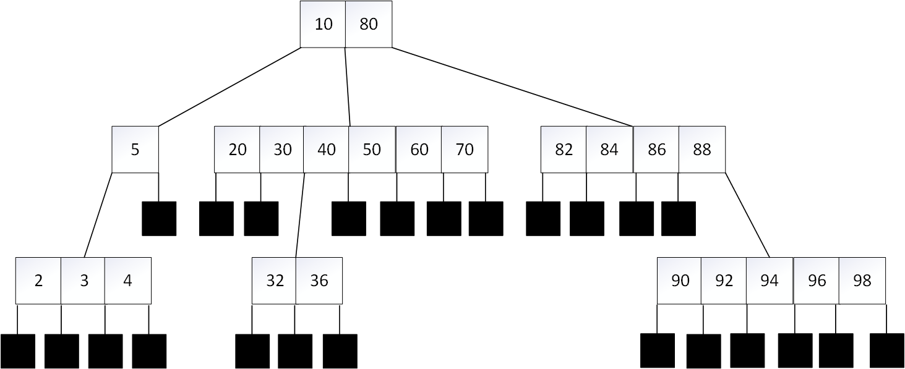
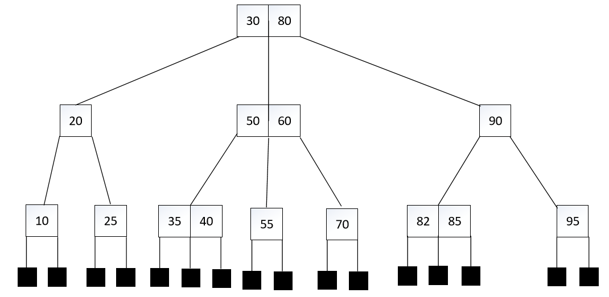
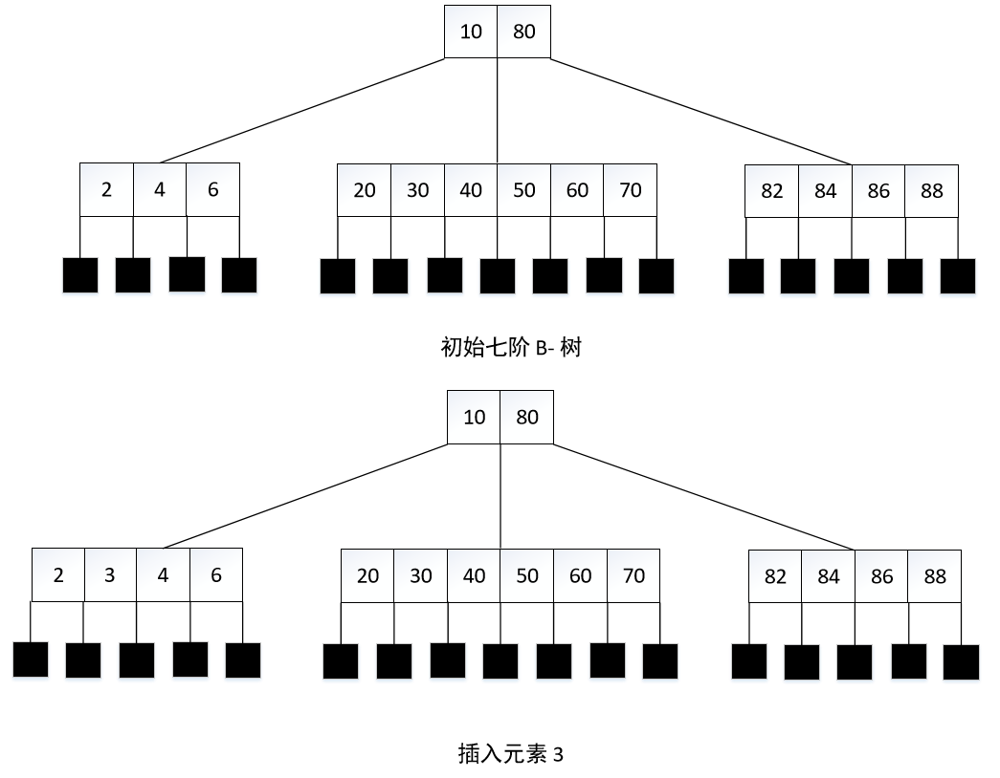
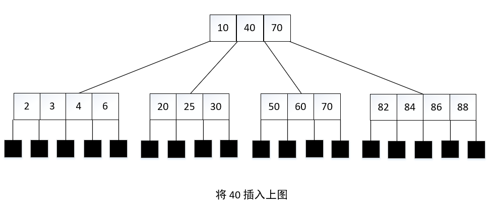
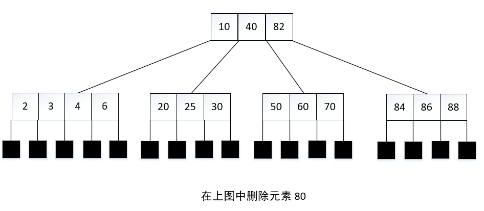
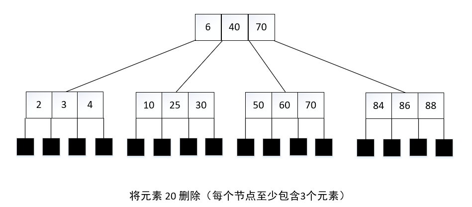
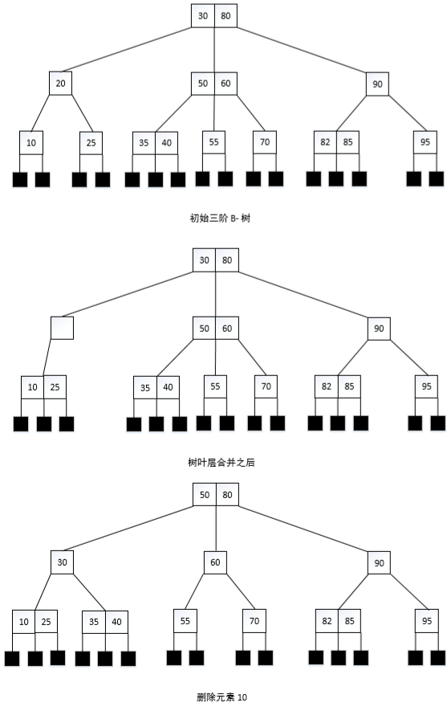

# B-树

## m 叉搜索树
定义：**m 叉搜索树**可以是一棵空树。如果非空，它必须满足以下特征：

1. 在相应的扩充搜索树中（即用外部节点替换空指针之后所得到的的搜索树），每个内部节点最多可以有 m 个孩子以及 1 ~ m-1 个元素（外部节点不含元素和孩子）。
2. 每一个含有 p 个元素的节点都有 p+1 个元素。
3. 在任意一个含有 p 个元素的节点，设 k1，···，kp 分别是这些元素的关键字。这些元素顺序排列，即 k1 <  k2 < ··· <  kp。设 c0 <  c1 < ··· <  cp 是该节点的 p+1 个孩子。在以 c0 为根的子树中，元素的关键字小于 k1；在以 cp 为根的子树中，元素的关键字大于 kp，在以 ci 为根的子树中，元素的关键字大于 ki 而小于 ki+1，其中 1 <= i <p。

## m 阶 B-树

定义：**m 阶 B-树**是一棵 m 叉搜索树。如果 B-树非空，那么相应的扩展树满足下列特征：

1. 根节点至少有 2 个孩子。
2. 除根节点以外，所有内部节点至少有 ⌈m/2⌉ 个孩子。
3. 所有外部节点在同一层。

例如：一棵三阶 B-树，因为其内部节点必须有 2 个孩子或 3 个孩子，所以也称 2 - 3 树；一棵四阶 B-树，因为其内部节点必须有 2 个、3 个孩子或 4 个孩子，所以也称 2-3-4 树（或简称2、4树）。

## B-树的高度

定理：设 T 是一棵高度为 h 的 m 阶  B-树。令 d = ⌈m/2⌉，n 是 T 的元素个数，则

1. 2dh-1 -1 <= n <= mh-1
2. logh-1(n+1) <= h <= logd(n+1 / 2) +1

## B-树的搜索

 B-树的搜索算法与 m 叉搜索树的搜索算法相同。在搜索过程中，从根至外部节点路径上的所有内部节点都有可能被搜索到，因此，磁盘访问次数最多是 h（h 是 B-树的高度）。

## B-树的插入

要在 B-树中插入一个新元素，首先要在 B-树中搜索关键字与之相同的元素。如果存在这样的元素，那么插入失败，因为在 B-树的元素中不允许有重复的关键字。如果不存在这样的元素，便可以将元素插入在搜索路径中所遇到的最后一个内部节点中。

 

当在一个饱和节点中插入一个新元素时，需要分裂该节点。令 P 是饱和节点，现在将带有空指针的新元素 e 插入 P，得到一个有 m 个元素和 m+1 个孩子的溢出节点。用下面的序列来表示这个溢出节点：

**m，c0，(e1，c1)，···，(em，cm)**

其中 ei 是元素，ci 是孩子指针。该节点从元素 ed，其中 d = ⌈m/2⌉。左边的元素保留在 P 中，右边的元素移到新节点 Q 中。数对 ，···，(ed，Q) 被插入 P 的父节点，新节点 P 和 Q 的格式为：

**P：d-1，c0，(e1，c1)，···，(ed-1，cd-1)**

**Q：m-d，cd，(ed+1，cd+1)，···，(em，cm)**

注意：P 和 Q 的孩子个数至少是 d。

当插入操作引起了 s 个节点分裂时，磁盘访问的次数为 h（读取搜索路径上的节点）+ 2s（回写分裂出的两个新节点）+1（回写新的根节点或插入后没有导致分裂的节点）。因此，所需要的磁盘访问次数是 h+2s+1，最多可达到 3h+1。

## B-树的删除

删除一个元素分为两种情况：

1. 该元素位于叶节点，即该节点的所有孩子都是外部节点；
2. 该元素位于非叶节点。

情况 2 可以转变为 情况 1，过程是用一个元素来替换被删除元素，这个元素既可以是被删除元素的左相邻子树的最大元素，也可以是被删除元素的右相邻子树的最小元素。替换元素必在叶节点。

由于情况 2 转化为情况 1 很容易，因此只讨论情况 1。如果要删除的元素所在的叶节点其元素个数大于最少数（一个叶节点，如果同时还是根节点，那么最少元素个数是1；否则，最少元素个数是⌈m/2⌉ - 1）那么直接删除，然后将修改后的节点写回磁盘即可。

当要删除的元素在一个非根节点中且该节点的元素个数最少时，可将其父节点中的临近元素移到该节点，并将最邻近的左兄弟或右兄弟中的元素移到父节点（除了根节点以外，每个节点都会有一个最邻近的左兄弟或右兄弟，或二者都有）。

 

当最临近的一个兄弟不包括额外元素时，就将两个兄弟与父节点中介于两个兄弟之间的元素合并成一个节点。由于这两个兄弟分别有 d-2 和 d-1 个元素，合并后的节点共有 2d-2 个元素。当 m 是奇数时，2d-2 等于 m-1；而当 m 是偶数时，2d-2 等于 m-2。节点有足够的空间来容纳这么多元素。

合并操作必减少父节点的元素个数，父节点可能会缺少一个元素。如果是这样，那么需要选择父节点的最邻近的一个兄弟，要么从中取一个元素，要么与它合并。如果从最邻近的右（左）兄弟中取一个元素，那么此兄弟节点的最左（最右）子树将被读取。如果进行合并，那么祖父节点也可能会缺少一个元素，然后在祖父节点重复相同的过程。最坏情况下，这种过程会一直回溯到根节点。当根节点缺少一个元素时，它在合并之后变成空节点，然后被删除，树的高度减 1。

对高度为 h 的 B-树实施删除操作，最坏情况是，合并操作发生在 h，h-1，···，3 层进行合并，从最邻近的兄弟中获取一个元素的操作发生在第 2 层。在最坏情况下磁盘访问次数是 3h；（找到被删除元素所在的节点需要 h 次度访问）+（得到第 2 至 h 层的最邻近兄弟需要 h-1 次读访问）+（在第 3 至 n 层的合并需要 h-2 次写访问）+（对修改过的根节点和第 2 层的 2 个节点进行 3 次写访问）。
