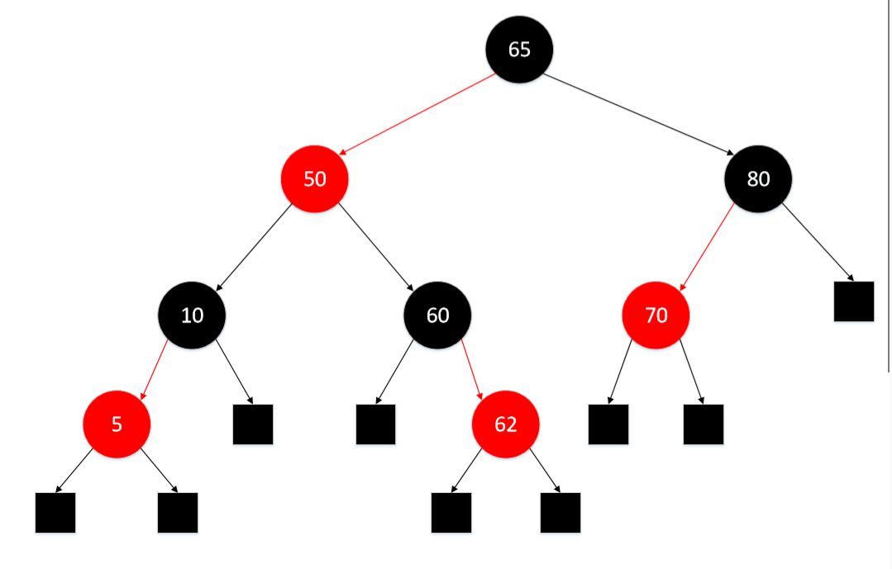
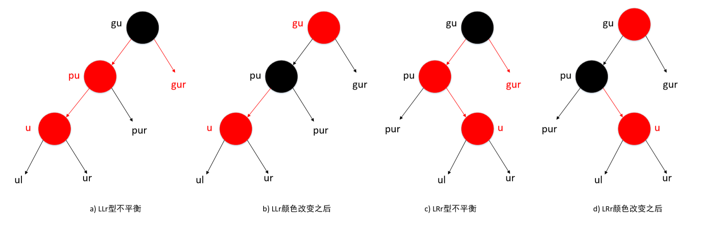
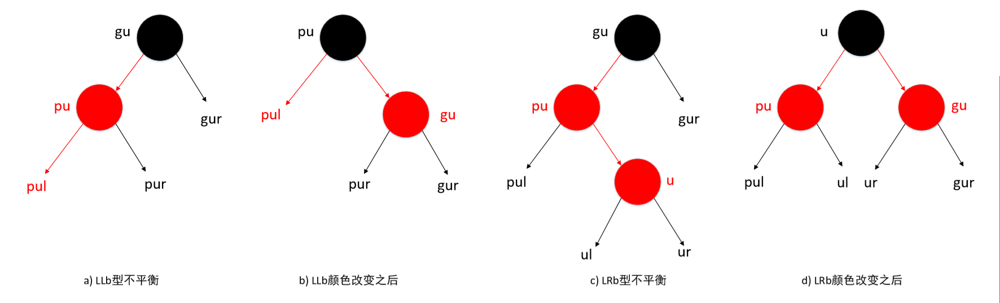
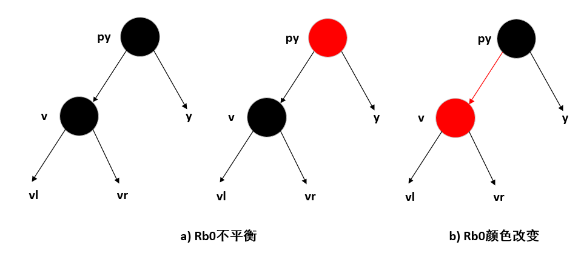
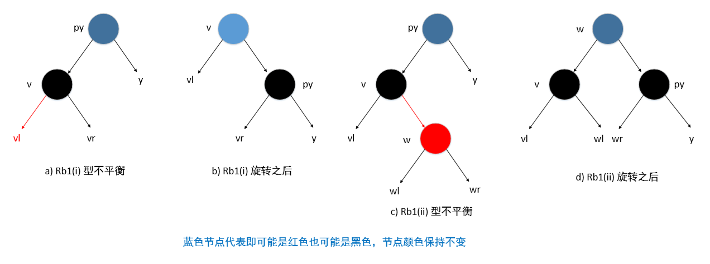
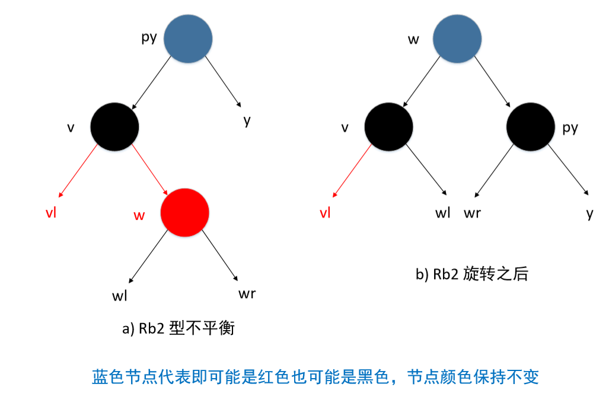
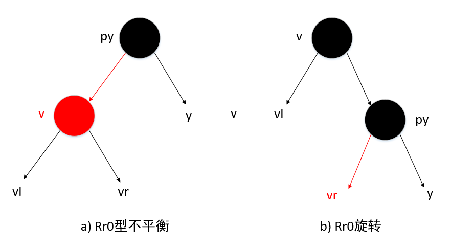
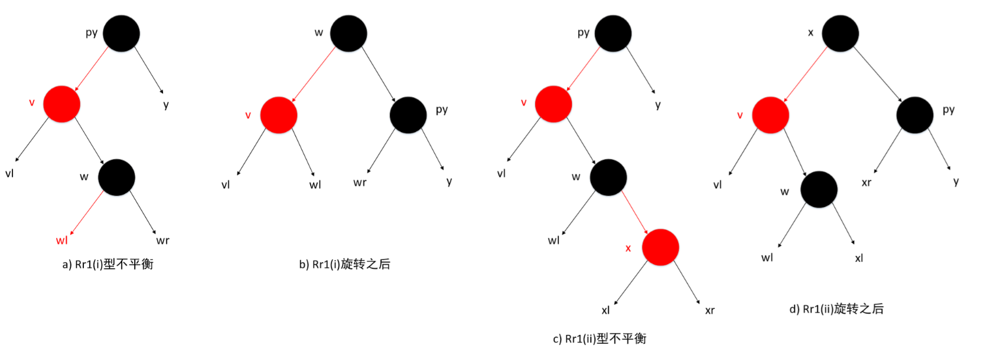
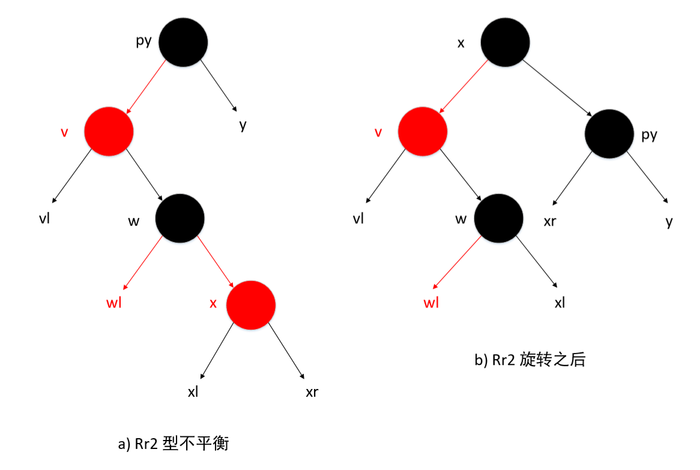

# 红 - 黑树

**红 - 黑树** 是这样的一棵二叉搜索树：树中每一个节点的颜色或者是黑色或者是红色，其他特征可以用相应的扩充二叉树说明。

红-黑树的性质有：

1. 根节点和所有外部节点都是黑色。
2. 在根至外部节点路径上，没有连续两个节点是红色。
3. 在所有根至外部节点的路径上，黑色节点的数目都相同。

红 - 黑树还有另一种等价，取决于父子节点间的指针颜色。从父节点指向黑色孩子的指针是黑色的，指向红色孩子的指针是红色的。红 - 黑树的性质还有：

1. 从内部节点指向外部节点的指针是黑色的。
2. 在根至外部节点路径上，没有两个连续的红色指针。
3. 在所有根至外部节点路径上，黑色指针的数目相同。

红 - 黑树的一个节点的 **阶**，是从该节点到一外部节点的路径上黑色指针的数量。因此，一个外部节点的阶是 0。

定理：设从根节点到外部节点的路径长度是该路径上的指针数量。如果 P 和 Q 是红 - 黑树中的两条从根至外部节点的路径，那么 length(P) <= 2length(Q)

定理：令 h 是一棵红 - 黑树的高度（不包括外部节点），n 是树的内部节点数量，而 r 是根节点的阶，则：

1. h <= 2r
2. n >= 2r-1
3. h <= 2log2(n+1)

## 红 - 黑树的搜索

可以使用普通二叉搜索树的搜索代码来搜索红 - 黑树。源代码的复杂性为 O(h)，而对红 - 黑树来说，则为 O(logn)。

## 红 - 黑树的插入

红 - 黑树的插入操作与普通二叉树的插入算法类似，对插入的新元素，需要上色。如果插入前的树是空的，那么新节点是根节点，颜色应是黑色；如果插入前的树是非空的，新节点应该是红色。

插入新的红色节点可能会破坏红 - 黑树的第 2 条性质，不平衡的状态可以通过检查新节点 u、父节点 pu 及 祖父节点 gu 来确定。（由红 - 黑树性质可知，不平衡状态时新插入的节点一定有红色的父节点和黑色的祖父节点）

不平衡的状态有：

* LLb 类型：pu 是 gu 的左孩子， u 是 pu 的左孩子且 gu 的另一个孩子是黑色的。
* LLr 类型：pu 是 gu 的左孩子， u 是 pu 的左孩子且 gu 的另一个孩子是红色的。
* LRb 类型：pu 是 gu 的左孩子， u 是 pu 的右孩子且 gu 的另一个孩子是黑色的。
* LRr 类型：pu 是 gu 的左孩子， u 是 pu 的右孩子且 gu 的另一个孩子是红色的。
* RLb 类型：pu 是 gu 的右孩子， u 是 pu 的左孩子且 gu 的另一个孩子是黑色的。
* RLr 类型：pu 是 gu 的右孩子， u 是 pu 的左孩子且 gu 的另一个孩子是红色的。
* RRb 类型：pu 是 gu 的右孩子， u 是 pu 的右孩子且 gu 的另一个孩子是黑色的。
* RRr 类型：pu 是 gu 的右孩子， u 是 pu 的右孩子且 gu 的另一个孩子是红色的。

XYr（X 和 Y 既可以是 L，也可以是 R）类型的不平衡可以通过改变颜色来处理，而 XYb 类型则需要旋转。当节点 gu 被改变颜色时，它和上一层节点可能破坏了红 - 黑树的第 2 条性质，这时的不平衡需要重新分类，而且 gu 变为 u，然后再次进行转换。旋转结束后，不再违反红 - 黑树的性质，因此不需要再进行其他操作。

XYr 型的颜色变化是一致的，需要将 pu 和 gu 的另一个孩子节点由红色改为黑色。另外，如果 gu 不是根，要将 gu 的颜色由黑色改为红色；如果 gu 是根，那么颜色不变，此时从根至外部节点路径上的黑色节点数量都增 1。

 

如果将 gu 的颜色改为红色而引起了不平衡，那么 gu 就变成了新的 u 节点，它的双亲就变成了新的 pu，它的祖父节点就变成了新的 gu，这时需要继续恢复平衡。如果 gu 是根节点或者 gu 节点的颜色改变没有违反规则 2，那么工作完成。

处理 LLb 和 LRb 不平衡时所做的旋转与 AVL 树的插入操作所需要的 LL 和 LR 旋转有相似之处。指针的改变相同，并且需要改变节点的颜色。旋转之后，在所有从根至外部节点的路径上，黑色节点（指针）的数量是不变的。插入后，一次旋转足以保持平衡。

## 红 - 黑树的删除

对于删除操作，首先使用普通二叉搜索树的删除算法，然后进行颜色变动，如果需要的话，还要作一次单旋转。在删除过程中，应该明确删除节点 y。（二叉搜索树删除操作中，**要删除的元素所对应的节点** 与 **实际删除的节点** 可能不同）

在红 - 黑树中，仅当被删除节点是黑色且 y 不是树根的时候，才会出现违反红 - 黑树性质（具体为性质 3 ）的情况。

*注意：当删除的节点只含有一个孩子节点且该节点为黑色时，应该将替代它的子节点颜色设为黑色（无论它原来是什么颜色）。*

当违反性质 3 的情况出现时，以 y 为根的子树缺少一个黑色节点(或一个黑色指针)，因此，从根至 y 子树的外部节点的路径与从根至其他外部节点的路径相比，前者所包含的黑色节点数量比后者的要少一个，这时的树是不平衡的。不平衡的类型可以根据 y 的父节点 py 和同胞节点 v 的特点来划分。当 y 是 py 的右孩子时，不平衡是 R 型的，否则是 L 型的。通过观察可以得知，如果 y 缺少一个黑色节点，那么 v 就肯定不是外部节点。如果 v 是一个黑色节点，那么不平衡是 Lb 或 Rb 型的；而当 v 是红色节点时，不平衡是 Lr 或 Rr 型的。

具体情况如下：

* Lb0 型：以 y 为根的子树是 py 的左子树，同胞节点 v 是黑色且没有红色孩子节点。
* Lb1(i) 型：以 y 为根的子树是 py 的左子树，同胞节点 v 是黑色且有一个红色右孩子节点。
* Lb1(ii) 型：以 y 为根的子树是 py 的左子树，同胞节点 v 是黑色且有一个红色左孩子节点。
* Lb2 型：以 y 为根的子树是 py 的左子树，同胞节点 v 是黑色且有两个红色孩子节点。
* Rb0 型：以 y 为根的子树是 py 的右子树，同胞节点 v 是黑色且没有红色孩子节点。
* Rb1(i) 型：以 y 为根的子树是 py 的右子树，同胞节点 v 是黑色且有一个红色左孩子节点。
* Rb1(ii) 型：以 y 为根的子树是 py 的右子树，同胞节点 v 是黑色且有一个红色右孩子节点。
* Rb2 型：以 y 为根的子树是 py 的右子树，同胞节点 v 是黑色且有两个红色孩子节点。

      

 

* Lr0 型：以 y 为根的子树是 py 的左子树，同胞节点 v 是红色且 v 的左孩子没有红色孩子节点。
* Lr1(i) 型：以 y 为根的子树是 py 的左子树，同胞节点 v 是红色且 v 的左孩子有一个红色右孩子节点。
* Lr1(ii) 型：以 y 为根的子树是 py 的左子树，同胞节点 v 是红色且 v 的左孩子有一个红色左孩子节点。
* Lr2 型：以 y 为根的子树是 py 的左子树，同胞节点 v 是红色且 v 的左孩子有两个红色孩子节点。
* Rr0 型：以 y 为根的子树是 py 的右子树，同胞节点 v 是红色且 v 的右孩子没有红色孩子节点。
* Rr1(i) 型：以 y 为根的子树是 py 的右子树，同胞节点 v 是红色且 v 的右孩子有一个红色左孩子节点。
* Rr1(ii) 型：以 y 为根的子树是 py 的右子树，同胞节点 v 是红色且 v 的右孩子有一个红色右孩子节点。
* Rr2 型：以 y 为根的子树是 py 的右子树，同胞节点 v 是红色且 v 的右孩子有两个红色孩子节点。

   

 

