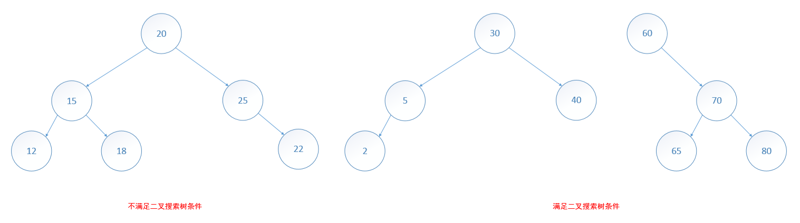
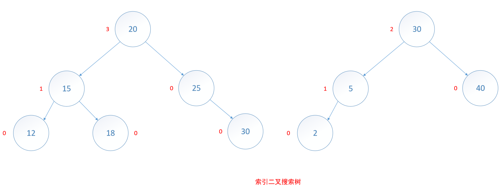

# 搜索树

## 二叉搜索树
定义：**二叉搜索树**是一棵二叉树，可能为空；一棵非空的二叉搜索树满足以下特征：

1. 每个元素有一个关键字，并且任意两个元素的关键字都不同；因此，所有的关键字都是唯一的。
2. 在根节点的左子树中，元素的关键字都小于根节点的关键字。
3. 在根节点的右子树中，元素的关键字都大于根节点的关键字。
4. 根节点的左、右子树也都是二叉搜索树。



```
抽象数据类型 bsTree
{
  实例
      二叉树，每一个节点都有一个数对，其中一个成员是关键字，另一个成员是数值；所有关键字都不相同；任何一个节点的左子树的关键字小于该节点的关键字；右子树的关键字大于该节点的关键字
  操作
      find(k)：返回关键字 k 的数对
      insert(p)：插入数对 p
      erase(k)：删除关键字为 k 的数对
      ascend()：按关键字升序输出所有数对
}
```

## 索引二叉搜索树

**索引二叉搜索树**源于普通二叉搜索树，只是在每个节点中添加一个 leftSize 域。这个域的值是该节点左子树的元素个数。注意，leftSize 同时给出了一个元素的索引（该元素在左子树的元素排在该元素之前）。



```
抽象数据类型 IndexedBSTree
{
  实例
      与 bsTree 的实例相同，只是每一个节点还有一个 leftSize 域
  操作
      find(k)：返回关键字 k 的数对
      get(index)：返回第 index 个数对
      insert(p)：插入数对 p
      erase(k)：删除关键字为 k 的数对
      ascend()：按关键字升序输出所有数对
}
```