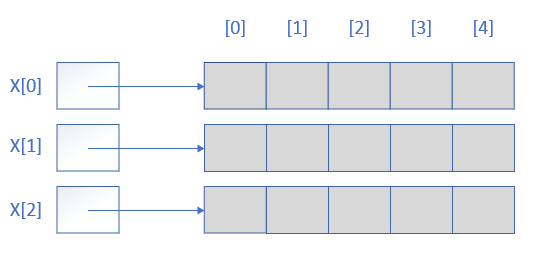

# 数组

## 抽象数据类型
数组的每一个实例都是形如（索引，值）数对集合，其中任意两个数对的索引都不相同。

```
抽象数据类型 array
{
  实例
      形如（index, value）的数对集合，任意两个数对的索引都不同。
  操作
      get(index)：返回索引为index的数对中的值
      set(index, value)：加入一个新数对，如果索引相同的数对已存在，则用新数对覆盖
}
```

## C++数组的索引
数组是C++的标准数据结构，k 维数组的索引（**下标**）具有如下形式：

**[i<sub>1</sub>] [i<sub>2</sub>] [i<sub>3</sub>] ... [i<sub>k</sub>]**

在C++中，一个 3 维整型数组 score 可用如下语句来创建：  

**int score[u<sub>1</sub>] [u<sub>2</sub>] [u<sub>3</sub>]**

## 二维数组
C++用 **数组的数组** 来表示一个多维数组。

二维数组 **int x[3][5]** 



白色块存储指针，灰色块存储整数。每个指针和整数各占 4 字节，一共 72 字节。
