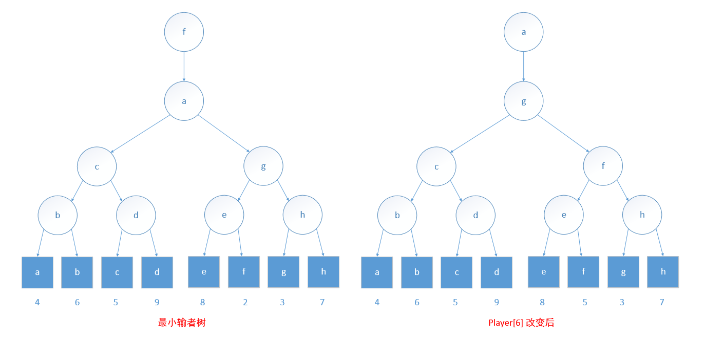

## 输者树

如果每个内部节点记录的是在该节点比赛的输者而不是赢者，那么当赢者 player[i] 改变后，再从该节点到根的路径上，重新确定每一场比赛的选手所需要的操作量就可以减少。最终的赢者可记录在 tree[0] 中。

当一个赢者发生变化时，使用输者树可以简化重赛的过程，但是，当其他选手发生改变时，情况会变得糟糕。因此，仅当 player[i] 为前次比赛的赢家时，对于函数 rePlay(i)，采用输者树比采用赢者树执行效率更高。