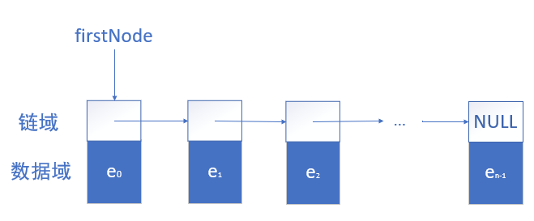
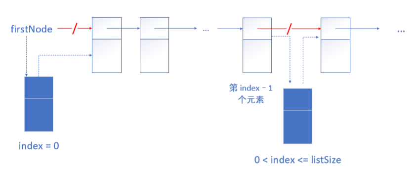
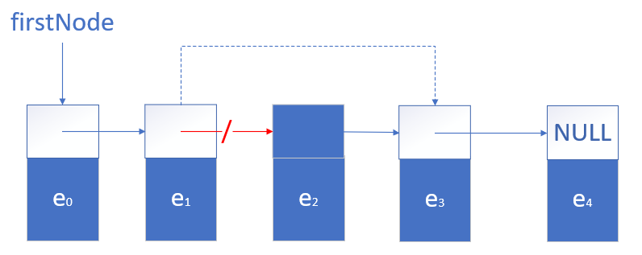
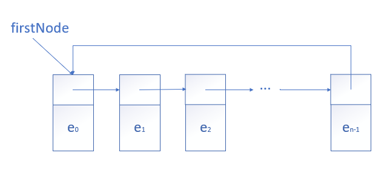
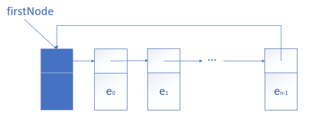
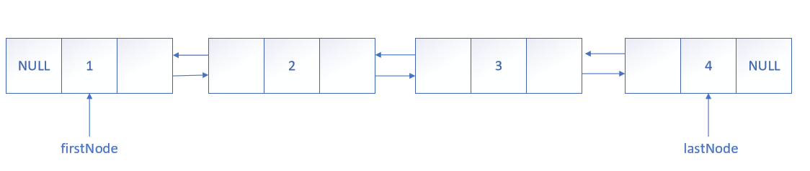

# 线性表——链式描述
在链式描述中，数据对象实例的每一个元素都用一个单元或节点来描述。每一个节点都明确包含另一个相关节点的位置信息，这个信息称为**链**或**指针**。

## 单向链表

**增加节点**  
在链表中插入未来索引为 index 的节点。

**删除节点**

## 循环链表和头结点
有两条措施可以使链表的应用代码简洁和高效：

1. 把线性表描述成一个 **循环链表**。
2. 在链表的前面加一个节点，成为 **头结点**。

**循环链表**

**有头结点的循环链表**  

## 双向链表
