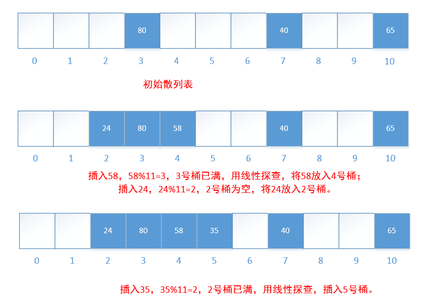
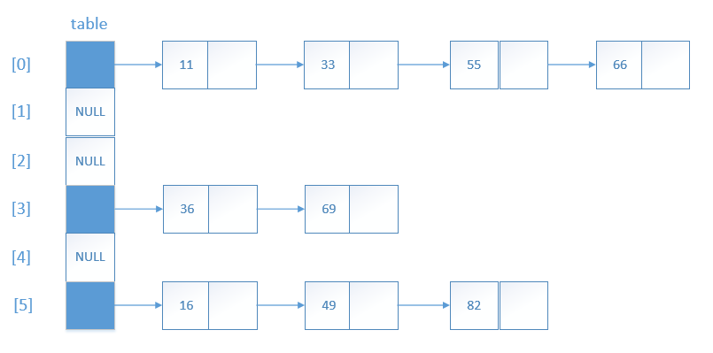
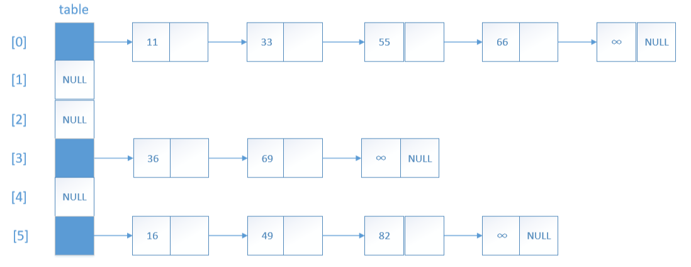

# 散列
散列表（哈希表），是根据关键码值(Key value)而直接进行访问的数据结构。它通过把关键码值映射到表中一个位置来访问记录，以加快查找的速度。这个映射函数叫做 **散列函数**，存放记录的数组叫做 **散列表**。

假设数对 p 的关键字是 k，散列函数为 f，那么理想情况下：p 在散列表中的位置为 f(k)。

## 散列函数和散列表

**桶和起始桶**

散列表的每一个位置叫一个**桶**；对关键字为 k 的数对，f(k)是起始桶；桶的数量等于散列表的长度或大小。

**除法散列函数**

在多种散列函数中，最常用的是除法散列函数，它的形式如下：

**f(k) = k%D**

其中 k 是关键字，D 是散列表的长度（桶的数量）。

**冲突和溢出**

当不同关键字所对应的起始桶相同时，就是**冲突**发生；如果桶没有空间存储一个新数对，就是**溢出**发生。

## 线型探查
解决溢出的常用方法是 **线性探查**。

假设要查找关键字为 k 的数对，首先搜索起始桶 f (k)，然后把散列表当做 **环表** 继续搜索下一个桶，直到以下情况之一发生为止：

1. 存在关键字 k 的桶已找到，即找到了要查找的数对
2. 到达一个空桶
3. 又回到起始桶 f(k)

*后两种情况说明关键字为 k 的数对不存在。*

## 链式散列
如果散列表的每一个桶可以容纳无限多个记录，那么溢出问题就不存在了。实现这个目标的一个方式是给散列表的每一个位置配置一个线性表。

在每个链表上增加一个尾节点，可以改进一些程序的性能。尾节点的关键字值最起码要比插入的所有数对的关键字都大。

