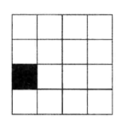
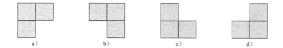
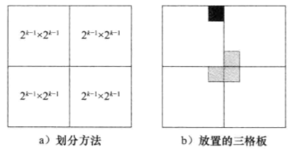

# 残缺棋盘

**残缺棋盘**是一个有 2k * 2k 个方格的棋盘，其中恰有一个方格残缺。

   

在残缺棋盘问题中，要求用三格板覆盖残缺棋盘。在覆盖中，任意两个三格板不能重叠，任意一个三格板不能覆盖残缺方格，但三格板必须覆盖其他所有方格。

 

把 2k * 2k 的残缺棋盘实例划分为较小的残缺棋盘实例，如 4 个 2 k-1 * 2k-1 棋盘。划分之后，在 4 个小棋盘中仅仅有一个棋盘存在残缺方格。首先覆盖残缺方格的小棋盘。然后把剩下的 3 个小棋盘转变为残缺棋盘，为此，将一个三格板放置由这三个小棋盘形成的角上。递归地使用这种分割技术。当棋盘的大小减为 1 * 1 时，递归过程终止。

 