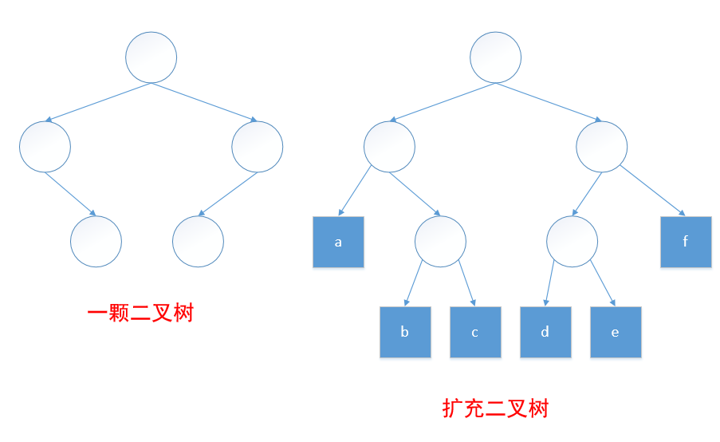
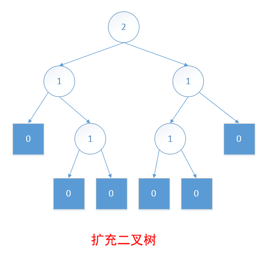
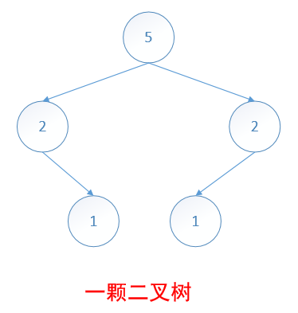
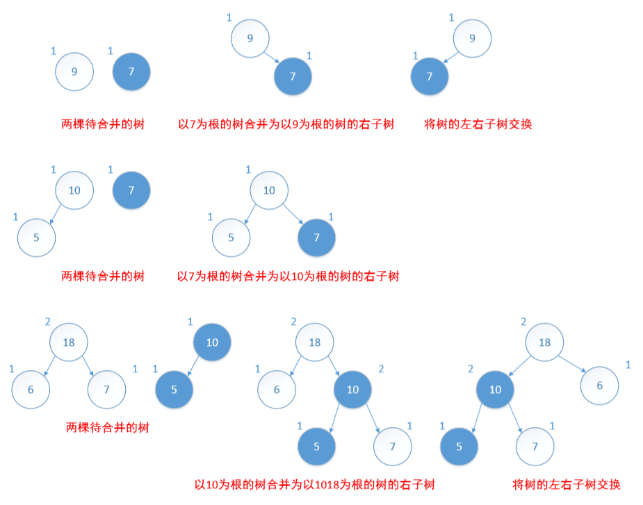
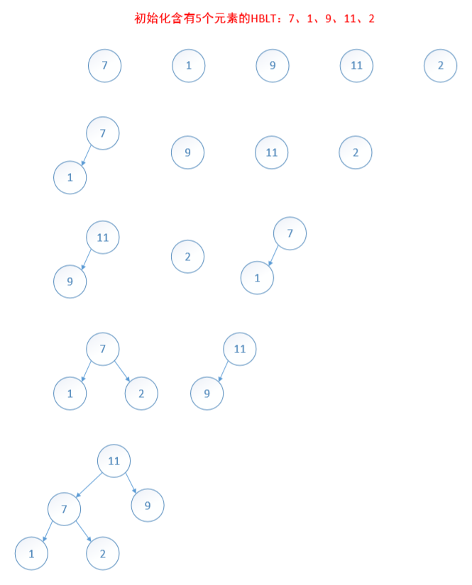

# 左高树

## 高度优先与重量优先的最大及最小左高树
一颗二叉树有一类特殊的节点叫做**外部节点**，它代替树中的空子树。其余节点叫做**内部节点**。增加了外部节点的二叉树被称为扩充二叉树。

 

令 s(x) 是从节点 x 到其子树的外部节点的所有路径中最短的一条。根据 s(x) 的定义，若 x 是外部节点，则 s 的值为 0；若 x 是内部节点，则 s 的值为：**min{s( L ), s( R )} + 1**，其中 L 与 R 分别为 x 的左右孩子。

扩充二叉树中各节点的 s 值如下所示：

  

定义：一棵二叉树称为**高度优先左高树(HBLT)**，当且仅当其任何一个内部节点的左孩子的 s 值都大于或等于右孩子的 s 值。若一颗 HBLT 同时还是大根树，则称为**最大 HBLT**；若一颗 HBLT 同时还是小根树，则称为**最小 HBLT**。

定理：令 x 为 **HBLT** 的一个内部节点，则：

1. 以 x 为根的子树的节点数目至少为 2s(x)-1。
2. 若以 x 为根的子树有 m 个节点，那么 s(x) 最多为 log2(m+1)。
3. 从 x 到一外部节点的最右路径（即从 x 开始沿右孩子移动的路径）的长度为 s(x)。

令 w(x) 是以节点 x 为根的子树的内部节点数目。若 x 是外部节点，则它的重量是 0；若 x 是内部节点，则它的重量是**其孩子节点的重量之和加1**。

上图二叉树中，各节点的重量如图：

  

定义：一棵二叉树称为**重量优先左高树(HBLT)**，当且仅当其任何一个内部节点的左孩子的 w 值都大于或等于右孩子的 w 值。若一颗 WBLT 同时还是大根树，则称为**最大 WBLT**；若一颗 HBLT 同时还是小根树，则称为**最小 WBLT**。

定理：

* 具有 m 个节点的 WBLT 的最右路径长度最多为 log2(m+1)。

## 最大 HBLT 的插入

最大 HBLT 的插入操作可利用 最大 HBLT 的合并操作来实现。要插入一个元素，可以先建立一颗新的只包含这个元素的 HBLT，然后将这颗新的 HBLT 与原来的 HBLT 合并。

## 最大 HBLT 的删除

最大元素在根中。若根被删除，则分别以左右孩子为根的子树是两棵最大 HBLT。将这两颗最大 HBLT 合并，便是删除后的结果。因此，删除操作可以通过删除根元素之后的两棵子树的合并来实现。

## 两棵最大 HBLT 的合并

具有 n 个元素的 HBLT，其最右路径的长度为 O(logn)。一个算法要合并两棵HBLT，只能在遍历其最右路径中进行。因此算法从两棵 HBLT 的根开始仅沿右孩子移动。

合并策略最好用递归来实现。令A、B为需要合并的两棵最大 HBLT。若一个为空，则另一个便是合并的结果；若两者均不为空，先比较两个根元素，较大者作为合并后的根。假定 A 的根较大，且其左子树为 L。令 C 是 A 的右子树与 B 合并而成的 HBLT。A 与 B 合并的结果是以 A 为根，以 L 和 C 为字数的最大 HBLT。若果 L 的 s 值小于 C 的 s 值，则 C 为左子树，否则 L 为左子树。

   

## 初始化

初始化过程是将 n 个元素逐个插入最初为空的最大 HBLT，所需时间为 O(nlogn)。

具有**线性时间**的初始化算法，首先创建 n 个仅含一个元素的最大 HBLT，这 n 棵树组成一个 FIFO 队列，然后从队列中依次成对删除 HBLT，然后将其合并后在插入队列末尾，知道队列只有一颗 HBLT 为止。

    
