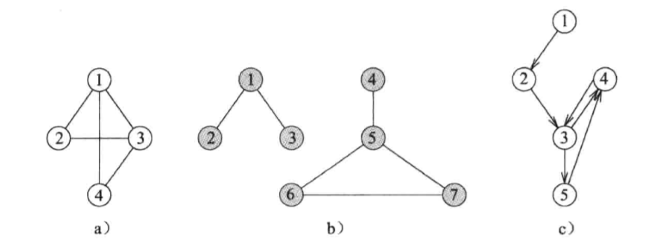
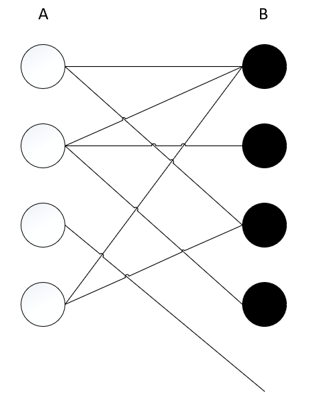

# 图

**图** 是有限集 V 和 E 的有序对，即 G=(V, E)，其中 V 的元素称为 **顶点（也成 节点 或 点）**，E 的元素称为 **边（也成 弧 或 线）**。每一条边连接两个不同的顶点，而且用元组(i, j)来表示，其中 i 和 j 是边所连接的两个顶点。带方向的边叫 **有向边**，而不带方向的边叫 **无向边**。

当且仅当 (i, j) 是图的边，称顶点 i 和 j 是 **邻接的**。边 **关联** 于顶点 i 和 j 。对于有向边来说：(i, j) 是 **关联至** 顶点 j 而 **关联于** 顶点 i；对于无向图来说，“至” 和 “于” 的含义相同。



如果图的所有边都是无向边，那么该图叫做无向图；如果图的所有边都是有向边，那么该图叫做有向图。根据定义，一个图不能有重复的边。在无向图的任意两个顶点之间，最多只能有一条边。在有向图的任意两个顶点 i 和 j 之间，从顶点 i 到顶点 j 最多有一条边，从顶点 j 到顶点 i 也最多有一条边。一个图不可能包含自连边，即 (i, i) 形式的边。自连边也叫做环。

在图的一些应用中，可能要为每条边赋予一个表示成本的值，称之为 **权**。这时的图称为 **加权有向图** 和 **加权无向图**。一个 **网络** 经常指一个加权有向图或加权无向图。

## 更多概念

* **简单路径：** 一条除第一个和最后一个顶点之外，其余所有顶点均不同的路径。
* **路径长度：** 该路径的所有边长度之和。
* **连通图：** G=(V, E) 是一个无向图，且 G 的每一对顶点之间都有一条路径。
* 图 H 是图 G 的 **子图：** H 的顶点和边的集合分别是 G 的顶点和边的集合的子集。
* **环路：** 一条始点和终点相同的简单路径。
* **树：** 没有环路的连通无向图 G。
* **生成树：** G 的子图，并且是包含 G 的所有顶点的一棵树。
* **二分图：** 图 G 的顶点被分为两个子集 A 和 B。每条边都有一个顶点在 A 中，另一个顶点在 B 中。



## 特性

在一个无向图中，与一个顶点 i 相关联的边数称为该顶点的 **度** d。

**特性：** 设 G=(V, E) 是一个无向图。令 n=|V|，e=|E|，则

1. $\sum_{i=1}^n{d_i}$ = 2e
2. 0 <= e <= n(n-1)/2

设 G 是一个有向图。顶点 i 的 **入度** d<sup>in</sup><sub>i</sub> 是指关联至该顶点的边数。顶点 i 的 **出度**  d<sup>out</sup><sub>i</sub> 是指关联于该顶点的边数。

**特性：** 设 G=(V, E) 是一个有向图。令 n=|V|，e=|E|，则

1. $\sum_{i=1}^n{d_i^{in}}$ = $\sum_{i=1}^n{d_i^{out}}$ = e
2. 0 <= e <= n(n-1)

## 抽象数据类型 graph

```
抽象数据类型 graph
{
  实例
    顶点集合 V 和边集合 E

  操作
    numberOfVertices()：返回图的定点数
    numberOfEdge(i, j)：返回图的边数
    existsEdge(i, j)：如果边 (i, j) 存在，返回 true，否则返回 false
    insertEdge(theEdge)：删除边 (i, j)
    eraseEdge(i, j)：删除边
    degree(i)：返回顶点 i 的度。只用于无向图
    inDegree(i)：返回顶点 i 的入度
    outDegree(i)：返回顶点 i 的出度
}
```