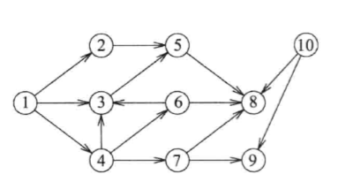

# 图的遍历

## 广度优先搜索

**广度优先搜索算法(Breadth First Search)**，又称为"宽度优先搜索"，简称BFS。

图的 BFS 和二叉树的层次遍历是相似的，其思路是从图上一个源节点出发，先访问其直接相连的子节点，再问其子节点的子节点，按级别顺序依次访问，直到访问到目标节点或全部节点。

    

上图用广度优先搜索算法，设 1 为源节点，则依次访问节点顺序如下：

1，2，3，4，5，6，7，8，9。

## 深度优先搜索

**深度优先搜索算法(Depth First Search)**，简称DFS。

图的 DFS 和二叉树的前序遍历是相似的，其思想是从图上一个源节点出发，沿着一条路一直走到底，如果发现不能到达目标解（已经访问完此路径上的全部节点），那就返回到上一个节点，然后从另一条路开始走到底，直到访问到目标节点或全部节点。

    

上图用深度优先搜索算法，设 1 为源节点，则依次访问节点顺序如下：

1，2，5，8，3，4，6，7，9。
