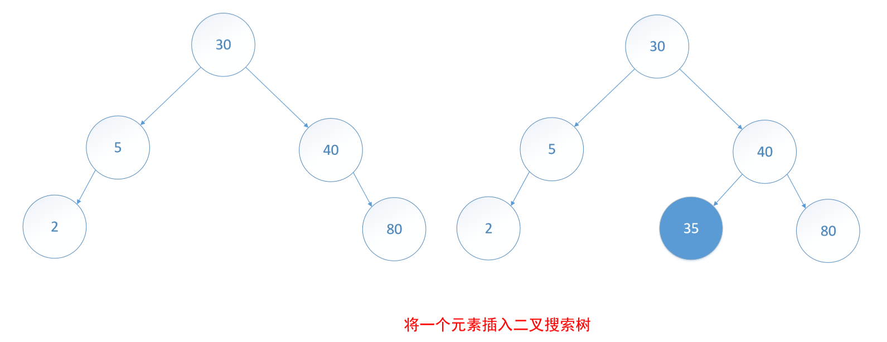
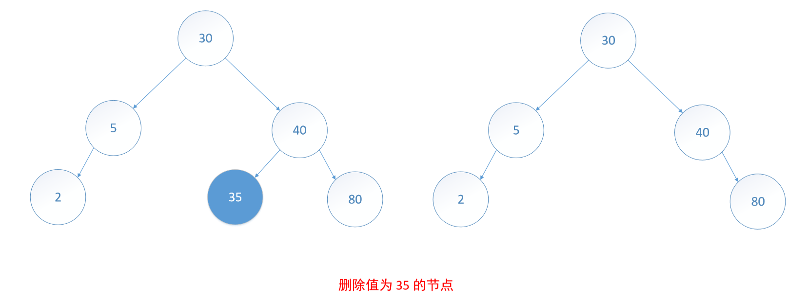
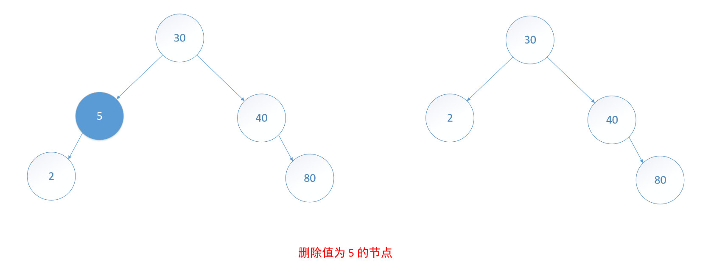
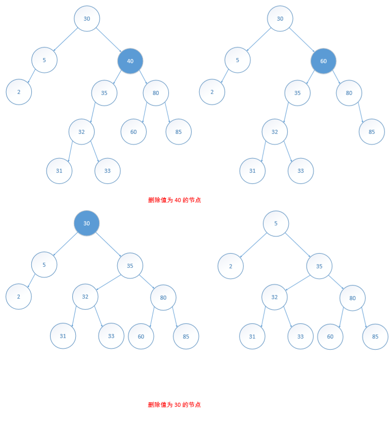

# 二叉搜索树的操作和实现

## 搜索
假设要查找关键字为 theKey 的元素。先从根开始查找。如果根为空，那么搜索树不包括任何元素，即查找失败。如果不空，则将 theKey 与根的关键字相比较。如果 theKey 小，那么只要查找左子树；如果 theKey 大，那么只要查找右子树；如果 theKey 等于根的关键字，则查找成功。在子树的查找与此类似。

## 插入
假设要在二叉搜索树中插入一个新元素 thePair，首先要通过查找来确定，在树中是否存在某个元素，其关键字与 thePair.first 相同。如果搜索成功，那么就用 thePair.second 替代该元素的值；如果搜索不成功，那么就将新元素作为搜索终端节点的孩子插入二叉搜索树。

## 删除
假设要删除的节点是 p，需要考虑三种情况：1) p 是树叶；2) p 只有一棵非空子树；3) p 有两棵非空子树。

1. 要删除的节点是叶节点。处理的方法是释放该叶节点空间，若是根节点，则令根为 NULL。

2. 要删除的节点 p 只有一棵子树。如果 p 没有父节点（即 p 是根节点），则 p 的唯一子树的根节点成为新的搜索树的根节点。如果 p 有父节点 pp，则修改 pp 的指针域，使得它指向 p 的唯一孩子，然后释放节点 p。

3. 要删除的节点 p 具有两棵非空子树。先将该节点的元素替换为它的左子树的最大元素或右子树的最小元素，然后把替换元素的节点删除。
 

注意，右子树的最小关键字节点（左子树的最大关键字节点）要么没有子树，要么只有一颗子树。要在一个节点的左子树中查找关键字最大的元素，先移动到左子树的根，然后沿着右孩子指针移动，直到右孩子指针为 NULL 的节点为止。类似地，要在一个节点的右子树中查找关键字最小的元素，先移动到右子树的根，然后沿着左孩子指针移动，直到左孩子指针为 NULL 的节点为止。

注意，要删除一个左右子树都不为空的元素节点，算法是：先替换，然后删除一个叶子或一个仅有单子树的节点。