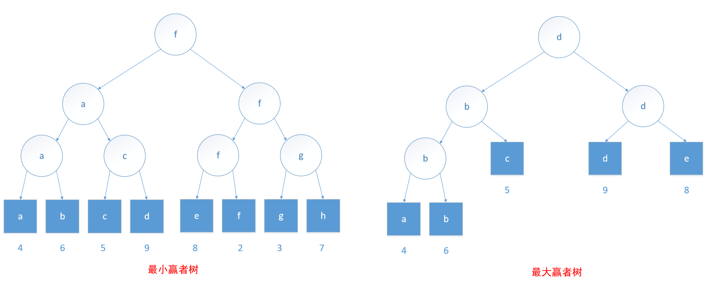

# 赢者树

**赢者树**的每一个内部节点所记录的都是比赛的赢者；**输者树**的每一个内部节点所记录的都是比赛的输者。竞赛树也称为**选择树**。

定义：有 n 个选手的一颗赢者树是一棵完全二叉树，它有 n 个外部节点和 n-1 个内部节点，每个内部节点记录的是在该节点比赛的赢者。

在**最小赢者树**中，分数小的选手获胜；在**最大赢者树**中，分数大的选手获胜；在分数相等，即平局的时候，左孩子表示的选手获胜。



## 抽象数据类型 WinnerTree
```
抽象数据类型
{
  实例
      完全二叉树，每一个内部节点指向比赛胜者；外部节点表示参赛者。
  操作
      initialize(a)：为数组 a 的参赛者初始化胜者树
      winnew()：返回锦标赛胜者
      rePlay()：在参赛者 i 改变之后重赛
}
```