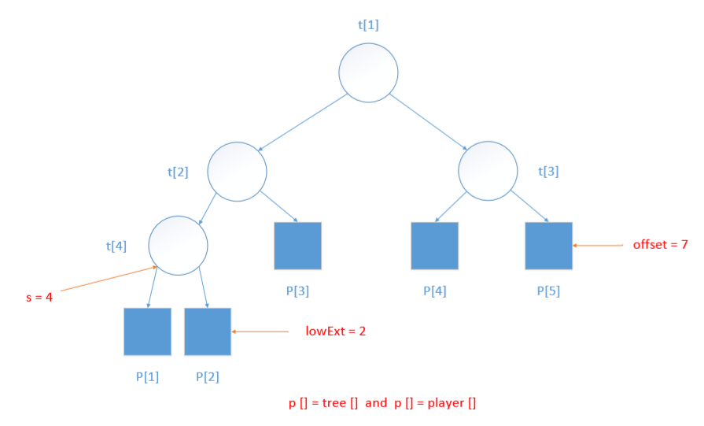

# 赢者树的实现

## 表示
假设用完全二叉树的数组表示来表示赢者树。一棵赢者树有 n 名选手，需要 n-1 个内部节点 tree[1: n-1]。选手（或外部节点）用数组 player[1: n] 表示，因此 tree[i] 是数组player的一个索引，类型为 int。在赢者树的节点 i 对应比赛中，tree[i] 代表赢者。

  

为实现这种对应关系，必须能够确定外部节点 player[i] 的父节点 tree[p]。当外部节点的个数为 n 时，内部节点的个数为 n-1。最底层最左端的内部节点，其编号为 s，且 s=2⌊long2(n-1)⌋。因此，最底层内部节点的个数是 n-s，最底层外部节点个数 **lowExt** 是这个数的 2 倍。令 **offset** = 2*s-1。对于任何一个外部节点 player[i]，其父节点 tree[p] 由以下公式给出：

$$ p = \begin{cases}  
(i + offset) / 2 & i <= lowExt \\
(i - lowExt + n - 1) / 2 & i > lowExt \\
\end{cases}$$

## 赢者树的初始化

为了初始化一棵赢者树，我们从右孩子选手开始，进行他所参加的比赛，而且逐层往上，只要是从右孩子上升到比赛节点，就可以进行在该节点的比赛。为此，要从左往右地考察右孩子选手。

注意，当在节点 tree[i] 进行比赛时，参加该比赛的选手已经确定，而且选手的记录已经存储在节点 tree[i]的子节点中。

## 重新组织比赛

当选手 thePlayer 的值改变时，在从外部节点 player[thePlayer] 到根 tree[1] 的路径上，一部分或全部比赛都需要重赛。