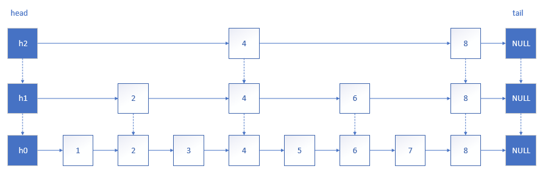
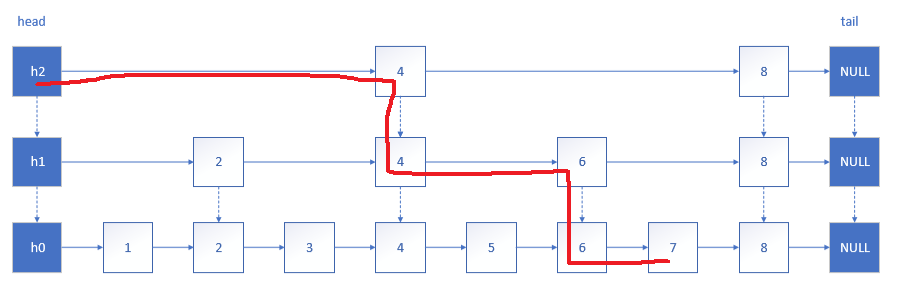
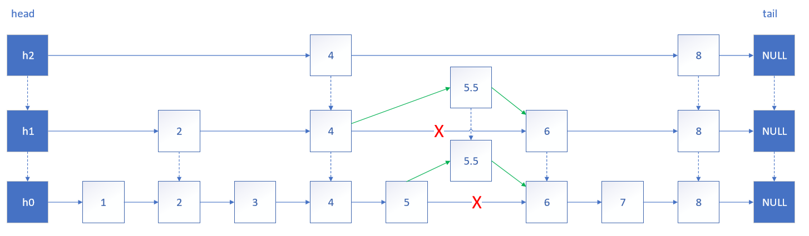
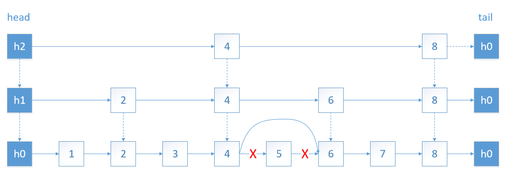

# 跳表
跳表是一个随机化的数据结构，实质就是一种可以进行二分查找的有序链表。跳表在原有的有序链表上面增加了多级索引，通过索引来实现快速查找。跳表不仅能提高搜索性能，同时也可以提高插入和删除操作的性能。

**查找**

跳表自上而下依次查找，当元素的值大于当前节点并小于下一节点时，进入下一层查找，依次类推。

例如：查找元素 7 的过程如下图

**插入**

在跳表中插入元素，首先要确定它的 **级数**，即该元素最高出现在几级链表。假设 n+1 级链表元素的个数是 n
级链表元素个数的 p ，则当元素插入 n 级链表后继续插入 n+1 级链表的概率的 p。（标准跳表中，p = 1/2）

为避免某些元素被分配的级数特别大，远远超过 log1/pN（N 是最大的元素预期数目），可以设定一个级数的上限 maxLevel，最大值为 **(log1/pN) - 1**。

**删除**

**注意：**
* 0 级列表包含所有元素。
* 如果一个元素出现在 n+1 级链表，那么它肯定出现在 n 级及以下的链表中。
* 跳表查询、插入、删除的时间复杂度为O(log n)，与平衡二叉树接近。