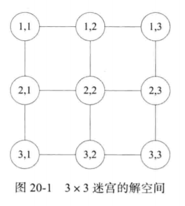
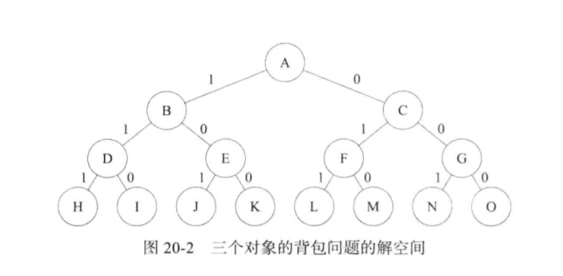

# 回溯算法思想

**回溯法** 是搜索问题解的一种系统方法，其步骤为：
1. 定义问题的一个 **解空间**。这个空间至少包含问题的一个（最优的）解。
2. 组织解空间，使解空间便于搜索，典型的组织方法是图或树。

3. 了解空间的组织方法后，在这个空间按深度优先方法从开始节点搜索。

开始节点就是一个活动节点，又是一个 E-节点。从 E-节点试着移到一个新节点，这个新节点就变成一个活动节点和新的 E-节点。而原来的 E-节点仍是一个活动节点。如果不能移到一个新节点，那么当前 E-节点 “死掉”，即不再是活动节点。然后回到最近的活动节点，这个活动节点变成了新的 E-节点。当已经找到答案或者不再有活动节点时，搜索过程结束。

* 当问题需要 n 个元素的一个子集来优化函数时，解空间树称为 **子集树**。
* 当问题需要 n 个元素的一个排列来优化函数时，解空间树称为 **排列树**。

确定一个新到达的节点能否导致一个比当前最优解还要好的解，可加速对最优解的搜索过程。如果不能，则移动到该节点的任何一颗子树都是无意义的，这个节点可被立即杀死。用来杀死活动节点的策略称为 **界定函数**。