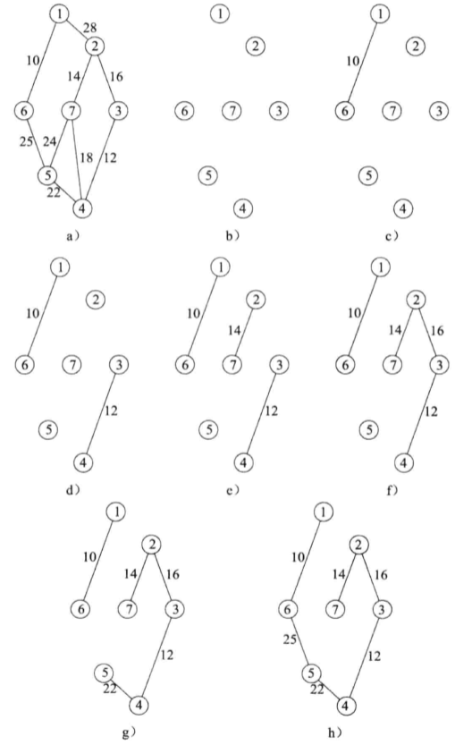
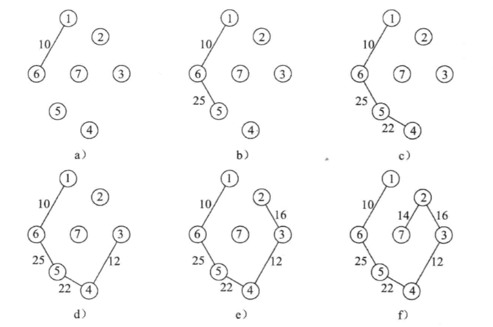
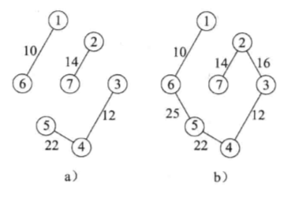

# 最小生成树

在 n 个顶点的图 G 中，每棵生成树都刚好有 n-1 条边。选择 n-1 条边使它们形成 G 的最小成本生成树。

## Kruskal 算法
Kruskal 算法分步骤选择 n-1 条边，每步选择一条边，所依据的贪婪准则是：**从剩下的边中选择一条成本最小且不会产生环路的边加入已选择的边集。**

**例：** 利用 Kruskal 算法构造最小生成树步骤如下

      
 
## Prim 算法

Prim 算法与 Kruskal 算法类似，通过分步骤选边来创建最小生成树，而且一步选择一条边。每步选边所依据的贪婪准则是：**从剩余的边中，选择一条成本最小的边，并且把它加入已选的边集中形成一棵新的树。**

**例：** 利用 Prim 算法构造最小生成树步骤如下

    

## Sollin 算法

Sollin 算法的思想是：初始时，令图中每个顶点表示一棵树，原图构成一个森林 T；之后为 T 中每棵树选择一个最小成本边，使其加入后仍是一棵树；重复上述步骤，直到 T 中只有一棵树为止。注意：当森林的两棵树选择同一边时，一方必须放弃；当有若干条边具有相同的成本，且两棵树选择不同边后相互连通时，一方必须放弃。

**例：** 利用 Sollin 算法构造最小生成树步骤如下（初始图与  Kruskal 算法例图相同）

   