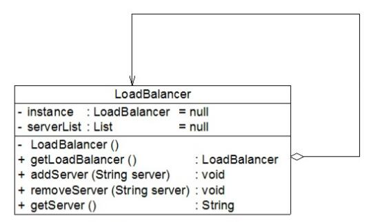

# 单例模式应用实例
## 实例说明
> 某软件公司承接了一个服务器负载均衡(Load Balance)软件的开发工作，该软件运行在一台负载均衡服务器上，可以将并发访问和数据流量分发到服务器集群中的多台设备上进行并发处理，提高系统的整体处理能力，缩短响应时间。由于集群中的服务器需要动态删减，且客户端请求需要统一分发，因此需要确保负载均衡器的唯一性，只能有一个负载均衡器来负责服务器的管理和请求的分发，否则将会带来服务器状态的不一致以及请求分配冲突等问题。如何确保负载均衡器的唯一性是该软件成功的关键，试使用单例模式设计服务器负载均衡器。

## 实例类图


## 实例代码
```
//负载均衡器LoadBalancer：充当单例角色
public class LoadBalancer {  
    //私有静态成员变量，存储唯一实例  
    private static LoadBalancer instance = null;  
    //服务器集合  
    private List serverList = null;  

    //私有构造函数  
    private LoadBalancer() {  
        serverList = new ArrayList();  
    }  

    //公有静态成员方法，返回唯一实例  
    public static LoadBalancer getLoadBalancer() {  
        if (instance == null) {  
            instance = new LoadBalancer();  
        }  
        return instance;  
    }  

    //增加服务器  
    public void addServer(String server) {  
        serverList.add(server);  
    }  

    //删除服务器  
    public void removeServer(String server) {  
        serverList.remove(server);  
    }  

    //使用Random类随机获取服务器  
    public String getServer() {  
        Random random = new Random();  
        int i = random.nextInt(serverList.size());  
        return (String)serverList.get(i);  
    }  
}
```
编写如下客户端测试代码：
```
public class Client {  
    public static void main(String args[]) {  
        //创建四个LoadBalancer对象  
        LoadBalancer balancer1,balancer2,balancer3,balancer4;  
        balancer1 = LoadBalancer.getLoadBalancer();  
        balancer2 = LoadBalancer.getLoadBalancer();  
        balancer3 = LoadBalancer.getLoadBalancer();  
        balancer4 = LoadBalancer.getLoadBalancer();  

        //判断服务器负载均衡器是否相同  
        if (balancer1 == balancer2 && balancer2 == balancer3 && balancer3 == balancer4) {  
            System.out.println("服务器负载均衡器具有唯一性！");  
        }  

        //增加服务器  
        balancer1.addServer("Server 1");  
        balancer1.addServer("Server 2");  
        balancer1.addServer("Server 3");  
        balancer1.addServer("Server 4");  

        //模拟客户端请求的分发  
        for (int i = 0; i < 10; i++) {  
            String server = balancer1.getServer();  
            System.out.println("分发请求至服务器： " + server);  
      }  
    }  
}
```
编译并运行程序，输出结果如下：
```
服务器负载均衡器具有唯一性！
分发请求至服务器：  Server 1
分发请求至服务器：  Server 3
分发请求至服务器：  Server 4
分发请求至服务器：  Server 2
分发请求至服务器：  Server 3
分发请求至服务器：  Server 2
分发请求至服务器：  Server 3
分发请求至服务器：  Server 4
分发请求至服务器：  Server 4
分发请求至服务器：  Server 1
```
虽然创建了四个LoadBalancer对象，但是它们实际上是同一个对象，因此，通过使用单例模式可以确保LoadBalancer对象的唯一性。

