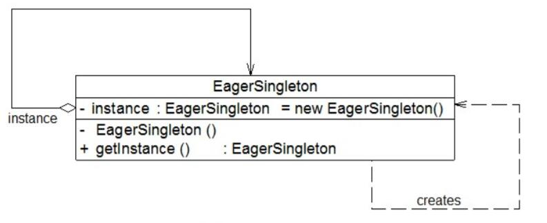
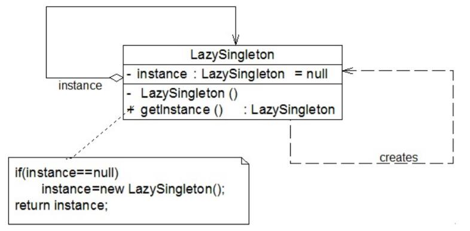

# 饿汉式单例与懒汉式单例
## 饿汉式单例类
饿汉式单例类是实现起来最简单的单例类。

```
public class EagerSingleton {   
    private static final EagerSingleton instance = new EagerSingleton();   
    
    private EagerSingleton() { }   

    public static EagerSingleton getInstance() {  
        return instance;   
    }     
}
```
当类被加载时，静态变量instance会被初始化，此时类的私有构造函数会被调用，单例类的唯一实例将被创建。

## 懒汉式单例与双重检查锁定

懒汉式单例在第一次调用getInstance()方法时实例化，在类加载时并不自行实例化，这种技术又称为延迟加载(Lazy Load)技术，即需要的时候再加载实例，为了避免多个线程同时调用getInstance()方法，可以使用关键字**synchronized**，代码如下所示:
```
public class LazySingleton {   
    private static LazySingleton instance = null;   

    private LazySingleton() { }   


    synchronized public static LazySingleton getInstance() {   
        if (instance == null) {  
            instance = new LazySingleton();   
        }  
        return instance;   
    }  
}
```
上述懒汉式单例类在getInstance()方法前面增加了关键字synchronized进行线程锁定，以处理多个线程同时访问的问题。上述代码虽然解决了线程安全问题，但是每次调用getInstance()时都需要进行线程锁定判断，在多线程高并发访问环境中，将会导致系统性能大大降低。因此可以继续对懒汉式单例进行改进。事实上，无须对整个getInstance()方法进行锁定，只需对其中的代码“instance = new LazySingleton();”进行锁定即可。因此getInstance()方法可以进行如下改进：
```
···
public static LazySingleton getInstance() {   
    if (instance == null) {  
        synchronized (LazySingleton.class) {  
            instance = new LazySingleton();   
        }  
    }  
    return instance;   
}
···
```
问题貌似得以解决，事实并非如此。如果使用以上代码来实现单例，还是会存在单例对象不唯一。原因如下：
假如在某一瞬间线程A和线程B都在调用getInstance()方法，此时instance对象为null值，均能通过"instance == null"的判断。由于实现了synchronized加锁机制，线程A进入synchronized锁定的代码中执行实例创建代码，线程B处于排队等待状态，必须等待线程A执行完毕后才可以进入synchronized锁定代码。但当A执行完毕时，线程B并不知道实例已经创建，将继续创建新的实例，导致产生多个单例对象，违背单例模式的设计思想，因此需要进行进一步改进，在synchronized中再进行一次(instance == null)判断，这种方式称为双重检查锁定(Double-Check Locking)。使用双重检查锁定实现的懒汉式单例类完整代码如下所示：
```
public class LazySingleton {   
    private volatile static LazySingleton instance = null;   

    private LazySingleton() { }   

    public static LazySingleton getInstance() {   
        //第一重判断  
        if (instance == null) {  
            //锁定代码块  
            synchronized (LazySingleton.class) {  
                //第二重判断  
                if (instance == null) {  
                    instance = new LazySingleton(); //创建单例实例  
                }  
            }  
        }  
        return instance;   
    }  
}
```
需要注意的是，如果使用双重检查锁定来实现懒汉式单例类，需要在静态成员变量instance之前增加修饰符volatile，被volatile修饰的成员变量可以确保多个线程都能够正确处理，且该代码只能在JDK 1.5及以上版本中才能正确执行。由于volatile关键字会屏蔽Java虚拟机所做的一些代码优化，可能会导致系统运行效率降低，因此即使使用双重检查锁定来实现单例模式也不是一种完美的实现方式。

## 饿汉式单例类与懒汉式单例类的比较
饿汉式单例类在类被加载时就将自己实例化，它的优点在于无须考虑多线程访问问题，可以确保实例的唯一性；从调用速度和反应时间角度来讲，由于单例对象一开始就得以创建，因此要优于懒汉式单例。但是无论系统在运行时是否需要使用该单例对象，由于在类加载时该对象就需要创建，因此从资源利用效率角度来讲，饿汉式单例不及懒汉式单例，而且在系统加载时由于需要创建饿汉式单例对象，加载时间可能会比较长。

懒汉式单例类在第一次使用时创建，无须一直占用系统资源，实现了延迟加载，但是必须处理好多个线程同时访问的问题，特别是当单例类作为资源控制器，在实例化时必然涉及资源初始化，而资源初始化很有可能耗费大量时间，这意味着出现多线程同时首次引用此类的机率变得较大，需要通过双重检查锁定等机制进行控制，这将导致系统性能受到一定影响。

## 使用静态内部类实现单例模式
饿汉式单例类不能实现延迟加载，不管将来用不用始终占据内存；懒汉式单例类线程安全控制烦琐，而且性能受影响。可见，无论是饿汉式单例还是懒汉式单例都存在这样那样的问题。为了克服这些问题，在Java语言中可以通过Initialization Demand Holder (IoDH)技术来实现单例模式。

在IoDH中，需要在单例类中增加一个静态(static)内部类，在该内部类中创建单例对象，再将该单例对象通过getInstance()方法返回给外部使用，实现代码如下所示：
```
//Initialization on Demand Holder
public class Singleton {
    private Singleton() {
    }
    private static class HolderClass {
        private final static Singleton instance = new Singleton();
    }
    public static Singleton getInstance() {
        return HolderClass.instance;
    }
    public static void main(String args[]) {
        Singleton s1, s2;
        s1 = Singleton.getInstance();
        s2 = Singleton.getInstance();
        System.out.println(s1==s2);
    }
}
```
编译并运行上述代码，运行结果为：true，即创建的单例对象s1和s2为同一对象。由于静态单例对象没有作为Singleton的成员变量直接实例化，因此类加载时不会实例化Singleton，第一次调用getInstance()时将加载内部类HolderClass，在该内部类中定义了一个static类型的变量instance，此时会首先初始化这个成员变量，由Java虚拟机来保证其线程安全性，确保该成员变量只能初始化一次。由于getInstance()方法没有任何线程锁定，因此其性能不会造成任何影响。

通过使用IoDH，我们既可以实现延迟加载，又可以保证线程安全，不影响系统性能，不失为一种最好的Java语言单例模式实现方式（其缺点是与编程语言本身的特性相关，很多面向对象语言不支持IoDH）