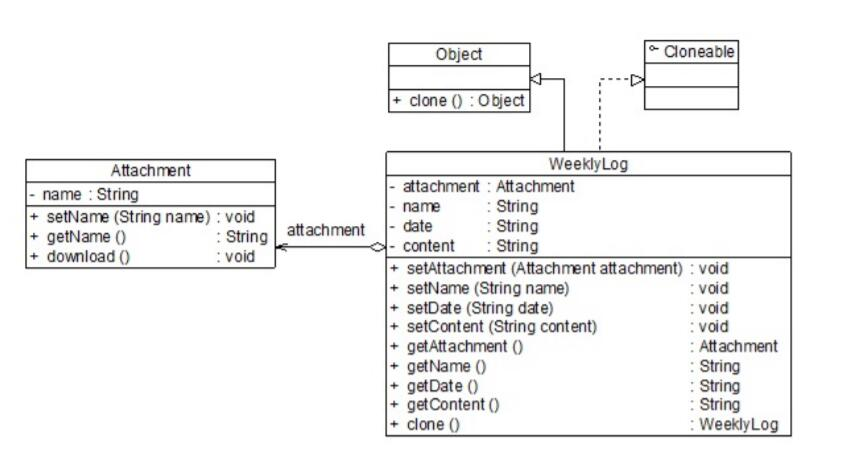
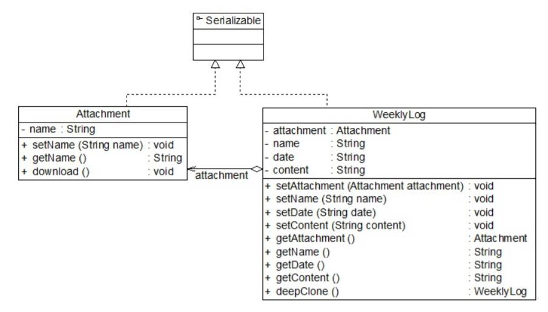

# 原型模式应用实例
## 实例说明
> 在使用某OA系统时，有些岗位的员工发现他们每周的工作都大同小异，因此在填写工作周报时很多内容都是重复的，为了提高工作周报的创建效率，大家迫切希望有一种机制能够快速创建相同或者相似的周报，包括创建周报的附件。
>
>试使用原型模式对该OA系统中的工作周报创建模块进行改进。

## 实例类图


## 实例代码
```
//附件类
public class Attachment
{
    private String name; //附件名
    public void setName(String name)
    {
        this.name = name;
    }
    public String getName()
    {
        return this.name;
    }
    public void download()
    {
        System.out.println("下载附件，文件名为" + name);
    }
}

//工作周报WeeklyLog
public class WeeklyLog implements Cloneable
{
    //为了简化设计和实现，假设一份工作周报中只有一个附件对象，实际情况中可以包含多个附件，可以通过List等集合对象来实现
    private Attachment attachment;
    private String name;
    private String date;
    private String content;
       
    public void setAttachment(Attachment attachment) {
      this.attachment = attachment;
    }
       
    public void setName(String name) {
        this.name = name;
    }

    public void setDate(String date) {
        this.date = date;
    }

    public void setContent(String content) {
        this.content = content;
    }

    public Attachment  getAttachment(){
        return (this.attachment);
    }

    public String getName() {
        return (this.name);
    }

    public String getDate() {
        return (this.date);
    }

    public String getContent() {
        return (this.content);
    }

    //使用clone()方法实现浅克隆
    public WeeklyLog clone()
    {
        Object obj = null;
        try
        {
            obj = super.clone();
            return (WeeklyLog)obj;
        }
        catch(CloneNotSupportedException  e){
            System.out.println("不支持复制！");
            return null;
        }
    }
}

//客户端测试类
public class Client
{
    public static void main(String args[])
    {
        WeeklyLog log_previous, log_new;
        log_previous = new WeeklyLog(); //创建原型对象
        Attachment attachment = new Attachment(); //创建附件对象
        log_previous.setAttachment(attachment);  //将附件添加到周报中
        log_new = log_previous.clone(); //调用克隆方法创建克隆对象
        //比较周报
        System.out.println("周报是否相同？ " + (log_previous ==  log_new));
        //比较附件
        System.out.println("附件是否相同？ " +  (log_previous.getAttachment() == log_new.getAttachment()));
    }
}
```
编译并运行程序，输出结果如下：
```
周报是否相同？ false
附件是否相同？ true
```
从输出结果可以得知，周报对象被成功复制，但是对象并没有被复制，实现了浅克隆。

## 深克隆解决方案
如果需要采用深克隆机制，在Java语言中，可以通过序列化(Serialization)等方式来实现。序列化就是将对象写到流的过程，写到流中的对象是原有对象的一个复制，而原对象仍然存在于内存中。通过序列化实现的复制不仅可以复制对象本身，而且可以复制其引用的成员对象，因此通过序列化将对象写到一个流中，再从流里将其读出来，可以实现深克隆。需要注意的是能够实现序列化的对象其类必须实现Serializable接口，否则无法实现序列化操作。

下面使用深克隆技术来实现工作周报和附件对象的复制，由于要将附件对象和工作周报对象都写入流中，因此两个类均需要实现Serializable接口，其结构如下所示：



```
//附件类
public class Attachment implements Serializable
{
    private String name; //附件名

    public void setName(String name)
    {
        this.name = name;
    }

    public String getName()
    {
        return this.name;
    }

    public void download()
    {
        System.out.println("下载附件，文件名为" + name);
    }
}

//工作周报类
public class WeeklyLog implements Serializable
{
    private Attachment attachment;
    private String name;
    private String date;
    private String content;

    public void setAttachment(Attachment attachment) {
        this.attachment = attachment;
    }
    public void setName(String name) {
        this.name = name;
    }
    public void setDate(String date) {
        this.date = date;
    }
    public void setContent(String content) {
        this.content = content;
    }
    public Attachment getAttachment(){
        return (this.attachment);
    }
    public String getName() {
        return (this.name);
    }
    publi String getDate() {
        return (this.date);
    }
    public String getContent() {
        return (this.content);
    }

    //使用序列化技术实现深克隆
    public WeeklyLog deepClone() throws IOException, ClassNotFoundException, OptionalDataException
    {
        //将对象写入流中
        ByteArrayOutputStream bao=new ByteArrayOutputStream();
        ObjectOutputStream oos=new ObjectOutputStream(bao);
        oos.writeObject(this);

        //将对象从流中取出
        ByteArrayInputStream bis=new ByteArrayInputStream(bao.toByteArray());
        ObjectInputStream ois=new ObjectInputStream(bis);
        return (WeeklyLog)ois.readObject();
    }
}

//客户端类
public class Client
{
    public static void main(String args[])
    {
        WeeklyLog log_previous, log_new = null;
        log_previous = new WeeklyLog(); //创建原型对象
        Attachment attachment = new Attachment(); //创建附件对象
        log_previous.setAttachment(attachment);  //将附件添加到周报中
        try{
            log_new = log_previous.deepClone(); //调用深克隆方法创建克隆对象
        }
        catch(Exception e){
            System.err.println("克隆失败！");
        }
        //比较周报
        System.out.println("周报是否相同？ " + (log_previous ==  log_new));
        //比较附件
        System.out.println("附件是否相同？ " +  (log_previous.getAttachment() == log_new.getAttachment()));
    }
}
```
编译并运行程序，输出结果如下：
```
周报是否相同？  false
附件是否相同？  false
```
