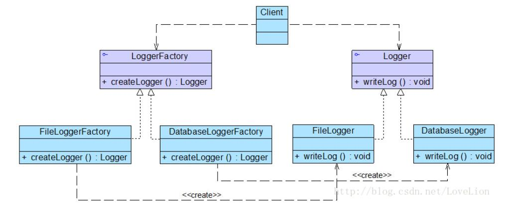

# 工厂方法模式应用实例
## 实例说明
>某系统运行日志记录器(Logger)可以通过多种途径保存系统的运行日志，例如通过文件记录或数据库记录，用户可以通过修改配置文件灵活地更换日志记录方式。在设计各类日志记录器时，开发人员发现需要对日志记录器进行一些初始化工作，初始化参数的设置过程较为复杂，而且某些参数的设置有严格的先后次序，否则可能会发生记录失败。
>
>为了更好地封装记录器的初始化过程并保证多种记录器切换的灵活性，现使用工厂模式设计该系统（注：在Java中常见的日志记录工具有SLF4J、Log4j、GCLogViewew、Logstash等）。

## 实例类图


## 实例代码
```
//日志记录器接口：抽象产品  
public interface Logger {  
    public void writeLog();  
}  

//数据库日志记录器：具体产品  
public class DatabaseLogger implements Logger {  
    public void writeLog() {  
        System.out.println("数据库日志记录。");  
    }  
}  

//文件日志记录器：具体产品  
public class FileLogger implements Logger {  
    public void writeLog() {  
        System.out.println("文件日志记录。");  
    }  
}  

//日志记录器工厂接口：抽象工厂  
public interface LoggerFactory {  
    public Logger createLogger();  
}  

//数据库日志记录器工厂类：具体工厂  
public class DatabaseLoggerFactory implements LoggerFactory {  
    public Logger createLogger() {  
        //连接数据库，代码省略  
        //创建数据库日志记录器对象  
        Logger logger = new DatabaseLogger();   
        //初始化数据库日志记录器，代码省略  
        return logger;  
    }     
}  

//文件日志记录器工厂类：具体工厂  
public class FileLoggerFactory implements LoggerFactory {  
    public Logger createLogger() {  
        //创建文件日志记录器对象  
        Logger logger = new FileLogger();   
        //创建文件，代码省略  
        return logger;  
    }     
}

//客户端测试类
public class Client {  
    public static void main(String args[]) {  
        LoggerFactory factory;  
        Logger logger;  
        factory = (LoggerFactory)XMLUtil.getBean(); //getBean()的返回类型为Object，需要进行强制类型转换  
        logger = factory.createLogger();  
        logger.writeLog();  
    }  
}
```
编译并运行程序，输出结果如下：
```
文件日志记录。
```