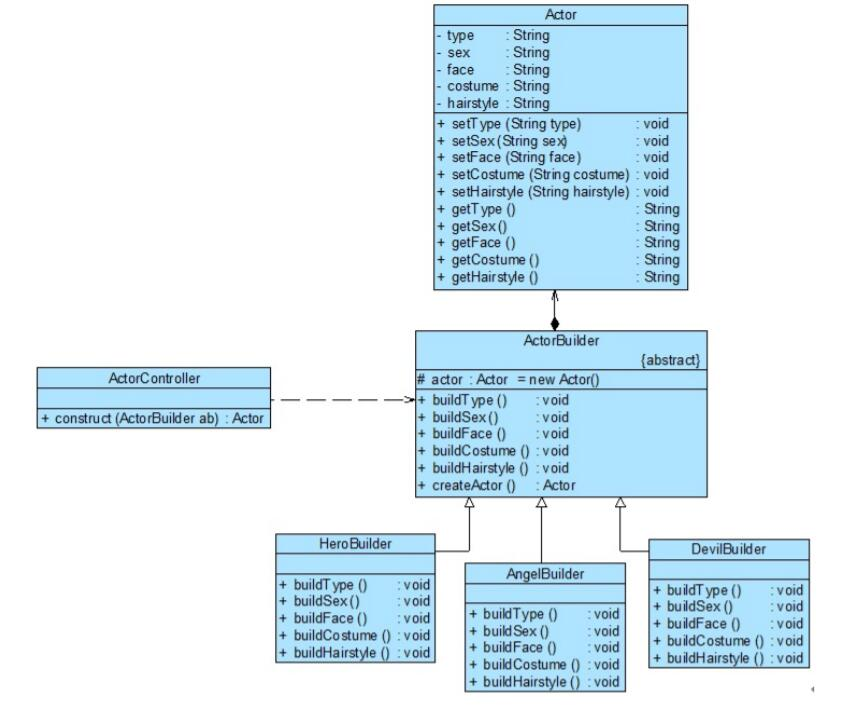

# 建造者模式应用实例
## 实例说明
> 某游戏公司决定开发一款基于角色扮演的多人在线网络游戏，玩家可以在游戏中扮演虚拟世界中的一个特定角色，角色根据不同的游戏情节和统计数据（例如力量、魔法、技能等）具有不同的能力，角色也会随着不断升级而拥有更加强大的能力。
>
>作为该游戏的一个重要组成部分，需要对游戏角色激进型设计，而且随着该游戏的升级将不断增加新的角色。通过分析发现，游戏角色是一个复杂对象，它包含性别、脸型等多个组成部分，不同类型的游戏角色，其性别、脸型、服装、发型等外部特性都有所差异，例如“天使”拥有美丽的面容和披肩的长发，并身穿一袭白裙；而“恶魔”极其丑陋，留着光头并穿一件刺眼的黑衣。
>
>无论是何种造型的游戏角色，它的创建步骤的大同小异，都需要逐步创建其组成部分，再将各组成部分装配成一个完整的游戏角色。
>
>试使用建造者模式来实现游戏角色的创建。

## 实例类图


## 实例代码
```
//游戏角色类：复杂产品对象
public class Actor
{
    private String type; //角色类型
    private String sex; //性别
    private String face; //脸型
    private String costume; //服装
    private String hairstyle; //发型

    public void setType(String type) {
        this.type = type;
    }
    public void setSex(String sex) {
        this.sex = sex;
    }
    public void setFace(String face) {
        this.face = face;
    }
    public void setCostume(String costume) {
        this.costume = costume;
    }
    public void setHairstyle(String hairstyle) {
        this.hairstyle = hairstyle;
    }
    public String getType() {
        return (this.type);
    }
    public String getSex() {
        return (this.sex);
    }
    public String getFace() {
        return (this.face);
    }
    public String getCostume() {
        return (this.costume);
    }
    public String getHairstyle() {
        return (this.hairstyle);
    }
}

//角色建造器：抽象建造者
public abstract class ActorBuilder
{
    protected Actor actor = new Actor();

    public abstract void buildType();
    public abstract void buildSex();
    public abstract void buildFace();
    public abstract void buildCostume();
    public abstract void buildHairstyle();

    //工厂方法，返回一个完整的游戏角色对象
    public Actor createActor()
    {
        return actor;
    }
}

//英雄角色建造器：具体建造者
public class HeroBuilder extends ActorBuilder
{
    public void buildType()
    {
        actor.setType("英雄");
    }
    public void buildSex()
    {
        actor.setSex("男");
    }
    public void buildFace()
    {
        actor.setFace("英俊");
    }
    public void buildCostume()
    {
        actor.setCostume("盔甲");
    }
    public void buildHairstyle()
    {
        actor.setHairstyle("飘逸");
    }    
}

//天使角色建造器：具体建造者
public class AngelBuilder extends ActorBuilder
{
    public void buildType()
    {
        actor.setType("天使");
    }
    public void buildSex()
    {
        actor.setSex("女");
    }
    public void buildFace()
    {
        actor.setFace("漂亮");
    }
    public void buildCostume()
    {
        actor.setCostume("白裙");
    }
    public void buildHairstyle()
    {
        actor.setHairstyle("披肩长发");
    }    
}

//恶魔角色建造器：具体建造者
public class DevilBuilder extends ActorBuilder
{
    public void buildType()
    {
        actor.setType("恶魔");
    }
    public void buildSex()
    {
        actor.setSex("妖");
    }
    public void buildFace()
    {
        actor.setFace("丑陋");
    }
    public void buildCostume()
    {
        actor.setCostume("黑衣");
    }
    public void buildHairstyle()
    {
        actor.setHairstyle("光头");
    }    
}

//游戏角色创建控制器：指挥者
public class ActorController
{
    //逐步构建复杂产品对象
    ublic Actor construct(ActorBuilder ab)
    {
        Actor actor;
        ab.buildType();
        ab.buildSex();
        ab.buildFace();
        ab.buildCostume();
        ab.buildHairstyle();
        actor=ab.createActor();
        return actor;
    }
}

//配置文件
<?xml version="1.0"?>
<config>
    <classNmae>designpatterns.builder.AngelBuilder</className>
</config>

//客户端测试类
public class Client
{
    public  static void main(String args[])
    {
        ActorBuilder ab; //针对抽象建造者编程
        ab =  (ActorBuilder)XMLUtil.getBean(); //反射生成具体建造者对象

        ActorController ac = new  ActorController();
        Actor actor;
        actor = ac.construct(ab); //通过指挥者创建完整的建造者对象

        String  type = actor.getType();
        System.out.println(type  + "的外观：");
        System.out.println("性别：" + actor.getSex());
        System.out.println("面容：" + actor.getFace());
        System.out.println("服装：" + actor.getCostume());
        System.out.println("发型：" + actor.getHairstyle());
    }
}
```
编译并运行程序，输出结果如下：
```
天使的外观：
性别：女
面容：漂亮
服装：白裙
发型：披肩长发
```

