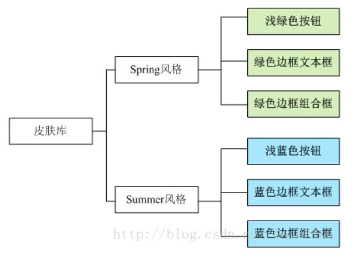
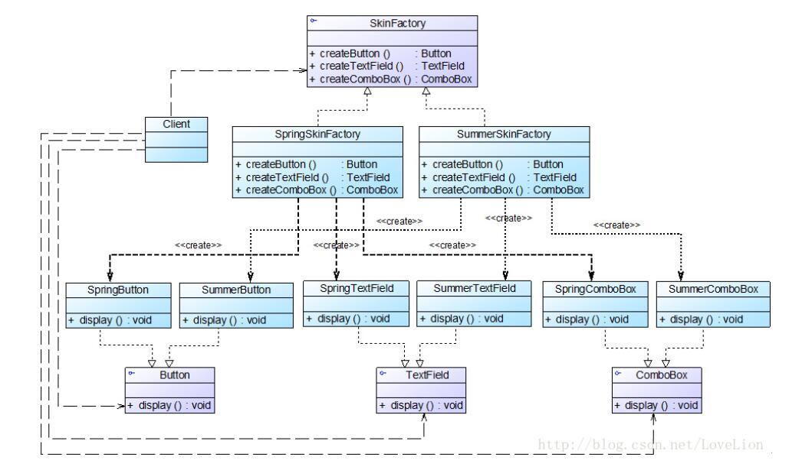

# 抽象工厂模式应用实例
## 实例说明
> 某软件公司要开发一套界面皮肤库，可以对基于Java的桌面软件进行界面美化。用户在使用时可以通过菜单来选择皮肤，不同的皮肤将提供视觉效果不同的按钮、文本框、组合栏等界面元素，例如：春天(Spring)风格的皮肤将提供浅绿色的按钮、浅绿色边框的文本框和浅绿色边框的组合框；而夏天(Summer)风格的皮肤则提供浅蓝色的按钮、浅蓝色边框的文本框和浅蓝色边框的组合框，其结构如图所示。
>
>
>
>该皮肤库需要具备良好的灵活性和可扩展性，用户可以自由选择不同的皮肤，开发人员可以在不修改既有代码的基础上增加新的皮肤。
>
> 试使用抽象工厂模式来设计该界面库。

## 实例类图


## 实例代码
```
//按钮接口：抽象产品  
public interface Button {  
    public void display();  
}  

//Spring按钮类：具体产品  
public class SpringButton implements Button {  
    public void display() {  
        System.out.println("显示浅绿色按钮。");  
    }  
}  

//Summer按钮类：具体产品  
public class SummerButton implements Button {  
    public void display() {  
        System.out.println("显示浅蓝色按钮。");  
    }     
}  

//文本框接口：抽象产品  
public interface TextField {  
    public void display();  
}  

//Spring文本框类：具体产品  
public class SpringTextField implements TextField {  
    public void display() {  
        System.out.println("显示绿色边框文本框。");  
    }  
}  

//Summer文本框类：具体产品  
public class SummerTextField implements TextField {  
    public void display() {  
        System.out.println("显示蓝色边框文本框。");  
    }     
}  

//组合框接口：抽象产品  
public interface ComboBox {  
    public void display();  
}  

//Spring组合框类：具体产品  
public class SpringComboBox implements ComboBox {  
    public void display() {  
        System.out.println("显示绿色边框组合框。");  
    }  
}  

//Summer组合框类：具体产品  
public class SummerComboBox implements ComboBox {  
    public void display() {  
        System.out.println("显示蓝色边框组合框。");  
    }     
}  

//界面皮肤工厂接口：抽象工厂  
public interface SkinFactory {  
    public Button createButton();  
    public TextField createTextField();  
    public ComboBox createComboBox();  
}  

//Spring皮肤工厂：具体工厂  
public class SpringSkinFactory implements SkinFactory {  
    public Button createButton() {  
        return new SpringButton();  
    }  

    public TextField createTextField() {  
        return new SpringTextField();  
    }  

    public ComboBox createComboBox() {  
        return new SpringComboBox();  
    }  
}  

//Summer皮肤工厂：具体工厂  
public class SummerSkinFactory implements SkinFactory {  
    public Button createButton() {  
        return new SummerButton();  
    }  

    public TextField createTextField() {  
        return new SummerTextField();  
    }  

    public ComboBox createComboBox() {  
        return new SummerComboBox();  
    }  
}

//客户端测试类
public class Client {  
    public static void main(String args[]) {  
        //使用抽象层定义  
        SkinFactory factory;  
        Button bt;  
        TextField tf;  
        ComboBox cb;  
        factory = (SkinFactory)XMLUtil.getBean();  
        bt = factory.createButton();  
        tf = factory.createTextField();  
        cb = factory.createComboBox();  
        bt.display();  
        tf.display();  
        cb.display();  
    }  
}
```

编译并运行程序，输出结果如下：
```
显示浅绿色按钮。
显示绿色边框文本框。
显示绿色边框组合框。
```
如果需要更换皮肤，只需修改配置文件即可。在实际环境中，可以提供一个可视化界面，例如菜单或者窗口来修改配置文件，用户无须直接修改配置文件。如果需要增加新的皮肤，只需增加一族新的具体组件并对应提供一个新的具体工厂，修改配置文件即可使用新的皮肤，原有代码无须修改，符合“开闭原则”。