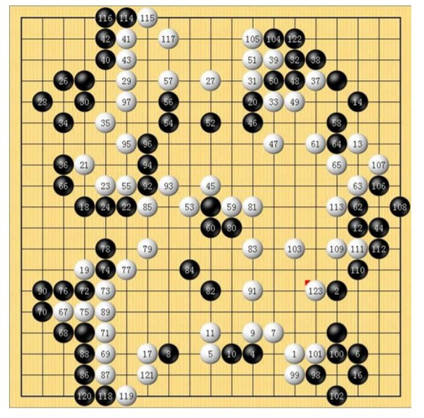
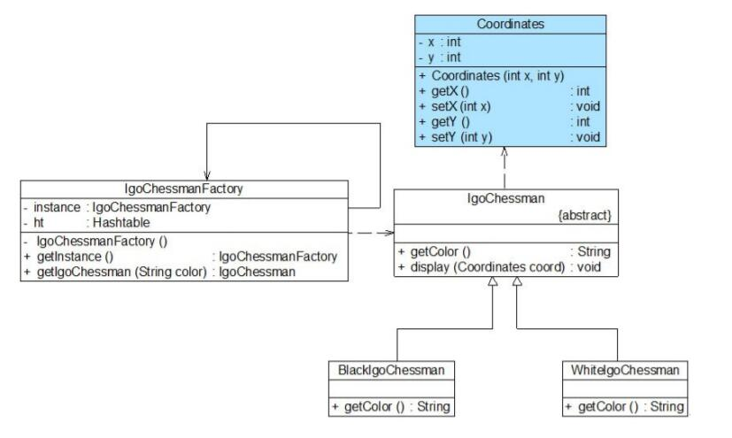

# 享元模式应用实例
## 实例说明
> 某软件公司欲开发一个围棋软件，其界面效果如图所示：
>
> 
>
>软件公司开发人员通过对围棋软件进行分析，发现在围棋棋盘中包含大量的黑子和白子，它们的形状、大小都一模一样，只是出现的位置不同而已。如果将每一个棋子都作为一个独立的对象存储在内存中，将导致该围棋软件在运行时所需内存空间较大，如何降低运行代价、提高系统性能是Sunny公司开发人员需要解决的一个问题。
为了解决该问题，现使用享元模式来设计该围棋软件的棋子对象。

## 实例类图


## 实例代码
```
//坐标类：外部状态类  
public class Coordinates {  
    private int x;  
    private int y;  

    public Coordinates(int x,int y) {  
        this.x = x;  
        this.y = y;  
    }  

    public int getX() {  
        return this.x;  
    }  

    public void setX(int x) {  
        this.x = x;  
    }  

    public int getY() {  
        return this.y;  
    }  

    public void setY(int y) {  
        this.y = y;  
    }  
}   

//围棋棋子类：抽象享元类  
public abstract class IgoChessman {  
    public abstract String getColor();  

    public void display(Coordinates coord){  
        System.out.println("棋子颜色：" + this.getColor() + "，棋子位置：" + coord.getX() + "，" + coord.getY() );    
    }  
}

//黑色棋子类：具体享元类  
public class BlackIgoChessman extends IgoChessman {  
    public String getColor() {  
        return "黑色";  
    }     
}  

//白色棋子类：具体享元类  
public class WhiteIgoChessman extends IgoChessman {  
    public String getColor() {  
        return "白色";  
    }  
}  

//围棋棋子工厂类：享元工厂类，使用单例模式进行设计  
public class IgoChessmanFactory {  
    private static IgoChessmanFactory instance = new IgoChessmanFactory(); 
    private static Hashtable ht; //使用Hashtable来存储享元对象，充当享元池  

    private IgoChessmanFactory() {  
        ht = new Hashtable();  
        IgoChessman black,white;  
        black = new BlackIgoChessman();  
        ht.put("b",black);  
        white = new WhiteIgoChessman();  
        ht.put("w",white);  
    }  

    //返回享元工厂类的唯一实例  
    public static IgoChessmanFactory getInstance() {  
        return instance;  
    }  

    //通过key来获取存储在Hashtable中的享元对象  
    public static IgoChessman getIgoChessman(String color) {  
        return (IgoChessman)ht.get(color);    
    }  
}

//客户端测试代码
public class Client {  
    public static void main(String args[]) {  
        IgoChessman black1,black2,black3,white1,white2;  
        IgoChessmanFactory factory;  

        //获取享元工厂对象  
        factory = IgoChessmanFactory.getInstance();  

        //通过享元工厂获取三颗黑子  
        black1 = factory.getIgoChessman("b");  
        black2 = factory.getIgoChessman("b");  
        black3 = factory.getIgoChessman("b");  
        System.out.println("判断两颗黑子是否相同：" + (black1==black2));  

        //通过享元工厂获取两颗白子  
        white1 = factory.getIgoChessman("w");  
        white2 = factory.getIgoChessman("w");  
        System.out.println("判断两颗白子是否相同：" + (white1==white2));  

        //显示棋子，同时设置棋子的坐标位置  
        black1.display(new Coordinates(1,2));  
        black2.display(new Coordinates(3,4));  
        black3.display(new Coordinates(1,3));  
        white1.display(new Coordinates(2,5));  
        white2.display(new Coordinates(2,4));  
    }  
}
```
编译并运行程序，输出结果如：
```
判断两颗黑子是否相同：true
判断两颗白子是否相同：true
棋子颜色：黑色，棋子位置：1，2
棋子颜色：黑色，棋子位置：3，4
棋子颜色：黑色，棋子位置：1，3
棋子颜色：白色，棋子位置：2，5
棋子颜色：白色，棋子位置：2，4
```
从输出结果可以看到，在每次调用display()方法时，都设置了不同的外部状态——坐标值，因此相同的棋子对象虽然具有相同的颜色，但是它们的坐标值不同，将显示在棋盘的不同位置。