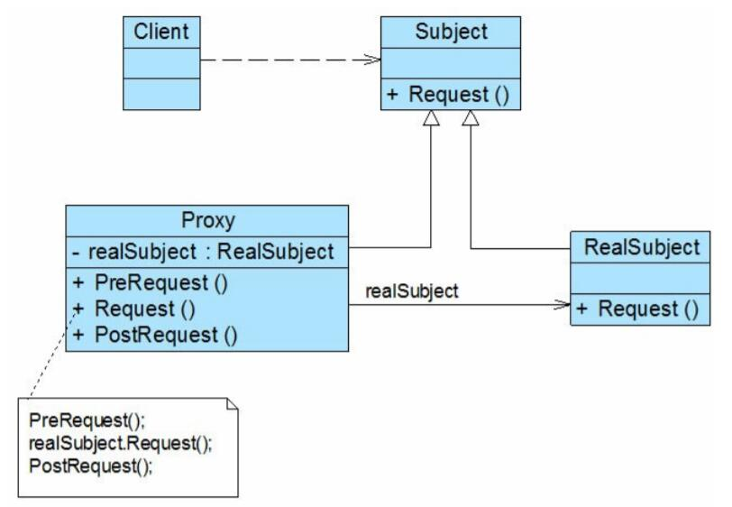

# 代理模式结构与实现

## 代理模式结构
 
1. Subject（抽象主题角色）：它声明了真实主题和代理主题的共同接口，这样一来在任何使用真实主题的地方都可以使用代理主题，客户端通常需要针对抽象主题角色进行编程。
2. Proxy（代理主题角色）：它包含了对真实主题的引用，从而可以在任何时候操作真实主题对象；在代理主题角色中提供一个与真实主题角色相同的接口，以便在任何时候都可以替代真实主题；代理主题角色还可以控制对真实主题的使用，负责在需要的时候创建和删除真实主题对象，并对真实主题对象的使用加以约束。通常，在代理主题角色中，客户端在调用所引用的真实主题操作之前或之后还需要执行其他操作，而不仅仅是单纯调用真实主题对象中的操作。
3. RealSubject（真实主题角色）：它定义了代理角色所代表的真实对象，在真实主题角色中实现了真实的业务操作，客户端可以通过代理主题角色间接调用真实主题角色中定义的操作。

## 代理模式实现
抽象主题类声明了真实主题类和代理类的公共方法，它可以是接口、抽象类或具体类，客户端针对抽象主题类编程，一致性地对待真实主题和代理主题，典型的抽象主题类代码如下：
```
public abstract class Subject {  
    public abstract void request();  
}
```
真实主题类继承了抽象主题类，提供了业务方法的具体实现，其典型代码如下：
```
public class RealSubject extends Subject  
{  
    public void request()  
    {  
        //业务方法具体实现代码  
    }  
}
```
代理类也是抽象主题类的子类，它维持一个对真实主题对象的引用，调用在真实主题中实现的业务方法，在调用时可以在原有业务方法的基础上附加一些新的方法来对功能进行扩充或约束，最简单的代理类实现代码如下：
```
public class Proxy extends Subject {  
    private RealSubject realSubject = new RealSubject(); //维持一个对真实主题对象的引用  

    public void PreRequest() {  
        …...  
    }  

    public void Request() {  
        PreRequest();  
        realSubject.Request(); //调用真实主题对象的方法  
        PostRequest();  
    }  

    public void PostRequest() {  
        ……  
    }  
}
```