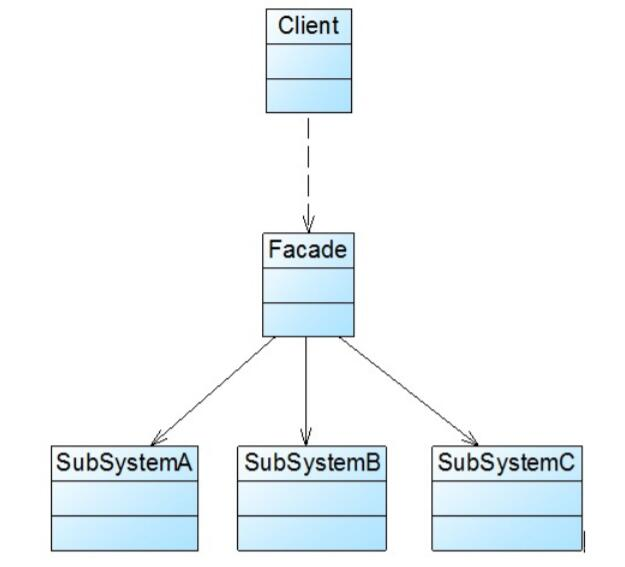

# 外观模式结构与实现

## 外观模式结构
 
1. Facade（外观角色）：在客户端可以调用它的方法，在外观角色中可以知道相关的（一个或者多个）子系统的功能和责任；在正常情况下，它将所有从客户端发来的请求委派到相应的子系统去，传递给相应的子系统对象处理。
2. SubSystem（子系统角色）：在软件系统中可以有一个或者多个子系统角色，每一个子系统可以不是一个单独的类，而是一个类的集合，它实现子系统的功能；每一个子系统都可以被客户端直接调用，或者被外观角色调用，它处理由外观类传过来的请求；子系统并不知道外观的存在，对于子系统而言，外观角色仅仅是另外一个客户端而已。

## 外观模式实现
```
public class SubSystemA  
{  
    public void MethodA()  
    {  
        //业务实现代码  
    }  
}  

public class SubSystemB  
{  
    public void MethodB()  
    {  
        //业务实现代码  
     }  
}  

public class SubSystemC  
{  
    public void MethodC()  
    {  
        //业务实现代码  
    }  
}
```
在引入外观类之后，与子系统业务类之间的交互统一由外观类来完成。
```
public class Facade  
{  
    private SubSystemA obj1 = new SubSystemA();  
    private SubSystemB obj2 = new SubSystemB();  
    private SubSystemC obj3 = new SubSystemC();  

    public void Method()  
    {  
        obj1.MethodA();  
        obj2.MethodB();  
        obj3.MethodC();  
    }  
}
```
由于在外观类中维持了对子系统对象的引用，客户端可以通过外观类来间接调用子系统对象的业务方法，而无须与子系统对象直接交互。
```
public class Program  
{  
    static void Main(string[] args)  
    {  
        Facade facade = new Facade();  
        facade.Method();  
    }  
}
```