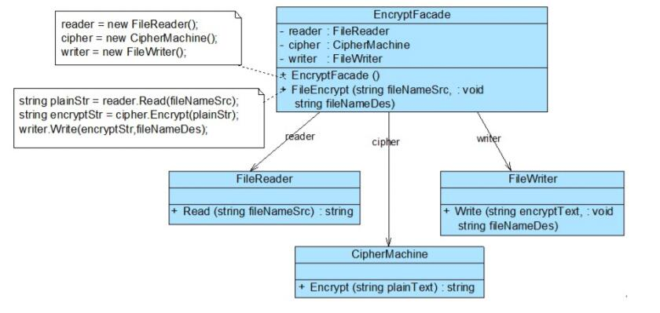

# 外观模式应用实例
## 实例说明
> 某软件公司欲开发一个可应用于多个软件的文件加密模块，该模块可以对文件中的数据进行加密并将加密之后的数据存储在一个新文件中，具体的流程包括三个部分，分别是读取源文件、加密、保存加密之后的文件，其中，读取文件和保存文件使用流来实现，加密操作通过求模运算实现。这三个操作相对独立，为了实现代码的独立重用，让设计更符合单一职责原则，这三个操作的业务代码封装在三个不同的类中。
>
>现使用外观模式设计该文件加密模块。

## 实例类图


## 实例代码
```
//文件读取类，充当子系统类
public class FileReader  
{  
    public string Read(String fileNameSrc) {  
        System.out.println("读取文件，获取明文：");  
        FileStream fs = null;  
        StringBuilder sb = new StringBuilder();  
        try {  
            fs = new FileStream(fileNameSrc, FileMode.Open);  
            int data;  
            while((data = fs.ReadByte())!= -1){  
                sb = sb.Append((char)data);  
            }  
            fs.Close();  
            System.out.println(sb.ToString());  
        }  
        catch(FileNotFoundException e) {  
            System.out.println("文件不存在！");  
        }  
        catch(IOException e) {  
            System.out.println("文件操作错误！");  
        }  
        return sb.ToString();  
    }  
}

//数据加密类，充当子系统类
public class CipherMachine  
{  
   public string Encrypt(String plainText) {  
        System.out.println("数据加密，将明文转换为密文：");  
        string es = "";    
        foreach(int i=0; i<plainText.lenth(); i++) {  
            String c = String.valueOf(plainTextcharAt(i) % 7);
            es += c;  
        }  
        System.out.println(es);  
        return es;  
    }  
}  

//文件保存类，充当子系统
public class FileWriter  
{  
    public void Write(String encryptStr, String fileNameDes)   
    {  
        System.out.println("保存密文，写入文件。");   
        try {  
            FileOutputStream outFS = new FileOutputStream(fileNameDes);  
            outFs.write(encryStr.getBytes());
            outFs.close();
        }      
        catch(FileNotFoundException e) {  
            System.out.println("文件不存在。");  
        }  
        catch(IOException e) {  
            System.out.println("文件操作错误！");  
        }          
    }  
}

//加密外观类，充当外观类。
public class EncryptFacade {  
    //维持对其他对象的引用  
    private FileReader reader;  
    private CipherMachine cipher;  
    private FileWriter writer;  

    public EncryptFacade() {  
        reader = new FileReader();  
        cipher = new CipherMachine();  
        writer = new FileWriter();  
    }  

    //调用子系统对象的业务方法  
    public void FileEncrypt(string fileNameSrc, string fileNameDes) {  
        string plainStr = reader.Read(fileNameSrc);  
        string encryptStr = cipher.Encrypt(plainStr);  
        writer.Write(encryptStr, fileNameDes);  
    }  
}

//客户端测试类
public class Client {  
    public static void Main(string[] args) {  
        EncryptFacade ef = new EncryptFacade();  
        ef.FileEncrypt("src.txt", "des.txt");   
    }  
}  
```
编译并运行程序，输出结果如下：
```
读取文件，获取明文：Hello world!
数据加密，将明文转换为密文：233364062325
保存密文，写入文件。
```