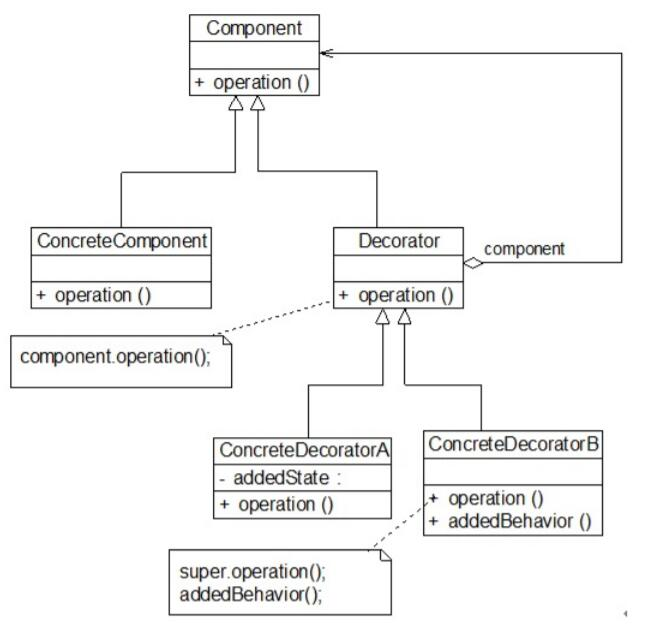

# 装饰模式结构与实现

## 装饰模式结构
 
1. Component（抽象构件）：它是具体构件和抽象装饰类的共同父类，声明了在具体构件中实现的业务方法，它的引入可以使客户端以一致的方式处理未被装饰的对象以及装饰之后的对象，实现客户端的透明操作。
2. ConcreteComponent（具体构件）：它是抽象构件类的子类，用于定义具体的构件对象，实现了在抽象构件中声明的方法，装饰器可以给它增加额外的职责（方法）。
3. Decorator（抽象装饰类）：它也是抽象构件类的子类，用于给具体构件增加职责，但是具体职责在其子类中实现。它维护一个指向抽象构件对象的引用，通过该引用可以调用装饰之前构件对象的方法，并通过其子类扩展该方法，以达到装饰的目的。
4. ConcreteDecorator（具体装饰类）：它是抽象装饰类的子类，负责向构件添加新的职责。每一个具体装饰类都定义了一些新的行为，它可以调用在抽象装饰类中定义的方法，并可以增加新的方法用以扩充对象的行为。

## 装饰模式实现
在装饰模式中，抽象构件类一般设计为抽象类或者接口，在其中声明了抽象业务方法，当然也可以在抽象构件类中实现一些所有具体构建类都共有的业务方法。抽象构件类的典型代码如下：
```
public abstract class Component{
    public abstract void operation();
}
```
具体构件类作为抽象构件类的子类实现了在抽象构件类中声明的业务方法，通常在具体构件类中只提供基本功能的实现，一些复杂的功能需通过装饰类进行扩展。其典型代码如下：
```
public class ConcreteComponent extends Component{
    public void operation(){
        //基本功能的实现
    }
}
```
装饰模式的核心在于抽象装饰类的设计，其典型代码如下：
```
public class Decorator implements Component{
    private Component component;  //维持一个对抽象构件对象的引用

    //注入一个抽象构件类型的对象
    public Decorator(Component component) {
        this.component=component;
    }

    public void operation(){
        component.operation();  //调用原有业务方法
    }
}
```
在抽象装饰类Decorator中定义了一个Component类型的对象component，维持一个对抽象构件对象的引用，并可以通过构造方法或Setter方法将一个Component类型的对象注入进来，同时由于Decorator类实现了抽象构件Component接口，因此需要实现在其中声明的业务方法operation()，需要注意的是在Decorator中并未真正实现operation()方法，而只是调用原有component对象的operation()方法，它没有真正实施装饰，而是提供一个统一的接口，将具体装饰过程交给子类完成。

在Decorator的子类即具体装饰类中将继承operation()方法并根据需要进行扩展，典型的具体装饰类代码如下：
```
public class ConcreteDecorator extends Decorator{
    public ConcreteDecorator(Component component){
        super(component);
    }

    public void operation(){
        super.operation();  //调用原有业务方法
        addedBehavior();  //调用新增业务方法
    }

    //新增业务方法
    public void addedBehavior(){    
        ……
    }
}
```
在具体装饰类中可以调用到抽象装饰类的operation()方法，同时可以定义新的业务方法，如addedBehavior()。

由于在抽象装饰类Decorator中注入的是Component类型的对象，因此我们可以将一个具体构件对象注入其中，再通过具体装饰类来进行装饰；此外，我们还可以将一个已经装饰过的Decorator子类的对象再注入其中进行多次装饰，从而对原有功能的多次扩展。