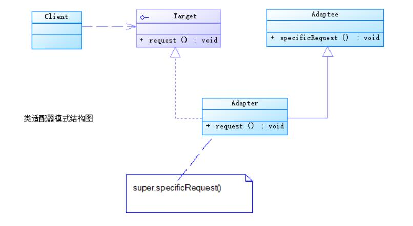
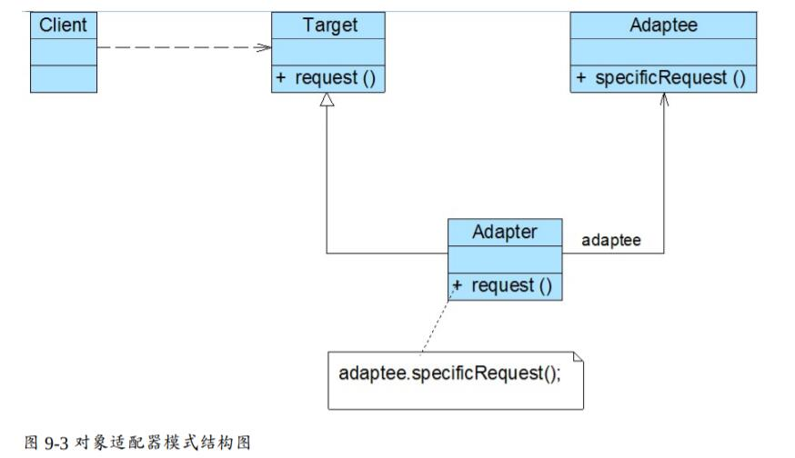

# 适配器模式结构与实现
适配器模式包括类适配器和对象适配器。在对象适配器模式中，适配器与适配者之间是关联关系；在类适配器模式中，适配器与适配者之间是继承（或实现）关系。

## 适配器模式结构
* Target（目标抽象类）：目标抽象类定义客户所需接口，可以是一个抽象类或接口，也可以是具体类。在类适配器中，由于Java语言不支持多重继承，它只能是接口。
* Adapter（适配器类）：适配器可以调用另一个接口，作为一个转换器，对Adaptee和Target进行适配，适配器类是适配器模式的核心，在类适配器中，它通过实现Target接口并继承Adaptee类来使二者产生联系；在对象适配器中，它通过继承Target并关联一个Adaptee对象使二者产生联系。
● Adaptee（适配者类）：适配者即被适配的角色，它定义了一个已经存在的接口，这个接口需要适配，适配者类一般是一个具体类，包含了客户希望使用的业务方法，在某些情况下可能没有适配者类的源代码。





## 适配器模式实现
### 类适配器
```
public class Adapter extends Adaptee implements Target{
    public void request(){
        super.specificRequest();
    }
}
```

### 对象适配器
```
public class Adapter extends Target {  
    private Adaptee adaptee; //维持一个对适配者对象的引用  

    public Adapter(Adaptee adaptee) {  
        this.adaptee=adaptee;  
    }  

    public void request() {  
        adaptee.specificRequest(); //转发调用  
    }  
}
```