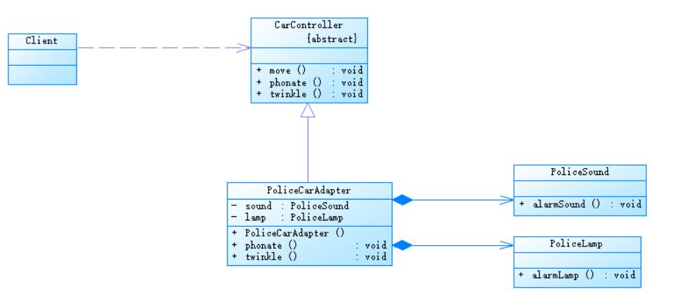

# 适配器模式应用实例
## 实例说明
> 某公司要开发一款儿童玩具汽车，为了更好地吸引小朋友的注意力，该玩具汽车在移动过程中伴随着灯光闪烁和声音提示。在该公司（例如警笛音效）的程序，为了重用先前的代码并且使汽车控制软件具有更好的灵活性和扩展性,现使用适配器模式设计该玩具汽车控制软件。

## 实例类图
 

## 实例代码
```
//汽车控制类，充当目标抽象类
public abstract class CarController {
	public void move() {
		System.out.println("玩具汽车移动！");
	}
	
	public abstract void phonate(); //发出声音
	public abstract void twinkle(); //灯光闪烁
}

//警笛类，充当适配者
public class PoliceSound {
	public void alarmSound() {
		System.out.println("发出警笛声音！");
	}
}

//警灯类，充当适配者
public class PoliceLamp {
	public void alarmLamp() {
		System.out.println("发出警灯闪烁！");
	}
}

//警车适配器，充当适配器
public class PoliceCarAdapter extends CarController {
	private PoliceSound sound;  //定义适配者PoliceSound对象
	private PoliceLamp lamp;    //定义适配者PoliceLamp对象
	
	public PoliceCarAdapter() {
		sound = new PoliceSound();
		lamp = new PoliceLamp();
	}
	
	//发出警笛声音
	public void phonate() {
		sound.alarmSound();  //调用适配者类PoliceSound的方法
	}
	
	//呈现警灯闪烁˸
	public void twinkle() {
		lamp.alarmLamp();    //调用适配者类PoliceLamp的方法
	}
}

//配置文件
<?xml version="1.0"?>
-<config>
<className>designpatterns.adapter.PoliceCarAdapter</className>
</config>

//客户端测试类
public class Client {
	public static void main(String args[]) {
		CarController car ;
		car = (CarController)XMLUtil.getBean();
		car.move();
		car.phonate();
		car.twinkle();
	}
}
```
编译并运行程序，输出结果如下：
```
玩具汽车移动！
发出警笛声音！
呈现警灯闪烁！
```