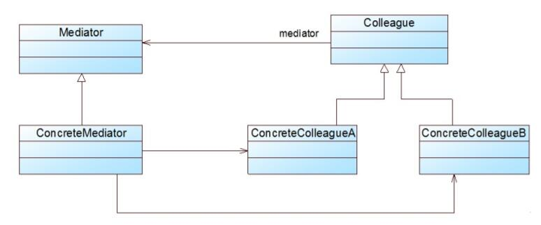

# 中介者模式结构与实现

## 中介者模式结构
   
1. Mediator（抽象中介者）：它定义一个接口，该接口用于与各同事对象之间进行通信。
2. ConcreteMediator（具体中介者）：它是抽象中介者的子类，通过协调各个同事对象来实现协作行为，它维持了对各个同事对象的引用。
3. Colleague（抽象同事类）：它定义各个同事类公有的方法，并声明了一些抽象方法来供子类实现，同时它维持了一个对抽象中介者类的引用，其子类可以通过该引用来与中介者通信。
4. ConcreteColleague（具体同事类）：它是抽象同事类的子类；每一个同事对象在需要和其他同事对象通信时，先与中介者通信，通过中介者来间接完成与其他同事类的通信；在具体同事类中实现了在抽象同事类中声明的抽象方法。

## 中介者模式实现
中介者模式的核心在于中介者类的引入，在中介者模式中，中介者类承担了两方面的职责：
1. 中转作用（结构性）：通过中介者提供的中转作用，各个同事对象不再需要显式地引用其他同事，当需要和其他同事进行通信时，可通过中介者来实现间接调用。该中转作用属于中介者在结构上的支持。 
2. 协调作用（行为性）：中介者可以更进一步的对同事之间的关系进行封装，同事可以一致的和中介者进行交互，而不需要指明中介者需要具体怎么做，中介者根据封装在自身内部的协调逻辑，对同事的请求进行进一步处理，将同事成员之间的关系行为进行分离和封装。该协调作用属于中介者在行为上的支持。

    
```
public abstract class Mediator {  
    protected ArrayList<Colleague> colleagues; //用于存储同事对象  

    //注册方法，用于增加同事对象  
    public void register(Colleague colleague) {  
        colleagues.add(colleague);  
    }  

    //声明抽象的业务方法  
    public abstract void operation();  
}  
```
在抽象中介者中可以定义一个同事类的集合，用于存储同事对象并提供注册方法，同时声明了具体中介者类所具有的方法。在具体中介者类中将实现这些抽象方法，典型的具体中介者类代码如下所示：
```
public class ConcreteMediator extends Mediator {  
    //实现业务方法，封装同事之间的调用  
    public void operation() {  
        ......  
        ((Colleague)(colleagues.get(0))).method1(); //通过中介者调用同事类的方法  
        ......  
    }  
}
```
在具体中介者类中将调用同事类的方法，调用时可以增加一些自己的业务代码对调用进行控制。

在抽象同事类中维持了一个抽象中介者的引用，用于调用中介者的方法，典型的抽象同事类代码如下所示：
```
public abstract class Colleague {  
    protected Mediator mediator; //维持一个抽象中介者的引用  

    public Colleague(Mediator mediator) {  
        this.mediator=mediator;  
    }  

    public abstract void method1(); //声明自身方法，处理自己的行为  

    //定义依赖方法，与中介者进行通信  
    public void method2() {  
        mediator.operation();  
    }  
}
```
在抽象同事类中声明了同事类的抽象方法，而在具体同事类中将实现这些方法，典型的具体同事类代码如下所示：
```
public class ConcreteColleague extends Colleague {  
    public ConcreteColleague(Mediator mediator) {  
        super(mediator);  
    }  

    //实现自身方法  
    public void method1() {  
        ......  
    }  
}
```
在具体同事类ConcreteColleague中实现了在抽象同事类中声明的方法，其中方法method1()是同事类的自身方法(Self-Method)，用于处理自己的行为，而方法method2()是依赖方法(Depend-Method)，用于调用在中介者中定义的方法，依赖中介者来完成相应的行为，例如调用另一个同事类的相关方法。