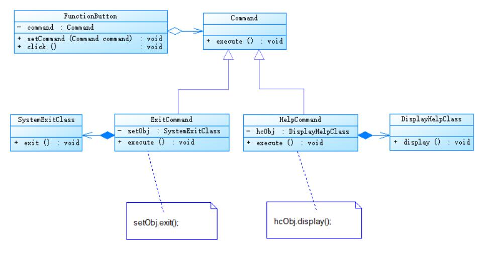

# 命令模式应用实例
## 实例说明
> 为了用户使用方便，某系统提供了一系列功能键，用户可以自定义功能键的功能，例如功能键FunctionButton可以用于退出系统（由SystemExitClass类来实现），也可以与显示帮助文档。（由DisplayHelpClass类来实现）
>
>用户可以通过修改配置文件改变功能键的用途，现使用命令模式设计该系统，使得功能键类与功能类之间解耦，可为同一个功能键设置不同的功能。

## 实例类图

 

## 实例代码
```
// 功能键类，充当请求调用者（请求发送者）
public class FunctionButton{
    private Command command; //维持一个抽象命令对象的引用

    //为功能键注入命令
    public void setCommand(Command command){
        this.command = command;
    }

    //发送请求的方法
    public void click(){
        System.out.print("单击功能键：");
        command.execute();
    }
}

// 抽象命令类
public abstract class Command{
    public abstract void execute();
}

// 退出命令类，充当具体命令类。
public class ExitCommand extends Command{
    private SystemExitClass seObj; //维持对请求接收者的引用

    public HelpCommand(){
        seObj = new SystemExitClass();
    }

    //命令执行方法，将调用请求接收者的业务方法
    public void execute(){
        seObj.exit();
    }
}

// 帮助命令类，充当具体命令类
public class HelpCommand extends Command{
    private DisplayHelpClass hcObj; //维持对请求接收者的引用

    public HelpCommand(){
        hcObj = new DisplayHelpClass();
    }

    //命令执行方法，将调用请求接收者的业务方法
    public void execute(){
        hcObj.display();
    }
}

// 退出系统模拟实现类，充当请求接收者。
public class SystemExitClass{
    public void exit(){
        System.out.print("退出系统！")
    }
}

// 显示帮助文档模拟实现类，充当请求接收者
public class DisplayHelpClass{
    public void display(){
        System.out.pringln("显示帮组文档！")
    }
}

// 配置文件
<?xml version="1.0"?>
<config>
    <className>designpatterns.command.ExitCommand</className>
</config>

// 客户端测试类
public class Client{
    public static void main(String args[]){
        FunctionButton fb = new FunctionButton();
        Command command;    //定义命令对象
        command = (Command)XMLUtil.getBean();   //读取配置文件，反射生成对象
        fb.setCommand(command);    //将命令对象注入功能键
        fb.click();    //调用功能键的业务方法
    }
}
```
编译并运行程序，输出结果如下：
```
单击功能键：退出系统！
```
在命令模式中，每一个具体命令类对应一个请求的处理者（接收者），通过向请求发送者注入不同的具体命令对象可以使得相同的发送者对应不同的接收者，从而实现“将一个请求封装为一个对象，用不同的请求对客户进行参数化”，客户端只需要将具体命令对象作为参数注入请求发送者，无须直接操作请求的接收者。