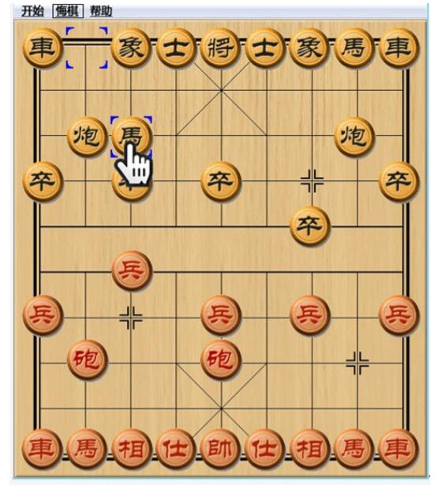
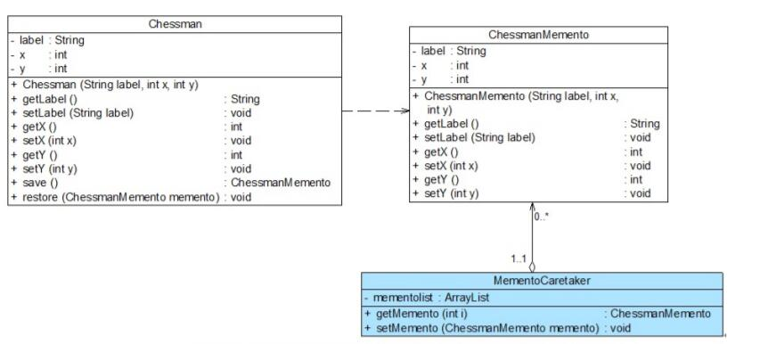

# 备忘录模式应用实例
## 实例说明
> 某软件公司要使用Java语言开发一款可以运行在Android平台的触摸式中国象棋软件，由于考虑到有些用户是“菜鸟”，经常不小心走错棋；还有些用户因为不习惯使用手指在手机屏幕上拖动棋子，常常出现操作失误，因此该中国象棋软件要提供“悔棋”功能，用户走错棋或操作失误后可恢复到前一个步骤。如图所示。
>
>
>
>为了实现“悔棋”功能，现使用备忘录模式来设计该中国象棋软件。

## 实例类图


## 实例代码
```
//象棋棋子类：原发器  
public class Chessman {  
    private String label;  
    private int x;  
    private int y;  

    public Chessman(String label,int x,int y) {  
        this.label = label;  
        this.x = x;  
        this.y = y;  
    }  

    public void setLabel(String label) {  
        this.label = label;   
    }  

    public void setX(int x) {  
        this.x = x;   
    }  

    public void setY(int y) {  
        this.y = y;   
    }  

    public String getLabel() {  
        return (this.label);   
    }  

    public int getX() {  
        return (this.x);   
    }  

    public int getY() {  
        return (this.y);   
    }  

    //保存状态  
    public ChessmanMemento save() {  
        return new ChessmanMemento(this.label,this.x,this.y);  
    }  

    //恢复状态  
    public void restore(ChessmanMemento memento) {  
        this.label = memento.getLabel();  
        this.x = memento.getX();  
        this.y = memento.getY();  
    }  
}  

//象棋棋子备忘录类：备忘录  
public class ChessmanMemento {  
    private String label;  
    private int x;  
    private int y;  

    public ChessmanMemento(String label,int x,int y) {  
        this.label = label;  
        this.x = x;  
        this.y = y;  
    }  

    public void setLabel(String label) {  
        this.label = label;   
    }  

    public void setX(int x) {  
        this.x = x;   
    }  

    public void setY(int y) {  
        this.y = y;   
    }  

    public String getLabel() {  
        return (this.label);   
    }  

    public int getX() {  
        return (this.x);   
    }  

    public int getY() {  
        return (this.y);   
    }     
}  

//象棋棋子备忘录管理类：负责人  
public class MementoCaretaker {  
    private ChessmanMemento memento;  

    public ChessmanMemento getMemento() {  
        return memento;  
    }  

    public void setMemento(ChessmanMemento memento) {  
        this.memento = memento;  
    }  
} 
``` 
编写如下客户端测试代码：
```
public class Client {  
    public static void main(String args[]) {  
        MementoCaretaker mc = new MementoCaretaker();  
        Chessman chess = new Chessman("车",1,1);  
        display(chess);  
        mc.setMemento(chess.save()); //保存状态       
        chess.setY(4);  
        display(chess);  
        mc.setMemento(chess.save()); //保存状态  
        display(chess);  
        chess.setX(5);  
        display(chess);  
        System.out.println("******悔棋******");     
        chess.restore(mc.getMemento()); //恢复状态  
        display(chess);  
    }  

    public static void display(Chessman chess) {  
        System.out.println("棋子" + chess.getLabel() + "当前位置为：" + "第" + chess.getX() + "行" + "第" + chess.getY() + "列。");  
    }  
}
```
编译并运行程序，输出结果如下：
```
棋子车当前位置为：第1行第1列。
棋子车当前位置为：第1行第4列。
棋子车当前位置为：第1行第4列。
棋子车当前位置为：第5行第4列。
******悔棋******
棋子车当前位置为：第1行第4列。
```