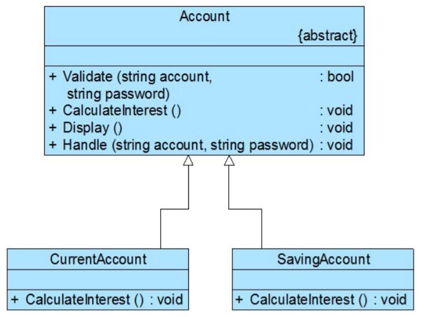

# 模板方法模式应用实例
## 实例说明
> 某软件公司欲为某银行的业务支撑系统开发一个利息计算模块，利息计算流程如下：
>
>(1) 系统根据账号和密码验证用户信息，如果用户信息错误，系统显示出错提示；
>
>(2) 如果用户信息正确，则根据用户类型的不同使用不同的利息计算公式计算利息（如活期账户和定期账户具有不同的利息计算公式）；
>
>(3) 系统显示利息。
试使用模板方法模式设计该利息计算模块。

## 实例类图


## 实例代码
```
//账户类，充当抽象类
public abstract class Account {  
    //基本方法——具体方法  
    public boolean validate(String account, String password)   
    {  
        System.out.println("账号" + account);
        System.out.println("密码" + password); 
        if (account.equalsIgnoreCase("张无忌") && password.equalsIgnoreCase("123456")) {  
            return true;  
        }  
        else {  
            return false;  
        }  
    }  

    //基本方法——抽象方法  
    public abstract void calculateInterest();  

    //基本方法——具体方法  
    public void Display() {  
        System.out.println("显示利息！"); 
    }  

    //模板方法  
    public void handle(String account, String password) {  
        if (!Validate(account,password)) {  
            System.out.println("账户或密码错误！"); 
            return;  
        }  
        calculateInterest();  
        display();  
    }  
}

//活期账户类，充当具体子类
public class CurrentAccount extends Account {  
    //覆盖父类的抽象基本方法  
    public void calculateInterest() {  
        System.out.println("按活期利率计算利息！"); 
    }  
}  

//定期账户类，充当具体子类
public class SavingAccount extends Account {  
    //覆盖父类的抽象基本方法  
    public void calculateInterest() {  
        System.out.println("按定期利率计算利息！"); 
    }  
}  

//配置文件
<?xml version="1.0"?>  
<config>  
    <className>designpatterns.templatemethod.CurrentAccount</className>
</config>

//客户端测试类
public class Crogram {  
    public static void Main(string[] args) {  
        Account account;  
        account = (Account)XMLUtil.getBean();//读取配置文件,反射生成对象  
        account.handle("张无忌", "123456");
    }  
}  
```
编译并运行程序，输出结果如下：
```
账号：张无忌
密码：123456
按活期利率计算利息！
显示利息！
```