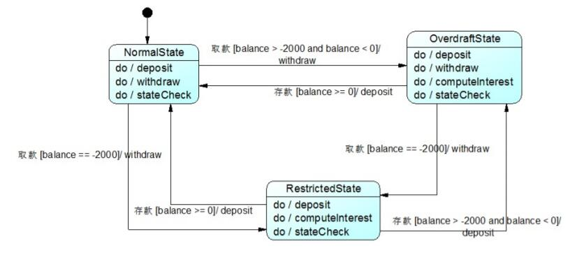
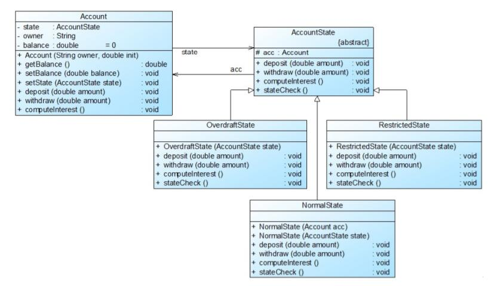

# 解释器模式应用实例
## 实例说明
>某软件公司欲为一银行开发一套信用卡业务系统，银行账户(Account)是该系统的核心类之一，通过分析，该软件公司的开发人员发现在该系统中，账户存在三种状态，且在不同状态下账户存在不同的行为，具体说明如下：
>
>(1) 如果账户中余额大于等于0，则账户的状态为正常状态(Normal State)，此时用户既可以向该账户存款也可以从该账户取款。
>
>(2) 如果账户中余额小于0，并且大于-2000，则账户的状态为透支状态(Overdraft State)，此时用户既可以向该账户存款也可以从该账户取款，但需要按天计算利息。
>
>(3) 如果账户中余额等于-2000，那么账户的状态为受限状态(Restricted State)，此时用户只能向该账户存款，不能再从中取款，同时也将按天计算利息。
>
>(4) 根据余额的不同，以上三种状态可发生相互转换。
试使用状态模式设计并实现银行账户状态的转换。

## 实例类图
通过对银行账户类进行分析，可以绘制如图所示的UML状态图。

 

NormalState表示正常状态，OverdraftState表示透支状态，RestrictedState表示受限状态，在这三种状态下账户对象拥有不同的行为，方法deposit()用于存款，withdraw()用于取款，computeInterest()用于计算利息，stateCheck()用于在每一次执行存款和取款操作后根据余额来判断是否要进行状态转换并实现状态转换，相同的方法在不同的状态中可能会有不同的实现。

 

## 实例代码
```
//银行账户：环境类  
public class Account {  
    private AccountState state; //维持一个对抽象状态对象的引用  
    private String owner; //开户名  
    private double balance = 0; //账户余额  

    public Account(String owner,double init) {  
        this.owner = owner;  
        this.balance = init;  
        this.state = new NormalState(this); //设置初始状态  
        System.out.println(this.owner + "开户，初始金额为" + init);   
        System.out.println("---------------------------------------------");      
    }  

    public double getBalance() {  
        return this.balance;  
    }  

    public void setBalance(double balance) {  
        this.balance = balance;  
    }  

    public void setState(AccountState state) {  
        this.state = state;  
    }  

    public void deposit(double amount) {  
        System.out.println(this.owner + "存款" + amount);  
        state.deposit(amount); //调用状态对象的deposit()方法  
        System.out.println("现在余额为"+ this.balance);  
        System.out.println("现在帐户状态为"+ this.state.getClass().getName());  
        System.out.println("---------------------------------------------");              
    }  

    public void withdraw(double amount) {  
        System.out.println(this.owner + "取款" + amount);  
        state.withdraw(amount); //调用状态对象的withdraw()方法  
        System.out.println("现在余额为"+ this.balance);  
        System.out.println("现在帐户状态为"+ this. state.getClass().getName());          
        System.out.println("---------------------------------------------");  
    }  

    public void computeInterest()  
    {  
        state.computeInterest(); //调用状态对象的computeInterest()方法  
    }  
}  

//抽象状态类  
public abstract class AccountState {  
    protected Account acc;  
    public abstract void deposit(double amount);  
    public abstract void withdraw(double amount);  
    public abstract void computeInterest();  
    public abstract void stateCheck();  
}  

//正常状态：具体状态类  
public class NormalState extends AccountState {  
    public NormalState(Account acc) {  
        this.acc = acc;  
    }  

    ublic NormalState(AccountState state) {  
        this.acc = state.acc;  
    }  

    public void deposit(double amount) {  
        acc.setBalance(acc.getBalance() + amount);  
        stateCheck();  
    }  

    public void withdraw(double amount) {  
        acc.setBalance(acc.getBalance() - amount);  
        stateCheck();  
    }  

    public void computeInterest()  
    {  
        System.out.println("正常状态，无须支付利息！");  
    }  

    //状态转换  
    public void stateCheck() {  
        if (acc.getBalance() > -2000 && acc.getBalance() <= 0) {  
            acc.setState(new OverdraftState(this));  
        }  
        else if (acc.getBalance() == -2000) {  
            acc.setState(new RestrictedState(this));  
        }  
        else if (acc.getBalance() < -2000) {  
            System.out.println("操作受限！");  
        }     
    }     
}    

//透支状态：具体状态类  
public class OverdraftState extends AccountState  
{  
    public OverdraftState(AccountState state) {  
        this.acc = state.acc;  
    }  

    public void deposit(double amount) {  
        acc.setBalance(acc.getBalance() + amount);  
        stateCheck();  
    }  

    public void withdraw(double amount) {  
        acc.setBalance(acc.getBalance() - amount);  
        stateCheck();  
    }  

    public void computeInterest() {  
        System.out.println("计算利息！");  
    }  

    //状态转换  
    public void stateCheck() {  
        if (acc.getBalance() > 0) {  
            acc.setState(new NormalState(this));  
        }  
        else if (acc.getBalance() == -2000) {  
            acc.setState(new RestrictedState(this));  
        }  
        else if (acc.getBalance() < -2000) {  
            System.out.println("操作受限！");  
        }  
    }  
}  

//受限状态：具体状态类  
public class RestrictedState extends AccountState {  
    public RestrictedState(AccountState state) {  
        this.acc = state.acc;  
    }  

    public void deposit(double amount) {  
        acc.setBalance(acc.getBalance() + amount);  
        stateCheck();  
    }  

    public void withdraw(double amount) {  
        System.out.println("帐号受限，取款失败");  
    }  

    public void computeInterest() {  
        System.out.println("计算利息！");  
    }  

    //状态转换  
    public void stateCheck() {  
        if(acc.getBalance() > 0) {  
            acc.setState(new NormalState(this));  
        }  
        else if(acc.getBalance() > -2000) {  
            acc.setState(new OverdraftState(this));  
        }  
    }  
}
```
编写如下客户端测试代码：
```
public class Client {  
    public static void main(String args[]) {  
        Account acc = new Account("段誉",0.0);  
        acc.deposit(1000);  
        acc.withdraw(2000);  
        acc.deposit(3000);  
        acc.withdraw(4000);  
        acc.withdraw(1000);  
        acc.computeInterest();  
    }  
}
```
编译并运行程序，输出结果如下：
```
段誉开户，初始金额为0.0
---------------------------------------------
段誉存款1000.0
现在余额为1000.0
现在帐户状态为NormalState
---------------------------------------------
段誉取款2000.0
现在余额为-1000.0
现在帐户状态为OverdraftState
---------------------------------------------
段誉存款3000.0
现在余额为2000.0
现在帐户状态为NormalState
---------------------------------------------
段誉取款4000.0
现在余额为-2000.0
现在帐户状态为RestrictedState
---------------------------------------------
段誉取款1000.0
帐号受限，取款失败
现在余额为-2000.0
现在帐户状态为RestrictedState
---------------------------------------------
计算利息！
```