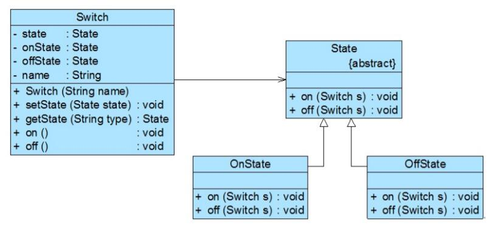

# 共享状态
在有些情况下，多个环境对象可能需要共享同一个状态，如果希望在系统中实现多个环境对象共享一个或多个状态对象，那么需要将这些状态对象定义为环境类的静态成员对象。

>如果某系统要求两个开关对象要么都处于开的状态，要么都处于关的状态，在使用时它们的状态必须保持一致，开关可以由开转换到关，也可以由关转换到开。



```
public class Switch {  
    private static State state,onState,offState; //定义三个静态的状态对象  
    private String name;  

    public Switch(String name) {  
        this.name = name;  
        onState = new OnState();  
        offState = new OffState();  
        this.state = onState;  
    }  

    public void setState(State state) {  
        this.state = state;  
    }  

    public static State getState(String type) {  
        if (type.equalsIgnoreCase("on")) {  
            return onState;  
        }  
        else {  
            return offState;  
        }  
    }  

    //打开开关  
    public void on() {  
        System.out.print(name);  
        state.on(this);  
    }  

    //关闭开关  
    public void off() {  
        System.out.print(name);  
        state.off(this);  
    }  
}
```
抽象状态类如下代码所示：
```
public abstract class State {  
    public abstract void on(Switch s);  
    public abstract void off(Switch s);  
}
```
两个具体状态类如下代码所示：
```
//打开状态  
public class OnState extends State {  
    public void on(Switch s) {  
        System.out.println("已经打开！");  
    }  

    public void off(Switch s) {  
        System.out.println("关闭！");  
        s.setState(Switch.getState("off"));  
    }  
}  

//关闭状态  
public class OffState extends State {  
    public void on(Switch s) {  
        System.out.println("打开！");  
        s.setState(Switch.getState("on"));  
    }  

    public void off(Switch s) {  
        System.out.println("已经关闭！");  
    }  
}
```
编写如下客户端代码进行测试：
```
public class Client {  
    public static void main(String args[]) {  
        Switch s1,s2;  
        s1=new Switch("开关1");  
        s2=new Switch("开关2");  

        s1.on();  
        s2.on();  
        s1.off();  
        s2.off();  
        s2.on();  
        s1.on();      
    }  
}
```
输出结果如下：
```
开关1已经打开！
开关2已经打开！
开关1关闭！
开关2已经关闭！
开关2打开！
开关1已经打开！
```
从输出结果可以得知两个开关共享相同的状态，如果第一个开关关闭，则第二个开关也将关闭，再次关闭时将输出“已经关闭”；打开时也将得到类似结果。