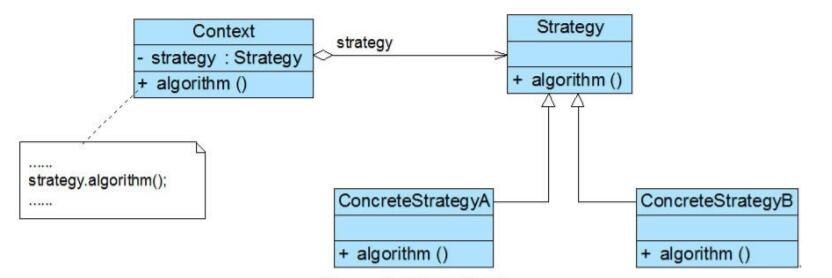

# 策略模式结构与实现

## 策略模式结构
  

1. Context（环境类）：环境类是使用算法的角色，它在解决某个问题（即实现某个方法）时可以采用多种策略。在环境类中维持一个对抽象策略类的引用实例，用于定义所采用的策略。
2. Strategy（抽象策略类）：它为所支持的算法声明了抽象方法，是所有策略类的父类，它可以是抽象类或具体类，也可以是接口。环境类通过抽象策略类中声明的方法在运行时调用具体策略类中实现的算法。
3. ConcreteStrategy（具体策略类）：它实现了在抽象策略类中声明的算法，在运行时，具体策略类将覆盖在环境类中定义的抽象策略类对象，使用一种具体的算法实现某个业务处理。

## 策略模式实现
策略模式是一个比较容易理解和使用的设计模式，策略模式是对算法的封装，它把算法的责任和算法本身分割开，委派给不同的对象管理。策略模式通常把一个系列的算法封装到一系列具体策略类里面，作为抽象策略类的子类。在策略模式中，对环境类和抽象策略类的理解非常重要，环境类是需要使用算法的类。在一个系统中可以存在多个环境类，它们可能需要重用一些相同的算法。

在使用策略模式时，我们需要将算法从Context类中提取出来，首先应该创建一个抽象策略类，其典型代码如下所示：
```
public abstract class AbstractStrategy {  
    public abstract void algorithm(); //声明抽象算法  
}
```
然后再将封装每一种具体算法的类作为该抽象策略类的子类，如下代码所示：
```
public class ConcreteStrategyA extends AbstractStrategy {  
    //算法的具体实现  
    public void algorithm() {  
       //算法A  
    }  
}
```
其他具体策略类与之类似，对于Context类而言，在它与抽象策略类之间建立一个关联关系，其典型代码如下所示：
```
public class Context {  
private AbstractStrategy strategy; //维持一个对抽象策略类的引用  

    public void setStrategy(AbstractStrategy strategy) {  
        this.strategy= strategy;  
    }  

    //调用策略类中的算法  
    public void algorithm() {  
        strategy.algorithm();  
    }  
}
```
客户端代码片段如下：
```
……  
Context context = new Context();  
AbstractStrategy strategy;  
strategy = new ConcreteStrategyA(); //可在运行时指定类型  
context.setStrategy(strategy);  
context.algorithm();  
……
```
在客户端代码中只需注入一个具体策略对象，可以将具体策略类类名存储在配置文件中，通过反射来动态创建具体策略对象，从而使得用户可以灵活地更换具体策略类，增加新的具体策略类也很方便。策略模式提供了一种可插入式(Pluggable)算法的实现方案。