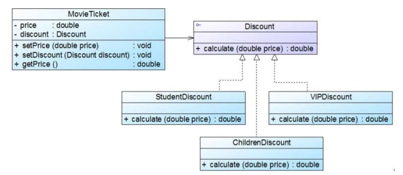

# 策略模式应用实例
## 实例说明
>软件公司为某电影院开发了一套影院售票系统，在该系统中需要为不同类型的用户提供不同的电影票打折方式，具体打折方案如下：
>
>(1) 学生凭学生证可享受票价8折优惠；
>
>(2) 年龄在10周岁及以下的儿童可享受每张票减免10元的优惠（原始票价需大于等于20元）；
>
>(3) 影院VIP用户除享受票价半价优惠外还可进行积分，积分累计到一定额度可换取电影院赠送的奖品。
>
>该系统在将来可能还要根据需要引入新的打折方式。试使用策略模式设计该影院售票系统的打折方案。

## 实例类图



## 实例代码
```
//电影票类：环境类  
public class MovieTicket {  
    private double price;  
    private Discount discount; //维持一个对抽象折扣类的引用  

    public void setPrice(double price) {  
        this.price = price;  
    }  

    //注入一个折扣类对象  
    public void setDiscount(Discount discount) {  
        this.discount = discount;  
    }  

    public double getPrice() {  
        //调用折扣类的折扣价计算方法  
        return discount.calculate(this.price);  
    }  
}  

//折扣类：抽象策略类  
public interface Discount {  
    public double calculate(double price);  
}  

//学生票折扣类：具体策略类  
public class StudentDiscount implements Discount {  
    public double calculate(double price) {  
        System.out.println("学生票：");  
        return price * 0.8;  
    }  
}   

//儿童票折扣类：具体策略类  
public class ChildrenDiscount implements Discount {  
    public double calculate(double price) {  
        System.out.println("儿童票：");  
        return price - 10;  
    }  
}   

//VIP会员票折扣类：具体策略类  
public class VIPDiscount implements Discount {  
    public double calculate(double price) {  
        System.out.println("VIP票：");  
        System.out.println("增加积分！");  
        return price * 0.5;  
    }  
}

//配置文件
<?xml version="1.0"?>  
<config>  
    <className>StudentDiscount</className>  
</config>

//客户端测试类：
public class Client {  
    public static void main(String args[]) {  
        MovieTicket mt = new MovieTicket();  
        double originalPrice = 60.0;  
        double currentPrice;  

        mt.setPrice(originalPrice);  
        System.out.println("原始价为：" + originalPrice);  
        System.out.println("---------------------------------");  

        Discount discount;  
        discount = (Discount)XMLUtil.getBean(); //读取配置文件并反射生成具体折扣对象  
        mt.setDiscount(discount); //注入折扣对象  

        currentPrice = mt.getPrice();  
        System.out.println("折后价为：" + currentPrice);  
    }  
}
```
编译并运行程序，输出结果如下：
```
原始价为：60.0
---------------------------------
学生票：
折后价为：48.0
```