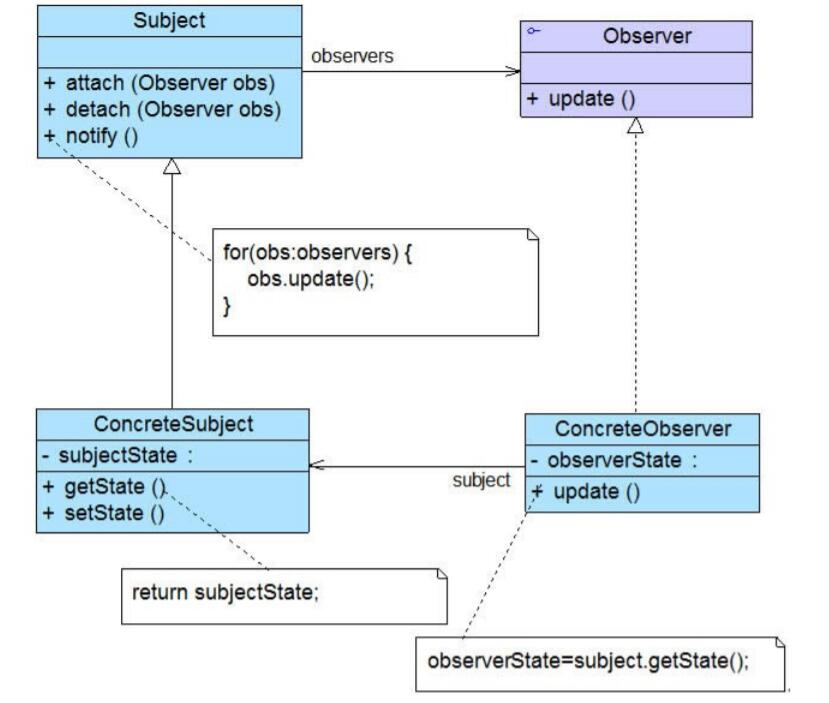

# 观察者模式结构与实现

## 观察者模式结构
   
1. Subject（目标）：目标又称为主题，它是指被观察的对象。在目标中定义了一个观察者集合，一个观察目标可以接受任意数量的观察者来观察，它提供一系列方法来增加和删除观察者对象，同时它定义了通知方法notify()。目标类可以是接口，也可以是抽象类或具体类。
2. ConcreteSubject（具体目标）：具体目标是目标类的子类，通常它包含有经常发生改变的数据，当它的状态发生改变时，向它的各个观察者发出通知；同时它还实现了在目标类中定义的抽象业务逻辑方法（如果有的话）。如果无须扩展目标类，则具体目标类可以省略。
3. Observer（观察者）：观察者将对观察目标的改变做出反应，观察者一般定义为接口，该接口声明了更新数据的方法update()，因此又称为抽象观察者。
4. ConcreteObserver（具体观察者）：在具体观察者中维护一个指向具体目标对象的引用，它存储具体观察者的有关状态，这些状态需要和具体目标的状态保持一致；它实现了在抽象观察者Observer中定义的update()方法。通常在实现时，可以调用具体目标类的attach()方法将自己添加到目标类的集合中或通过detach()方法将自己从目标类的集合中删除。

## 观察者模式实现
观察者模式描述了如何建立对象与对象之间的依赖关系，以及如何构造满足这种需求的系统。观察者模式包含观察目标和观察者两类对象，一个目标可以有任意数目的与之相依赖的观察者，一旦观察目标的状态发生改变，所有的观察者都将得到通知。作为对这个通知的响应，每个观察者都将监视观察目标的状态以使其状态与目标状态同步，这种交互也称为发布-订阅(Publish-Subscribe)。观察目标是通知的发布者，它发出通知时并不需要知道谁是它的观察者，可以有任意数目的观察者订阅它并接收通知。

首先定义一个抽象目标Subject，典型代码如下所示：
```
public abstract class Subject {  
    //定义一个观察者集合用于存储所有观察者对象  
    protected ArrayList observers<Observer> = new ArrayList();  

    //注册方法，用于向观察者集合中增加一个观察者  
    public void attach(Observer observer) {  
        observers.add(observer);  
    }  

    //注销方法，用于在观察者集合中删除一个观察者  
    public void detach(Observer observer) {  
        observers.remove(observer);  
    }  

    //声明抽象通知方法  
    public abstract void notify();  
}
```
具体目标类ConcreteSubject是实现了抽象目标类Subject的一个具体子类，其典型代码如下所示：
```
public class ConcreteSubject extends Subject {  
    //实现通知方法  
    public void notify() {  
        //遍历观察者集合，调用每一个观察者的响应方法  
        for(Object obs:observers) {  
            ((Observer)obs).update();  
        }  
    }     
}
```
抽象观察者角色一般定义为一个接口，通常只声明一个update()方法，为不同观察者的更新（响应）行为定义相同的接口，这个方法在其子类中实现，不同的观察者具有不同的响应方法。抽象观察者Observer典型代码如下所示：
```
public interface Observer {  
    //声明响应方法  
    public void update();  
}  
```
在具体观察者ConcreteObserver中实现了update()方法，其典型代码如下所示：
```
public class ConcreteObserver implements Observer {  
    //实现响应方法  
    public void update() {  
        //具体响应代码  
    }  
}
```
在客户端代码中首先创建具体目标对象以及具体观察者对象，然后调用目标的attach()方法，将这个观察者对象在目标对象中登记，也就是将它加入到目标对象的观察者集合中，代码片段如下：
```
···
Subject subject = new ConcreteSubject();
Observer observer = new ConcreteObserver();
subject.attch(observer);
subject.notify();
···
```
客户端在调用目标对象的notify()方法时将调用在其观察者集合中注册的观察者对象的update()方法。