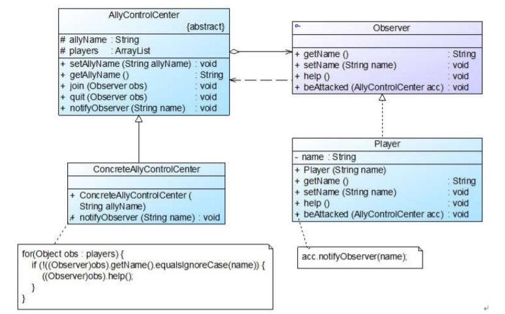

# 观察者模式应用实例
## 实例说明
在某多人联机对战游戏中，多个玩家可以加入同一战队组成联盟，当战队中某一成员受到敌人攻击时将给所有其他盟友发送通知，盟友收到通知后将作出响应。
试使用观察者模式设计并实现该过程，以实现战队成员之间的联动。

## 实例类图



## 实例代码
```
//战队控制中心类：目标类  
public abstract class AllyControlCenter {  
    protected String allyName; //战队名称  
    protected ArrayList<Observer> players = new ArrayList<Observer>(); //定义一个集合用于存储战队成员  

    public void setAllyName(String allyName) {  
        this.allyName = allyName;  
    }  

    public String getAllyName() {  
        return this.allyName;  
    }  

    //注册方法  
    public void join(Observer obs) {  
        System.out.println(obs.getName() + "加入" + this.allyName + "战队！");  
        players.add(obs);  
    }  

    //注销方法  
    public void quit(Observer obs) {  
        System.out.println(obs.getName() + "退出" + this.allyName + "战队！");  
        players.remove(obs);  
    }  

    //声明抽象通知方法  
    public abstract void notifyObserver(String name);  
}  

//具体战队控制中心类：具体目标类  
public class ConcreteAllyControlCenter extends AllyControlCenter {  
    public ConcreteAllyControlCenter(String allyName) {  
        System.out.println(allyName + "战队组建成功！");  
        System.out.println("----------------------------");  
        this.allyName = allyName;  
    }  

    //实现通知方法  
    public void notifyObserver(String name) {  
        System.out.println(this.allyName + "战队紧急通知，盟友" + name + "遭受敌人攻击！");  
        //遍历观察者集合，调用每一个盟友（自己除外）的支援方法  
        for(Object obs : players) {  
            if (!((Observer)obs).getName().equalsIgnoreCase(name)) {  
                ((Observer)obs).help();  
            }  
        }         
    }  
}

//抽象观察类  
public interface Observer {  
    public String getName();  
    public void setName(String name);  
    public void help(); //声明支援盟友方法  
    public void beAttacked(AllyControlCenter acc); //声明遭受攻击方法  
}  

//战队成员类：具体观察者类  
public class Player implements Observer {  
    private String name;  

    public Player(String name) {  
        this.name = name;  
    }  

    public void setName(String name) {  
        this.name = name;  
    }  

    public String getName() {  
        return this.name;  
    }  

    //支援盟友方法的实现  
    public void help() {  
        System.out.println("坚持住，" + this.name + "来救你！");  
    }  

    //遭受攻击方法的实现，当遭受攻击时将调用战队控制中心类的通知方法notifyObserver()来通知盟友  
    public void beAttacked(AllyControlCenter acc) {  
        System.out.println(this.name + "被攻击！");  
        acc.notifyObserver(name);         
    }  
}  

// 客户端测试类
public class Client {  
    public static void main(String args[]) {  
        //定义观察目标对象  
        AllyControlCenter acc;  
        acc = new ConcreteAllyControlCenter("金庸群侠");  

        //定义四个观察者对象  
        Observer player1,player2,player3,player4;  

        player1 = new Player("杨过");  
        acc.join(player1);  

        player2 = new Player("令狐冲");  
        acc.join(player2);  

        player3 = new Player("张无忌");  
        acc.join(player3);  

        player4 = new Player("段誉");  
        acc.join(player4);  

        //某成员遭受攻击  
        Player1.beAttacked(acc);  
    }  
}
```
编译并运行程序，输出结果如下：
```
金庸群侠战队组建成功！
----------------------------
杨过加入金庸群侠战队！
令狐冲加入金庸群侠战队！
张无忌加入金庸群侠战队！
段誉加入金庸群侠战队！
杨过被攻击！
金庸群侠战队紧急通知，盟友杨过遭受敌人攻击！
坚持住，令狐冲来救你！
坚持住，张无忌来救你！
坚持住，段誉来救你！
```