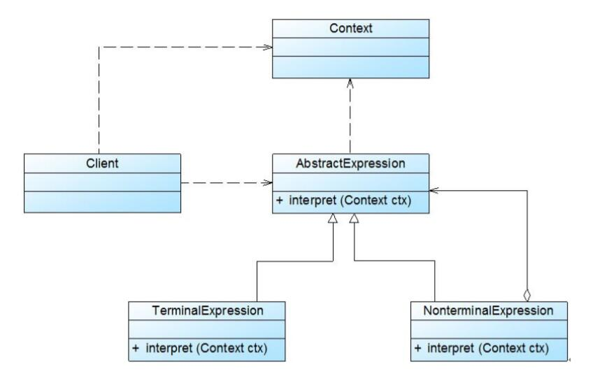

# 解释器模式结构与实现

## 解释器模式结构
  
1. AbstractExpression（抽象表达式）：在抽象表达式中声明了抽象的解释操作，它是所有终结符表达式和非终结符表达式的公共父类。
2. TerminalExpression（终结符表达式）：终结符表达式是抽象表达式的子类，它实现了与文法中的终结符相关联的解释操作，在句子中的每一个终结符都是该类的一个实例。通常在一个解释器模式中只有少数几个终结符表达式类，它们的实例可以通过非终结符表达式组成较为复杂的句子。
3. NonterminalExpression（非终结符表达式）：非终结符表达式也是抽象表达式的子类，它实现了文法中非终结符的解释操作，由于在非终结符表达式中可以包含终结符表达式，也可以继续包含非终结符表达式，因此其解释操作一般通过递归的方式来完成。
4. Context（环境类）：环境类又称为上下文类，它用于存储解释器之外的一些全局信息，通常它临时存储了需要解释的语句。


## 解释器模式实现
在解释器模式中，每一种终结符和非终结符都有一个具体类与之对应，正因为使用类来表示每一条文法规则，所以系统将具有较好的灵活性和可扩展性。对于所有的终结符和非终结符，我们首先需要抽象出一个公共父类，即抽象表达式类，其典型代码如下所示：
```
public abstract class AbstractExpression {
    public abstract void interpret(Context ctx);
}
```
终结符表达式和非终结符表达式类都是抽象表达式类的子类，对于终结符表达式，其代码很简单，主要是对终结符元素的处理，其典型代码如下所示：
```
public class TerminalExpression extends AbstractExpression {
    public void interpret(Context ctx) {
        //终结符表达式的解释操作
    }
}
```
对于非终结符表达式，其代码相对比较复杂，因为可以通过非终结符将表达式组合成更加复杂的结构，对于包含两个操作元素的非终结符表达式类，其典型代码如下：
```
public class NonterminalExpression extends AbstractExpression {
    private AbstractExpression left;
    private AbstractExpression right;

    public NonterminalExpression(AbstractExpression left,AbstractExpression right) {
        this.left=left;
        this.right=right;
    }

    public void interpret(Context ctx) {
        //递归调用每一个组成部分的interpret()方法
        //在递归调用时指定组成部分的连接方式，即非终结符的功能
    }     
}
```
除了上述用于表示表达式的类以外，通常在解释器模式中还提供了一个环境类Context，用于存储一些全局信息，通常在Context中包含了一个HashMap或ArrayList等类型的集合对象（也可以直接由HashMap等集合类充当环境类），存储一系列公共信息，如变量名与值的映射关系（key/value）等，用于在进行具体的解释操作时从中获取相关信息。其典型代码片段如下：
```
public class Context {
    private HashMap map = new HashMap();
    public void assign(String key, String value) {
        //往环境类中设值
        map.put(key, value);
    }
    
    public String  lookup(String key) {
        //获取存储在环境类中的值
        return map.get(key);
    }
}
```
环境类Context的对象通常作为参数被传递到所有表达式的解释方法interpret()中，可以在环境类对象中存储和访问表达式解释器的状态，向表达式解释器提供一些全局的、公共的数据，此外还可以在环境类中增加一些所有表达式解释器共有的功能，以减轻解释器的职责。当系统无须提供全局公共信息时可以省略环境类，可根据实际情况决定是否需要环境类。