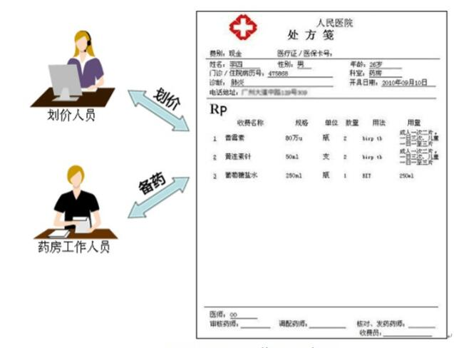

# 访问者模式

访问者模式是一种较为复杂的行为型设计模式，它包含访问者和被访问元素两个主要组成部分，这些被访问的元素通常具有不同的类型，且不同的访问者可以对它们进行不同的访问操作。例如处方单中的各种药品信息就是被访问的元素，而划价人员和药房工作人员就是访问者。访问者模式使得用户可以在不修改现有系统的情况下扩展系统的功能，为这些不同类型的元素增加新的操作。
 
在使用访问者模式时，被访问元素通常不是单独存在的，它们存储在一个集合中，这个集合被称为“对象结构”，访问者通过遍历对象结构实现对其中存储的元素的逐个操作。

>访问者模式(Visitor Pattern)表示一个作用于某对象结构中的各个元素的操作。访问者模式让用户可以在不改变各元素的类的前提下定义作用于这些元素的新操作。

访问者模式是一种**对象行为型**模式，它为操作存储不同类型元素的对象结构提供了一种解决方案，用户可以对不同类型的元素施加不同的操作。