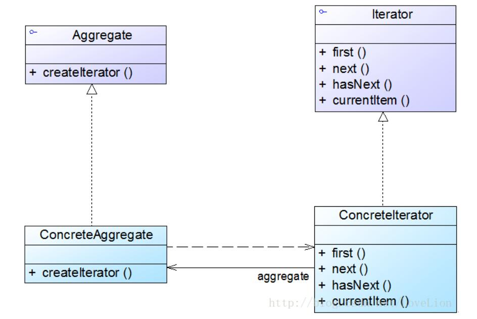

# 迭代器模式结构与实现

## 迭代器模式结构
在迭代器模式结构中包含聚合和迭代器两个层次结构，考虑到系统的灵活性和可扩展性，在迭代器模式中应用了工厂方法模式。

  

1. Iterator（抽象迭代器）：它定义了访问和遍历元素的接口，声明了用于遍历数据元素的方法，例如：用于获取第一个元素的first()方法，用于访问下一个元素的next()方法，用于判断是否还有下一个元素的hasNext()方法，用于获取当前元素的currentItem()方法等，在具体迭代器中将实现这些方法。
2. ConcreteIterator（具体迭代器）：它实现了抽象迭代器接口，完成对聚合对象的遍历，同时在具体迭代器中通过游标来记录在聚合对象中所处的当前位置，在具体实现时，游标通常是一个表示位置的非负整数。
3. Aggregate（抽象聚合类）：它用于存储和管理元素对象，声明一个createIterator()方法用于创建一个迭代器对象，充当抽象迭代器工厂角色。
4. ConcreteAggregate（具体聚合类）：它实现了在抽象聚合类中声明的createIterator()方法，该方法返回一个与该具体聚合类对应的具体迭代器ConcreteIterator实例。

## 迭代器模式实现
在迭代器模式中，提供了一个外部的迭代器来对聚合对象进行访问和遍历，迭代器定义了一个访问该聚合元素的接口，并且可以跟踪当前遍历的元素，了解哪些元素已经遍历过而哪些没有。迭代器的引入，将使得对一个复杂聚合对象的操作变得简单。

在抽象迭代器中声明了用于遍历聚合对象中所存储元素的方法，典型代码如下所示：
```
public interface Iterator {  
    public void first(); //将游标指向第一个元素  
    public void next(); //将游标指向下一个元素  
    public boolean hasNext(); //判断是否存在下一个元素  
    public Object currentItem(); //获取游标指向的当前元素  
}
```
在具体迭代器中将实现抽象迭代器声明的遍历数据的方法，如下代码所示：
```
public class ConcreteIterator implements Iterator {  
    private ConcreteAggregate objects; //维持一个对具体聚合对象的引用，以便于访问存储在聚合对象中的数据  
    private int cursor; //定义一个游标，用于记录当前访问位置  
    public ConcreteIterator(ConcreteAggregate objects) {  
        this.objects=objects;  
    }  

    public void first() {  ......  }  

    public void next() {  ......  }  

    public boolean hasNext() {  ......  }  

    public Object currentItem() {  ......  }  
}
```
需要注意的是抽象迭代器接口的设计非常重要，一方面需要充分满足各种遍历操作的要求，尽量为各种遍历方法都提供声明，另一方面又不能包含太多方法，接口中方法太多将给子类的实现带来麻烦。因此，可以考虑使用抽象类来设计抽象迭代器，在抽象类中为每一个方法提供一个空的默认实现。如果需要在具体迭代器中为聚合对象增加全新的遍历操作，则必须修改抽象迭代器和具体迭代器的源代码，这将违反“开闭原则”，因此在设计时要考虑全面，避免之后修改接口。

聚合类用于存储数据并负责创建迭代器对象，最简单的抽象聚合类代码如下所示：
```
public interface Aggregate {  
    Iterator createIterator();  
}
```
具体聚合类作为抽象聚合类的子类，一方面负责存储数据，另一方面实现了在抽象聚合类中声明的工厂方法createIterator()，用于返回一个与该具体聚合类对应的具体迭代器对象，代码如下所示：
```
public class ConcreteAggregate implements Aggregate {    
    ......    
    public Iterator createIterator() {  
    return new ConcreteIterator(this);  
    }  
    ......  
}
```