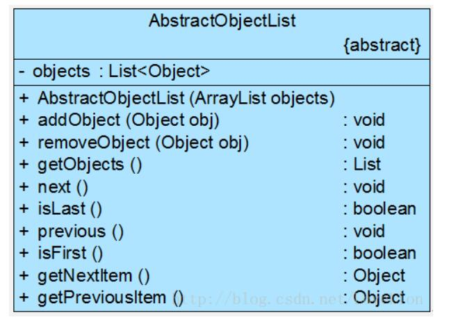
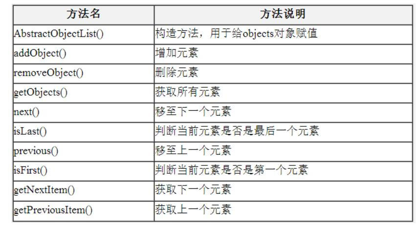
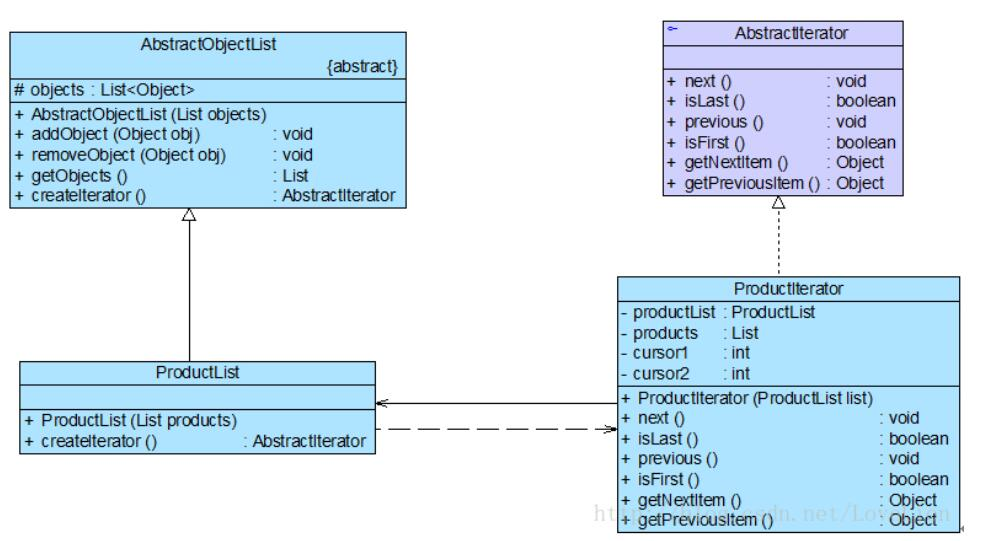

# 迭代器模式应用实例
## 实例说明
>某软件公司开发了一套销售管理系统，在对该系统进行分析和设计时，开发人员发现经常需要对系统中的商品数据、客户数据等进行遍历，为了复用这些遍历代码，开发人员设计了一个抽象的数据集合类AbstractObjectList，而将存储商品和客户等数据的类作为其子类，AbstractObjectList类结构如图所示：
>
>
>
>在图中，List类型的对象objects用于存储数据，方法说明如表所示。
>
>
AbstractObjectList类的子类ProductList和CustomerList分别用于存储商品数据和客户数据。
>
>通过分析发现AbstractObjectList类的职责非常重，它既负责存储和管理数据，又负责遍历数据，违反了单一职责原则，实现代码非常复杂。因此开发人员决定使用迭代器模式对AbstractObjectList类进行重构，将负责遍历数据的方法提取出来封装到专门的类中，实现数据存储和数据遍历分离，还可以给不同的具体数据集合类提供不同的遍历方式。
现给出使用迭代器模式重构后的解决方案。


## 实例类图


## 实例代码
```
//抽象聚合类  
public abstract class AbstractObjectList {  
    protected List<Object> objects = new ArrayList<Object>();  

    public AbstractObjectList(List objects) {  
        this.objects = objects;  
    }  

    public void addObject(Object obj) {  
        this.objects.add(obj);  
    }  

    public void removeObject(Object obj) {  
        this.objects.remove(obj);  
    }  

    public List getObjects() {  
        return this.objects;  
    }  

    //声明创建迭代器对象的抽象工厂方法  
    public abstract AbstractIterator createIterator();  
}  

//商品数据类：具体聚合类  
public class ProductList extends AbstractObjectList {  
    public ProductList(List products) {  
        super(products);  
    }  

    //实现创建迭代器对象的具体工厂方法  
    public AbstractIterator createIterator() {  
        return new ProductIterator(this);  
    }  
}   

//抽象迭代器  
public interface AbstractIterator {  
    public void next(); //移至下一个元素  
    public boolean isLast(); //判断是否为最后一个元素  
    public void previous(); //移至上一个元素  
    public boolean isFirst(); //判断是否为第一个元素  
    public Object getNextItem(); //获取下一个元素  
    public Object getPreviousItem(); //获取上一个元素  
}  

//商品迭代器：具体迭代器  
public class ProductIterator implements AbstractIterator {  
    private ProductList productList;  
    private List products;  
    private int cursor1; //定义一个游标，用于记录正向遍历的位置  
    private int cursor2; //定义一个游标，用于记录逆向遍历的位置  

    public ProductIterator(ProductList list) {  
        this.productList = list;  
        this.products = list.getObjects(); //获取集合对象  
        cursor1 = 0; //设置正向遍历游标的初始值  
        cursor2 = products.size() -1; //设置逆向遍历游标的初始值  
    }  

    public void next() {  
        if(cursor1 < products.size()) {  
            cursor1++;  
        }  
    }  

    public boolean isLast() {  
        return (cursor1 == products.size());  
    }  

    public void previous() {  
        if (cursor2 > -1) {  
            cursor2--;  
        }  
    }  

    public boolean isFirst() {  
        return (cursor2 == -1);  
    }  

    public Object getNextItem() {  
        return products.get(cursor1);  
    }   

    public Object getPreviousItem() {  
        return products.get(cursor2);  
    }     
}
```
编写如下客户端测试代码：
```
public class Client {  
    public static void main(String args[]) {  
        List products = new ArrayList();  
        products.add("倚天剑");  
        products.add("屠龙刀");  
        products.add("断肠草");  
        products.add("葵花宝典");  
        products.add("四十二章经");  

        AbstractObjectList list;  
        AbstractIterator iterator;  

        list = new ProductList(products); //创建聚合对象  
        iterator = list.createIterator();   //创建迭代器对象  

        System.out.println("正向遍历：");      
        while(!iterator.isLast()) {  
            System.out.print(iterator.getNextItem() + "，");  
            iterator.next();  
        }  
        System.out.println();  
        System.out.println("-----------------------------");  
        System.out.println("逆向遍历：");  
        while(!iterator.isFirst()) {  
            System.out.print(iterator.getPreviousItem() + "，");  
            iterator.previous();  
        }  
    }  
}
```
编译并运行程序，输出结果如下：
```
正向遍历：
倚天剑，屠龙刀，断肠草，葵花宝典，四十二章经，
-----------------------------
逆向遍历：
四十二章经，葵花宝典，断肠草，屠龙刀，倚天剑，
```
如果需要增加一个新的具体聚合类，如客户数据集合类，并且需要为客户数据集合类提供不同于商品数据集合类的正向遍历和逆向遍历操作，只需增加一个新的聚合子类和一个新的具体迭代器类即可，原有类库代码无须修改，符合“开闭原则”；如果需要为ProductList类更换一个迭代器，只需要增加一个新的具体迭代器类作为抽象迭代器类的子类，重新实现遍历方法，原有迭代器代码无须修改，也符合“开闭原则”；但是如果要在迭代器中增加新的方法，则需要修改抽象迭代器源代码，这将违背“开闭原则”。