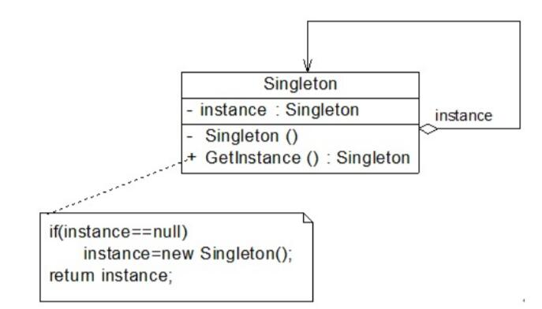

# 单例模式结构与实现
## 单例模式结构


* Singleton（单例）：在单例类的内部实现创建它的唯一实例，并通过静态方法getInstance()让客户端可以使用它的唯一实例；为了防止在外部对其实例化，将其构造函数设计为private；在单例类内部定义了一个Singleton类型的静态对象，作为外部共享的唯一实例。

## 单例模式实现
```
public class Singleton{
    private static Singleton instance = null; //静态私有成员变量

    //私有构造函数
    private Singleton(){        
    }

    //静态公有工厂方法，返回唯一实例
    public static Singleton getInstance(){
        if(instance = null){
            instance = new Singleton();
        }
        return instance;
    }
}

//客户端测试类
public class Client{
    public static void main(Sting args[]){
        Singleton s1 = Singleton.getInstance();
        Singleton s2 = Singleton.getInstance();
    }
    //判断两个对象是否相同
    if(s1 == s2){
        System.out.println("两个对象是相同实例)；
    }
    else{
        System.out.println("两个对象是不同实例)；
    }
}
```
编译代码并运行，输出结果为：
```
两个对象是相同实例。
```
在单例模式的实现过程中需要注意以下3点：
1. 单例类构造函数的可见性为private。
2. 提供一个类型为自身的静态私有成员变量。
3. 提供一个公有的静态工厂方法。