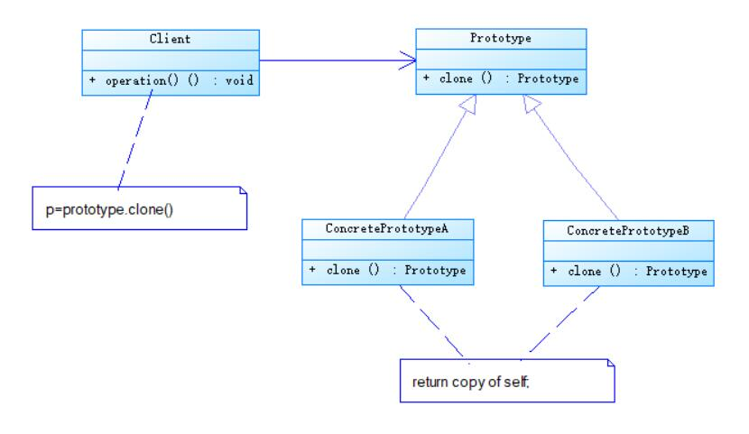
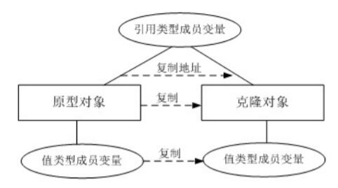
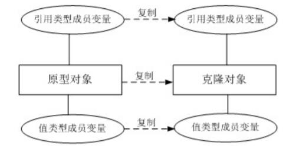

# 原型模式结构与实现
## 原型模式结构
* Prototype（抽象原型类）：它是声明克隆方法的接口，是所有具体原型类的公共父类，可以是抽象类也可以是接口，甚至还可以是具体实现类。
* ConcretePrototype（具体原型类）：它实现在抽象原型类中声明的克隆方法，在克隆方法中返回自己的一个克隆对象。
* Client（客户类）：让一个原型对象克隆自身从而创建一个新的对象，在客户类中只需要直接实例化或通过工厂方法等方式创建一个原型对象，再通过调用该对象的克隆方法即可得到多个相同的对象。由于客户类针对抽象原型类Prototype编程，因此用户可以根据需要选择具体原型类，系统具有较好的可扩展性，增加或更换具体原型类都很方便。



## 浅克隆与深克隆
### 浅克隆
在浅克隆中，如果原型对象的成员变量是值类型（如int、double、boolean、char等基本数据类型），将复制一份给克隆对象；如果原型对象的成员变量是引用类型（如类、数组等复杂数据类型），则将引用对象的地址复制一份给克隆对象，也就是说原型对象和克隆对象的成员变量指向相同的内存地址。简单来说，在浅克隆中，当对象被复制时只复制它本身和其中包含的值类型的成员变量，而引用类型的成员对象并没有复制。



### 深克隆
在深克隆中，无论原型对象的成员变量是值类型还是引用类型，都将复制一份给克隆对象，
深克隆将原型对象的所有引用对象也复制一份给克隆对象。简单来说，在深克隆中，除了对
象本身被复制外，对象所包含的所有成员变量也将复制。



## 原型模式实现
实现原型模式在于如何实现克隆方法，下面将介绍两种在Java语言中常用的克隆实现方法。

### 通用实现方法
通用的克隆实现方法是在具体原型类的克隆方法中实例化一个与自身类型相同的对象并将其返回，并将相关的参数传入新创建的对象中，保证它们的成员变量相同。示意代码如下所示：
```
public abstract class Prototype{
    public abstract Prototype clone();
}

public class ConcretePrototype implements Prototype
{
    private String attr; //成员变量

    public void setAttr(String attr)
    {
        this.attr = attr;
    }
    
    public String getAttr()
    {
        return this.attr;
    }

    public Prototype clone() //克隆方法
    {
        Prototype  prototype = new ConcretePrototype(); //创建新对象
        prototype.setAttr(this.attr);
        return prototype;
    }
}
```

在客户类中只需要创建一个ConcretePrototype对象作为原型对象，然后调用其clone()方法即可得到对应的克隆对象，如下代码所示：
```
Prototype obj1  = new ConcretePrototype();
obj1.setAttr("Sunny");
Prototype obj2  = obj1.clone();
```
这种方法可作为原型模式的通用实现，它与编程语言特性无关，任何面向对象语言都可以使用这种形式来实现对原型的克隆。

在原型模式的通用实现中，可通过手工编写clone()方法来实现浅克隆和深克隆。对于引用类型的对象，可以在clone()方法中通过赋值的方式来实现复制，这是一种浅克隆实现方案；如果在clone()方法中通过创建一个全新的成员对象来实现复制，则是一种深克隆实现方案。

### Java语言中的clone()方法和Cloneable接口()
Java语言中，所有的Java类都继承自java.lang.Object。Object类提供一个clone()方法，可以将一个Java对象复制一份。因此在Java中可以直接使用Object提供的clone()方法来实现对象的浅克隆。

需要注意的是能够实现克隆的Java类必须实现一个标识接口Cloneable，表示这个Java类支持被复制。如果一个类没有实现这个接口但是调用了clone()方法，Java编译器将抛出一个CloneNotSupportedException异常。如下代码所示：
```
public class ConcretePrototype implements  Cloneable
{
    ……
    public Prototype clone()
    {
　　    Object object = null;
　　    try {
　　　  　　object = super.clone();
　　    } catch (CloneNotSupportedException exception) {
　　　　    　System.err.println("Not support cloneable");
　　    }
　　    return (Prototype )object;
    }
    ……
}
```
在客户端创建原型对象和克隆对象也很简单，如下代码所示：
```
Prototype obj1  = new ConcretePrototype();
Prototype obj2  = obj1.clone();
```
Java语言中的clone()方法满足以下几点：
1. 对任何对象x，都有x.clone() != x，即克隆对象与原型对象不是同一个对象；
2. 对任何对象x，都有x.clone().getClass() == x.getClass()，即克隆对象与原型对象的类型一样；
3. 如果对象x的equals()方法定义恰当，那么x.clone().equals(x)应该成立。

为了获取对象的一份拷贝，可以直接利用Object类的clone()方法，具体步骤如下：
1. 在派生类中覆盖基类的clone()方法，并声明为public；
2. 在派生类的clone()方法中，调用super.clone()；
3. 派生类需实现Cloneable接口。

此时，Object类相当于抽象原型类，所有实现了Cloneable接口的类相当于具体原型类。